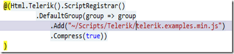

## The Background (feel free to skip it)

As we all know in MS change is a slow process. However something is definitely wrong (in a good sense) with the ASP.NET team. They seem to be innovating at the speed of thought!

MVC is already into revision 3 and the PDC demos by Scott Hanselman are already outdated (they phased out MvcScaffold replaced it with MvcScaffolding package).

Either-ways MVC + Scaffolding + EF seemed like a very nice way to re-do the archaic 4 year old system I am currently maintaining. Whether someone needs it at work or not it is a good ‘real-world’ (as opposed to ‘hello, World’) project to take up, while learning ASP.NET MVC.

But the grid implementations out of the box is pathetic and I stumbled upon Telerik’s feature packed MVC Extensions and guess what, they have a GNU license version for you to play around with. It was even available for download through Nuget package manager. Wow!

## Anything that’s too good to be true usually is…

My joy was short lived. Off the bat the new scaffolding generator refused to use the custom t4 templates (like Scott had shown). I fiddled around a little but couldn’t figure it out so left it and changed the view by hand to convert the Index page such that it uses the Telerik Grid.

Examples seemed helpful enough and slowly but surely things were falling into place when I noticed the filtering functionality was not working! Then I noticed the Popup for New/Edit was not centered and did not have correct styling (background wasn’t disabled and popup-header’s drag wasn’t working). Started digging around. View Source indicated some javascript files were missing. Added them, and BAM! Hell broke loose, jScript errors all over the place. Everything stopped working.

## Retrace Steps (abandon brute force)

Registered and downloaded the latest samples from Telerik (the project had the package installed through Nuget package manager). The sample ran like a champ in local environment. Confused again!

- Added all the latest javascripts from sample to my project
- Added the Telerik.Web.Mvc from sample to my project (essentially replaced the reference added by Nuget)
- Then I noticed the following little piece missing in the \_Layout.cshtml

Even after adding it the errors continued.

Back to sample.

- Then I noticed in the sample \_Layout.chtml there were no direct references to the individual js files (from telerik). All it had was the above registration code. Light bulb moment!!!
- Removed the direct references to the other js files and kept the registration code only. Still no luck! But this time I got an exception in the above line saying one of the js files not found under “~/Scripts/” folder. Oh Boy! All the telerik js files need to be under “~/Scripts/”. Moved them out to the  ‘Scripts’ root and changed the code to look like

- Eureka moment! Finally things look the way they should.

## In Conclusion

- Telerik extensions available through Nuget (today) are not the latest (they use jquery 1.4.3 as opposed to MVC 3 using 1.4.4)
- Download latest from Telerik.
- You only need to register the above javascript and the rest of the scripts are registered automatically
- All the Telerik javascripts need to be in the “~/Scripts/” folder. Don’t be fooled by the cryptic folder (like 2010.3.1110) created by Nuget. You will need them to be in the root folder.
- Don’t rely on ‘View Source’ completely. There is still some amount of backend munging going on.
- Unlike me start with the sample and move it to your project, not the other way round.
- Stay tuned for T4 templates to generate views and controllers taking advantage of Telerik extensions.
- Last but not least Telerik MVC extensions at-least for the Grid are pretty powerful and I thank Telerik for making the entire suite available under GNU license.
