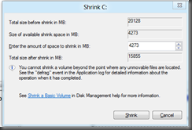
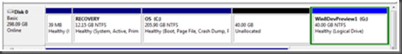
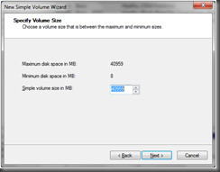
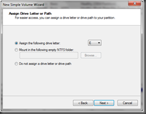
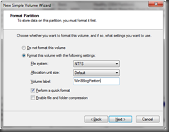

Okay, so my last article was huge hit (by my standards). I was trying to setup Windows 8 Developer Preview on my Mac and thought of sharing the experience. Turns out lots of people were trying the same .

After a day of playing around, I was beginning to feel the pinch of VM so wanted to setup Win8 on some hardware. I have an existing laptop running Windows 7 and oodles of free disk-space. So decided to give it a shot.

Before you start here is the configuration I start with

1\. Core i5 Dell Latitude with 8 Gigs of RAM and 250 Gig HDD with about 200+ Gig free and Windows 7 Professional OEM installed

2\. The same Developer Preview ISO I used for my previous post

3\. An ISO mounting tool like [SlySoft’s Virtual Clone Drive](http://www.slysoft.com/en/download.html)

4\. _After a long twitter exchange with one fellow enthusiast, I need to put in this extra warning. You CANNOT setup Win8 on a Dynamic partition using the method outlined here. This will work only if you have 'Basic' partitioning. How to know what type of partition you have, in the Disk Manager select the hard disk and the first column on the left will show DiskN, Basic or Dynamic. If you see in the images for the Disk Manager below it shows 'Disk0 Basic'._ So proceed only if you have a Basic parition.

**_Standard Disclaimer: The below worked for me, the Windows ecosystem comes with so many permutations and combinations that it’s impossible to predict if it will work for you._**

**_If Shrinking partitions/Installing Drivers doesn’t sound like things you can do, DO NOT ATTEMPT IT. Hopefully nothing is affected but if your system is hosed in the process I cannot be held responsible._**

**_Use the below steps at your own risk, no warranties here._**

All set? Here we go

# 1\. Creating a new Partition.

You need to do this ONLY if you don’t have a partition that can be formatted. If you already have a partition that you can format, format it and jump to step 2.

- Navigate to My Computer->Manage
- Select Storage->Disk Management
- Select the drive that has atleast 20GB free.
- Right click on the drive and select ‘Shrink Volume’. It will take a couple of minutes for the disk-manager to respond but at the end it will show the following dialog
- 
- First Line is maximum capacity of the drive. I am writing this blog on the Win8 server so it’s showing ~20GB.
- Second line is the size up to which you can shrink it down (not sure how Windows came up with that number but I am sure it can’t shrink it down to that size because there isn’t so much space left on the drive currently).
- Third line is size of new drive.
- Fourth line shows the future size of current partition (size after shrinking).
- Click Shrink. Windows will shrink the partition and you’ll have a Unallocated block as follows

- Right Click on it and select New Simple Volume.

- Follow the wizard and create a new partition ready for setup
- 
- Allocate maximum (that is selected by default)
- 
- Give a Volume name identifying it as a Win8 Drive.
- Click Finish.

# 2\. Start Installation

- Load the Win 8 DP iso by right clicking and Open With->Virtual Clone Drive
- If the AutoRun comes up don’t start the setup from the AutoRun dialog. Instead select Explore File using Windows Explorer.
- If you have AutoRun disabled just start Explorer and navigate to the virtual Drive.
- **_Here is the kicker. Navigate to G:\\Sources\\ folder (Replace G: with your Virtual Drive letter), and run the Setup.exe from there. If you don’t do this Window 8 installation doesn’t allow side-by-side install, it will insist on deleting you existing partition and overwriting on it._**
- Once setup starts, point it to the newly created empty Drive as the destination drive. Sit back and get some coffee. All the reboot options default to required settings so pretty much no other intervention is required till you boot up. I again forget exact number of reboots, I think it rebooted thrice for me.

# 3\. Notes and potential Gotchas

- Since side by side install required writing to the MBR (master boot record) any antivirus worth it’s salt will try to prevent you from doing it. So unfortunately you have to disable the Antivirus for the period of installation.
- Funnily enough the VM installation found ALL required drivers (except for the generic display). But it connected to Internet etc perfectly. It’s not so rosy on hardware. If you have drivers from your laptop for Windows 7 keep them handy. The initial setup did not recognize among other things – Wireless Adapter, TrackPoint, Chipset etc.
    
    - Luckily enough I just went to Computer->Properties->Device Manager and for each device that had an exclamation mark select “Update Driver” and pointed it to the folder where all my drivers were. Win 8 picked up the required drivers automatically and applied them. All except the multitouch trackpad which I had to run the Setup for it that came with the laptop.
    - That’s it. You are done. Must say running Win8 (‘on the Metal’) with 8 GB RAM is a much improved experience than running it on a VM with 2GB memory.
    

With that I end my ‘Setup’ series for Win 8. I promise the next one will be ‘Code to Metal’. Planning to explore WinRT and made a ‘real’ Social App.

Cheers.
