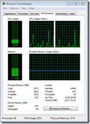
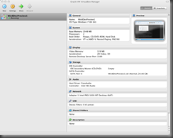

Microsoft launched the Windows 8 Developer Preview today at the Build conference. If you like living on the bleeding edge of technology and want to play around with the release, you need a computer to do a clean install of Windows 8 DP. Fortunately if you don’t have a spare computer to mess with, Virtualization solutions are there to the rescue.

I usually use VMWare on OSX to run all my Windows VMs. However VMWare failed to install the Win8 DP. So I decided to install Oracle (formerly Sun) [VirtualBox](http://www.virtualbox.org/wiki/Downloads "VirtualBox downloads") solution. It supports Windows, OSX and Linux as host OSes.

I am of course assuming you have already downloaded the Win 8 DP iso from [Microsoft](http://msdn.microsoft.com/en-us/windows/apps/br229516 "Windows 8 Developer Preview Download Site").

Once you have VirtualBox and Win 8 DP iso, lets get started.

# Step 1

Fire up Virtual Box. It will look as follows:

# Step 2

Click on ‘New’

# Step 3

Click Continue

# Step 4: Give the VM a Name.

- I have given ‘Win8 Dev Preview 1’.
    
- Select OS as Microsoft Windows. Version as Window 7 (64 Bit).
    
- I am assuming you have downloaded the 64 Bit ISO from MS.
    

# Step 5: Selecting memory for the VM.

This is a very critical step. If you over-allocate memory the VM setup will fail.

- I selected the maximum available at the time on my machine (3584 MB) and failed to setup the VM first time. I had to reduce it down to 2048 MB (2 GB). Mind you I have a system with 8GB of memory installed.
- A good indication of free memory can be had by running Activity Monitor on OSX or Task Manager if you are doing it on Windows host system. Rebooting the system before starting might give you some more memory. But remember if you don’t have that much memory later when you try to start the VM, Virtual Box will simply Pause the VM load unless it has the allocated memory (+some more) to play with.
- Below screenshots show how to check free memory in your system currently

Above image of Task Manager shows 932Mb free on this Win7 System.

Above image from the Activity Monitor in OSX shows free memory available = 516 MB

The example values are very less because I am running two VMs at the moment, but point to note is you need to make a guess of Memory to allocate to the VM based on the above Free Memory available values. So if you see 2.0 GB free then assign about 1.5 GB. Hope this update helps people who are facing setup issues.

# Step 6. Create a New Hard Disk

# Step 7.  Select type of Image

I selected VDI.

# Step 8. Selecting Storage Type

Keep it Dynamically Allocated unless you want to block off a portion of your HDD to start off with.

# Step 9. Specify the VM file location and Size.

20GB is default and it worked for me. My installation left about 6 GB of the 20 GB left

# Step 10. Finish VM Setup

Click Create.

# Step 11. Win 8 Installations

Now Click on Start

# Step 12. Select source ISO file

Here point it to the iso file you downloaded

# Step 13. Fun times begin

Notes:

- Windows installation will start with the usual wizard interface that you can easily step through.
    
- One thing to remember, when it reboots the first time around the ISO will be loaded and you will get a prompt to ‘Press Any Key to Boot from CD/DVD”. DO NOT press any key. Wait for it to boot from the virtual HDD. If you press any key by mistake, the installation process will start again. Just cancel out and agree to rebooting the system.
    
- I counted 3 reboots. May/may not vary for you.
    
- I was able to log in to system using my Hotmail account.
    
- Give it a couple of minutes to connect and get all details and also do initial tile setup.
    
- 2 GB of memory doesn’t make it a spiffy system.
    

**UPDATE**: Some folks have had a hard time in-spite of the tutorial, so that got me thinking and I realized that between the setup failing for me the first time around (that I attributed to lack of memory above) and me getting it working, I also did some configuration changes to the VM that are different from the default shown in Step 10: So here are the final settings that work for me (click to expand). Notice I have enabled Acceleration, given it both the CPU cores to play with (default is 1 only) and given it a healthy dose of Graphics memory. For your system, keep an eye for the Green Line for each setting, don’t stretch beyond the green line in any of the settings. Again, virtualization is tough job simply because of the sheer number of h/w software combinations possible. So if it’s not working for you, sorry to hear that.

**UPDATE 2**: I just noted on twitter today this site had a very pointed solution to Virtual Box issues on Win 7 [http://www.kombitz.com/2011/09/16/status-0xc000025-error-when-installing-windows-8-developer-preview-on-virtualbox/](http://www.kombitz.com/2011/09/16/status-0xc000025-error-when-installing-windows-8-developer-preview-on-virtualbox/)

You can try the above if you are facing the same issue.
