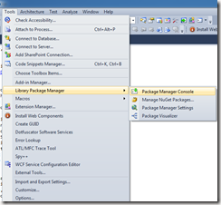
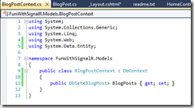
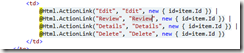
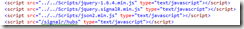
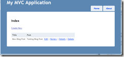
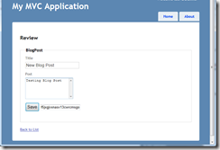
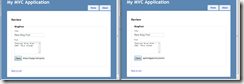

This article has grown a little long in the tooth because SignalR has changed significantly since this was written more than a year ago. I recently co-wrote a new article with Suprotim Agarwal in the [DNC Magazine](http://www.dotnetcurry.com/magazine/dnc-magazine-issue5.aspx). If you are a .NET Dev I strongly recommend you subscribe to this Free Bi-monthly Magazine. The source code for the article is on Github [Repository of DotNetCurry](https://github.com/dotnetcurry/signalr-tictactoe-dncmag5). You can see the sample live [here](http://tictactor.apphb.com/).

# Background

For the past several months I have noticed David Fowler, Damien Edwards, Phil Haack and a few other MS Techies I follow on twitter, tweet excitedly about a new framework called SignalR. I didn’t understand the excitement fully and to be honest didn’t try too hard to figure out.

Yesterday Scott Hanselman published [this](http://www.hanselman.com/blog/SolvingTheShakespeareMillionMonkeysProblem%C4%B0nRealtimeWithParallelismAndSignalR.aspx) article and re-distributed a link to an [article](http://www.hanselman.com/blog/AsynchronousScalableWebApplicationsWithRealtimePersistentLongrunningConnectionsWithSignalR.aspx) which he wrote end of August, 2011. After going through both, I really wanted to take a closer look at SignalR, and while trying to get his ‘…monkey typing Shakespeare…’ code working I finally had the ‘Ah ha!’ moment.

I just had to come up with this quick and dirty sample to demonstrate a use for SignalR and since I want the bragging rights for it, I am going to throw it up as is without bothering about the niceties of a Nuget package or sample.

**UPDATE: I have deployed a working sample of this application at [http://apps.apphb.com/funwithsignalr](http://funwithsignalr.apphb.com/ "Fun with SignalR live on AppHb")**

# The Idea

First time I saw Google Wave’s technology demo where they showed multiple people editing/reviewing the document at the same time, it blew me away. I was fascinated by it, but told myself I was too ‘javasciptically challenged’ to design such an Async client side framework.

When my tubelight\*\* finally came on, SignalR was the obvious way to do it. Following is my first rough cut that as of now only syncs content. We’ll get to the fancy colored carets at a later point (hopefully in another article).

\*\*In India one is referred to as a tubelight if something strikes late. Back in the days of non-electronic ballasts for fluorescent lighting, the tubes used to flicker for few seconds before turning on.

Please go through Scott’s articles or SignalR documentation to understand SignalR better. I make no attempts to explain SignalR here (partly because I know precious little and partly it’s such a fantastic framework that you need very little up front to get going).

# Head-first into SignalR

To build a scaffolding for SignalR framework you can use plain html with a backend server side SignalR Hub class as Scott demonstrated. But I chose to start off with an ASP.NET MVC 3 project. (Actually my first attempt at ASP.NET MVC 4 using VS 2011 Dev Preview didn’t quite go so well, so I rolled back to the stable releases of ASP.NET MVC 3 on Win 7 using VS 2010).

## Setting up a support app as an ASP.NET MVC 3 web project

I called it ‘FunWithSignalR’ and set it up as an Intranet Application

## Adding SignalR to your project using Package Manager Console

The package manager console helps you download Nuget packages among other things. If you don’t have it visible you can bring it up from the above menu (in VS 2010)

SignalR is available as a nuget package and all you have to do to include is run the following command in the Package Manager Console

Install-package SignalR

The above command will get all the dependencies you need for SignalR and if your jQuery script files are not up to speed, will get the latest libraries for jQuery too (SignalR client uses jQuery hence the dependency check results in the upgrade). The output will looks something similar to

Update jQuery dependencies in Views\\Shared\\\_Layout.cshtml by pointing to the most recently updated jQuery version. As per above image the latest version for me today is jquery-1.6.4.min.js because that’s the one the package manager installed.

## Setup the Code First EF Model

We’ll setup a very simple code first model by adding one Entity called BlogPost in our Model folder.

Add the DbContext for the BlogPost.

Build the solution at this point.

## Scaffold the Controller and UI

To use the default scaffold tooling that comes with MVC 3, right click on the Controllers folder and select Add –> Controller.

Select the Template, Model and Data Context values as shown above and click Add.

At this point you will have the scaffolding necessary to Add/Edit/Delete BlogPosts.

### Adding the ‘Review’ Action

Open the BlogPostController and Copy paste the Get and Post action methods for the Edit action. Change Edit to Review as shown below.

Copy the Edit.cshtml and paste it in the View folder. Rename it to Review.cshtml

Update the Index.cshtml such that a ‘Review’ link comes up in the Index

# Getting SignalR into the game

#### The Server Side

In your web project create a folder called SignalR (You can call it anything you want, in a real life project this as server side component and could very well reside in a dll of it’s own).

In the SignalR project add a class BlogHub.cs

Add the following code to it

\[code\]

using System; using System.Collections.Generic; using System.Linq; using System.Web; using SignalR.Hubs;

namespace FunWithSignalR.SignalR { \[HubName("blogHub")\] public class BlogHub : Hub { /// 
 /// The method called from SignalR client (JS) /// 
 ///String Data ///Session ID: Used in this sample to track users ///A boolean value used in the example indicating /// if incoming value should be appended or overwritten when sent back to /// other clients public void Send(string message, string sessnId, bool append) { Clients.addMessage(message, sessnId, append); } } }

\[/code\]

### The Client Side

- Open Review.cshtml and add the following script references

Note: json2.min.js is not packaged with the SignalR nuget. I have packaged it as a part of my code. I got it from Scott’s ‘Shakespeare demo’.

Note 2: /signalr/hubs is dynamically generated at runtime. So don’t worry if it gives a green squidgy right now. It works fine at runtime. Without this reference SignalR client won’t work.

- Change the Html helper for the Post property from Html.EditorFor(…) to Html.TextAreaFor(…).
- Add a hidden field to save the session Id in it (this maybe a security hole, need to investigate best practices)

\[code\]

<input id="sessinId" type="hidden" value="@Session.SessionID" />

\[/code\]

- Drop the following script in

\[code\] 

\[/code\]

- If you see closely this is pretty similar to Scott’s 11 lines of code to get a chat client going.

Changes I have made are:

1\. Send message to server on KeyUp event of the Post text area, instead of an explicit button push

2\. Send more meta information like the current sessionId and if the keystroke means an append action should take place at the client action of an overwrite action should take place at the client option.

## Let it Roll

Run the application and navigate to the BlogPost Index

Add a new Post

Click on Review

Press Ctrl+N to start a new browser instance with the same page. Hit F5 so the session id (the text field next to Save button) changes. Arrange the two browsers side by side.

Type in one Post text area and watch the other one change almost simultaneously

As Scott says, Kabooom! brain explodes…..

## In Conclusion

To wrap up, we saw how mind numbingly easy it is to use SignalR.

It’s a fantastic abstraction over various techniques available for persistent connections over http. Under the hood it can use websockets or longpolling depending on what’s available.

You can get infinitely creative with it and build fantastic collaborative ASP.NET apps using SignalR backend.

Some day (hopefully) in the near future, I would have overcome my javascript challenges and built a real collaborative editor with all the fancy bells an whistles of Google Docs.

Finally, David Fowler and team, a million thanks for such a fantastic framework. I am loving the ‘just works’ motto . And Scott Hanselman for providing the ‘Aah ha!’ moment, without which I probably would have not given SignalR a look yet.

## The Code

The code can be downloaded from [here (size 844 KB)](https://skydrive.live.com/redir.aspx?cid=9ff6a7fb81f93f33&resid=9FF6A7FB81F93F33!123 "Fun With SignalR Code") (skydrive). It is provided AS IS, with no warranties expressed or implied. You are free to use it without any attribution (but I would love it if you do feed my ego ).

I have now made the code available on bitbucket Mercurial repository. You can get it from here [https://bitbucket.org/sumitmaitra/funwithsignalr](https://bitbucket.org/sumitmaitra/funwithsignalr)

## Update

The code in bitbucket now uses Google's diff-match-patch implementation and is hence Apache licensed now.
