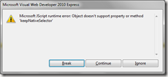
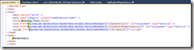

Yesterday I was playing around with the jquery.mobile package from Nuget and found an interesting gotcha.

I had a project from the MVC4 WebAPI template (note: WebAPI doesn’t have anything to do with it). I wanted to add Mobile support to it, so I installed the jquery.Mobile.Mvc package through the package manager console. The idea was I would use the ViewSwitcher framework to create mobile views with appropriate extensions. But to my surprise my edit views started getting buttons that looked like Mobile buttons.

I also got exceptions in jquery.mobile js module like the following.

I started scratching my head wondering why was the mobile rendering kicking in when I didn’t have any mobile views created?

Turns out, that when you install jquery.Mobile.MVC or the standalone jquery.mobile nuget packages, the new MVC4 Bundling and minification functionality rolls up all the js files together in the \_Layout.cshtml. As a result jquery.mobile kicks in and tries to convert everything into mobile layout.

## Possible Solution

There is an easy way out.

After you have installed jQuery.mobile under the Scripts folder create a ‘Mobile’ folder and move jquery.mobile\* files there.

Before                                    After   

 

This will ensure the regular views don’t load jQuery Mobile scripts.

Now update the \_layout.Mobile.cshtml to point to the updated location for jQuery.mobile scripts

You can do the same for the css to if you want to keep a clear separation.

Hope this helps you some head scratching. To me it seems the Nuget Package should be updated. But I’ll leave the solution to the biggies .
