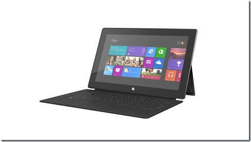
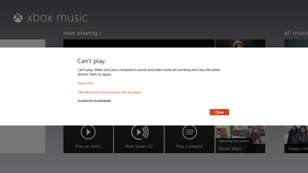

###### (Image Copyright: Microsoft Corporation, not to be reproduced from here)

Okay folks, as I warned, I got a new Surface and you expect lots of 'updates' for it! This my Day 1 Update. Don't expect a 30 days of Surface series, but I will try to put out as much information as I can about this little device! I am not writing this to help you make a purchase decision, I am not writing this to convince you to buy the device, I have not been paid by anyone to write this, it's just me being stoked about the Surface and sharing my experience as it comes. TL;DR for today is, I like the Surface RT with its blackheads/pimples and all ;-)...

Before I start let me warn you I might sound like a giggling kid with a new toy because that's pretty much how I feel about it. I was stoked about Windows 8 since Build 2011 and I was super happy to see Surface announcement by Microsoft. After watching in dismay, Apple launch iPad and steal Microsoft's thunder by claiming to be pioneers of 'Post PC era/Touch computing' and MS make blunders like scrapping the Courier tablet, I was HAPPY about the Surface! At least Microsoft would be making an attempt to control it's destiny instead of depending on crappy OEMs whose imagination gave us the 'Netbook'. This definitely sounded exciting.

Fast forward to launch of Surface and I was sitting here in India wondering when Microsoft Store India would go online (it's been offline since it got hacked last year). Then holiday season started and my friend agreed to lug one from US to India. Unfortunately he landed on the other side of the country and more than two weeks after my Surface arrived in India I finally got it in my hands on December 5, 2012.

# First Day - Setup and Hello World

If you have used Windows 8 on a new PC the Surface setup was no different. Give it a WiFi access point, select your favorite color, put in credentials for a Microsoft account (Outlook.com, msn.com, Hotmail.com etc.) and let it do its thing. Mine was out of charge and the first charge using the supplied charger took almost three hours. I completed the setup with the device plugged in

The good thing about Windows 8 is Roaming settings that tend to carry over bookmarks shortcuts and keep them in Sync. So when the Surface started up my IE bookmarks, couple of pinned shortcuts were ready on my desktop.

Before I did anything with the Surface I went to Control Panel (Desktop->Windows Explorer->type in "Control Panel" is how I roll) and initiated Windows Update->Check for Updates. It gave me a bunch of updates that were ready but kept refusing to start installation. That resulted in my previous post. Initially lots of people complained that they didn't find Office update and one even returned their RT because of that. But for me Office update was right there. With the updates done I was ready to explore my Surface RT!

# Keyboard - Touch Vs. Type Cover

Initially I had thought of skipping on the keyboard covers but later I fell for it and got the touch cover. Last weekend, before I got my hands on my Surface, I got a chance to checkout Subodh sir's Surface with the Type cover! The tactile feedback for the type cover felt awesome. I spent only a few minutes with it. So when I got my own touch cover and saw that the keys had no tactile feedback whatsoever and in fact they barely had the key etched out on the cover I felt a little disappointed. To me the type cover seemed way more functional if you want to do serious typing on the Surface. So I sent a tweet to @Mossyblog telling him if he intended to buy a Surface without looking at a physical one he should go for the type cover. He promptly retweeted it and that created a storm in the teacup. Pete Brown, Tim Anderson and Ginny Caughey responded saying they like the type cover better. Pete mentioned that he's typed a lot on them and he liked the touch better than the type. Tim mentioned that the Type cover feels funny when you wrap it around. So I was left feeling a little silly with my pre-mature declaration that type was better than touch.

Having said that I have been typing this on my Surface for the past one hour now and this is my first serious typing effort on the Surface. I still feel that I am missing out on the Type cover. The touch cover is very functional but I am often a key off here and there and I seem to be missing the spacebar a lot, specially with my left thumb. Also this is a perception thing - the lack of physical depth gives me the feeling that the touch cover is more fragile than the type cover. This leads me to tap gingerly instead of going pound-pound-pound like we usually do.

Either-ways I'll continue to use the type cover and see if I get better at it.

# Drivers Support - Printers et. al. It's a Whole New World

Drivers have always been the bane of every Windows update. Vendors have made it into an opportunity to force obsolescence and encourage periodic upgrades. However things have been relatively stable with Windows since Vista. Anything that worked on Vista pretty much works on Windows 7 and Windows 8 (x86/x64). However Windows RT is a whole new ball game. Since RT is based on the ARM architecture the drivers will have to be ported to Windows RT. The Windows 8 team wrote a long post (using EPSON printer's images) on how they are making things easy. But now I realize that it still means Windows is at the mercy of Printer driver vendors or specifically Printer Vendors.

My 4 month old HP Laserjet M1213nf is not supported by Windows RT. I have tried almost all tricks in the bag but no luck. Windows can see the printer but can't print to it. Whatever generic driver I use, the printer choses non to respond. It says version of Windows not supported. I had the previous model 1210 in US and it didn't support iOS' eprinting capabilities, the 1213 does support them. So I guess a future generation of the printer will probably support but then I guess HP will expect me to upgrade the printer instead of providing a driver for the existing printer. So I am guessing this printer is a no go.

## Mobile Internet

The only other hardware I tried was to plug in my Wireless USB Modem (by ZTE) but no luck. Windows recognized it but couldn't locate drivers for it. It came with drivers for Windows 7/OSX/Linux (rpm) but no luck with RT. So mobility of the RT is limited to my Home and Wireless hotspots only.

# Working on the RT

With my initial experiments done with available hardware, next thing I wanted to do was to test my Windows 8 app on the device.

## Wireless Deploy and Debug – Steps towards a wireless world

I followed steps documented by Tim Heuer for setting up Remote Debug tools on the RT. Then I started Visual Studio, selected Remote Debug, it detected the Remote machine (the RT) on my network Subnet and installed it over the air to the RT. \*\*\*\* MIND BLOWN \*\*\*\*

Coming from iPad/iPhone development I was almost getting off my chair to fetch a USB cable to plug the RT into a USB port of the desktop. I just couldn't believe things were working over the air. I quickly pinged the nicest iOS dev I know Matt Gemmell on Twitter and he responded with a confirmation that you still need to tether iPad for debug/deploy. Damn MS just one-upped Apple atleast for developers there! Woo hoo!

## Remote Desktop

If you check Microsoft's comparison chart of RT v Pro you'll see under Pro remote desktop is called out as a feature giving you the impression it might be missing from RT. But Justin Angel confirmed RDPs presence on RT and that kind of influenced a lot of my purchase. Sure enough Remote desktop is present on RT and I can RDP into my Desktop Win8 machine or Win 7 laptop!

Sweet! Fact that the Surface has > resolution than my 2009 MBP gives me enough reason to access it from the RT. Sure enough it works just fine.

## Blogging/Typing

Windows RT is a little sparse with respect to apps available but the WordPress app is available so I gave it a spin. Totally worthless as a Content creation app. No intermediate Saves, drafts, no tag support and no theme support. Over to Word. If nothing it does AutoSave. Also the WordPress app is unable to edit posts.

# Battery Life

From the first charge to first discharge (shutdown) it almost last 26 hours with all the above stuff I mentioned. But overall it was pretty mild usage with very little actually typing and no music etc. Today I have been at it since 6:30 am and it's 11:56 now. Battery remaining is 44%. I typed this entire thing out on the Surface. Listened to Adele playing for about 2 hours and sent out a bunch of tweets. I also joined it to the Homegroup in hope of getting the printer to work over a printer share no luck yet. So I believe it works up to its billing of 10 hours battery life.

# Wireless Networking

The wireless receiver is pretty decent and I got the same download speed I get on my desktop (it went up to 195KB/sec for the below file.

# Other Niggles

When I started IE for the first time it offered to disable an add-on that was delaying startup. Turns out it is office document cache handler! LoL!

There were a few more niggles. Last night the Surface shut down with battery at 6%. Today morning when I started it (left overnight for charging), it started without WiFi and said no Wireless Hardware was found. A second reboot fixed it. Hope it's not h/w defect. Without network ability it's a slab of metal and glass.

Xbox music keeps crashing, not sure if something to do with region confusion. How long can I listen to music for free?

# Summary

Well that is a massive first day review for you. Hope to put the Surface to some serious use in the upcoming few weeks and will post things as I find them. Overall very nice hardware, software is sufficient but will definitely mature and I am going to be hands on about that part so Rock on Windows 8 and Windows RT!!!
