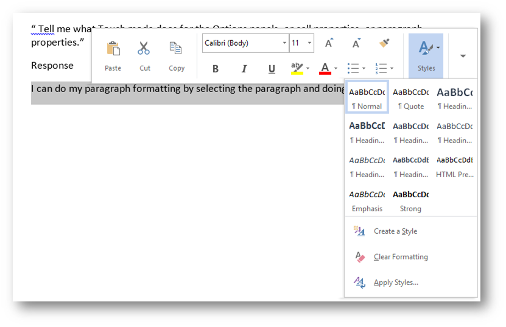
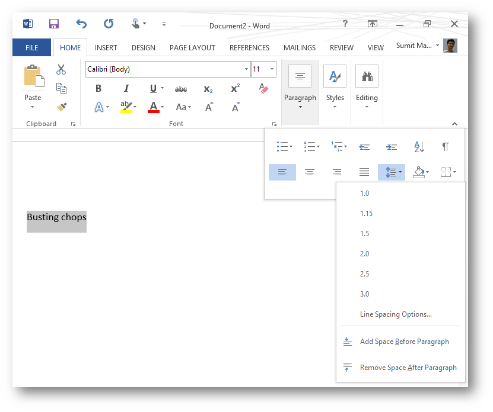

Today I got into a debate with Peter Bright of Ars Technica on Twitter. Got a little bugged with his hyperbolic claims that Office 2013 only increases spacing on the ribbon in the name of enabling touch. Having used Word RT for significant amount of time in the past few months I found his claims childish. He retorted back with an F bomb asking how about a UI that doesn't need a mouse. I replied saying I don't need mouse for most of what I do. He came back with a bunch of challenges and this post is an attempt to publicly respond to them.

Before we get started a little bit of history on why the ribbon was introduced in Office 2007 in the first place. This is for regular readers who may end up here looking for Office 2013 features. Microsoft found that people were not aware of a boatload of existing features in Office because they were hidden behind some obscure menu/tool bar/options dialog. The ribbon was introduced to bring to fore these hidden features. Ribbon was supposed to be the way forward and dialogs were relegated to power user functions only.

After the initial hue and cry of who moved my cheese people found ways to deal with the 'radical ribbon'. I learned to recognize the visual cues Office was throwing at me for every action and then following the cues. For example if you select an image office will highlight the format tab and give a red heading called Picture Tools letting you know subtly that image manipulation options are on that tab. These cues combined with my limited knowledge of Word Shortcuts I have managed to do whatever I wanted to do with it. Remember I don't earn my living using Office/Word but still I am not a novice.

Before I go further, none of the dialogs in Office 2013 are touch optimized, and if you need advanced formatting that has no other shortcut available on the ribbon you are left at poking at option dialogs designed for mouse with your fingers. That said Office 2013 has significant intuitiveness built in to bring up required shortcuts on the ribbon based on my current context.

Also as far as I have seen Touch mode only makes the ribbon slightly bigger and the buttons a lot sparser making them easier touch targets.

# Challenge 1

"Tell me what Touch mode does for the Options panels, or cell properties, or paragraph properties."

## Response

I haven't had the need to invoke them given the options available in the context menu.

I can do my paragraph formatting in multiple ways that seems to be dependent on the type of word temple I am using. In this 'Blog' template I can do it by selecting the paragraph and doing a tap and hold to get the context menu that has my basic formatting shortcuts right there under the big honking touch friendly 'Styles' button.

If styles doesn't work for you tap on the down arrow to get more options.

Selecting Font from that menu launches the following dialog. Now this is where things get old school where if you select Font or Paragraph you get this

Now depending on how dexterous your fingers are things can get a little testy. But you know what, if you tell me, that you adjust ligature of your font for every document and that you don't have it defined as a style I say you don't really know how to use Word.

BTW I do use the hyperlink dialog often and it's given me no problems because all I do is paste the hyperlink in the Address box and tap OK.

Notice that the two vertical column of buttons are pretty well setup for touch even though there is no 'optimization' per se.

Again the flow is much more convenient if I were using the default Word template. There is a big honking paragraph button right on the ribbon's Home tab. If you tell me you need more options that these 90% of the time you are just arguing for the heck of it.

Bottomline: You can get by with 80% of your stuff without looking at the un-optimized (for touch) dialogs and I have not needed them except for this writeup.

# Challenge 2

"tell me how touch friendly adding an e-mail account is to Outlook."

## Response

I don't have a clue because I am still skeptical about using Outlook. I don't exactly like an app choking in its own cough of a couple of Gb of data. So I plead no contest.

# Challenge 3

"you're seriously pretending that the various dialog boxes are designed for touch? Even though they're not changed?"

## Response

Show me your use case that needs you to use these dialogs on a regular basis. Either you are too old school to figure out the ribbon or you are arguing for the heck of it. The ribbon was designed to take care of >80% of your editing needs and as I showed it does.

# Office and Modern UI/Windows Store Apps

Office will surely be ported to the Modern UI sooner than later. As someone dabbling in Windows Store apps I have a firsthand idea of the challenges. In fact I have said this before, when Windows supports a Modern UI version of Office, it will be the showcase of how to do complex apps in Modern UI.

Till then there are other Office shortcomings to hate on like flaky Sky Drive connectivity and Sync, a not so great simultaneous edit functionality and others I can't recall at the moment. But don't BS that it not touch friendly. It has the best touch functionality for the complexity of the app. I think the only decent Modern UI app in comparison is CodeWriter which is not a productivity suite rather a decently done text editor. SketchBook, FreshPaint are all good apps filling niche requirements but none are in the same league as a productivity suite like Office 2013.

P.S. this entire article was written in Word RT on my Surface using the on screen keyboard. The screenshots were taken using the windows+reduce volume button and then pasted into Word and cropped all using the on screen touch UI.

P.P.S. I don't pick fights with professional bloggers every day, I either ignore them or tell them what I feel over twitter. Today for some reason I was specially pissed, wonder if it's got something to do with EU's antitrust bitching. Looking forward to the day when Microsoft will be penalized for offering Bing as the default search engine if user selects IE as their browser. Maybe people need a banner to choose a search engine as well.
