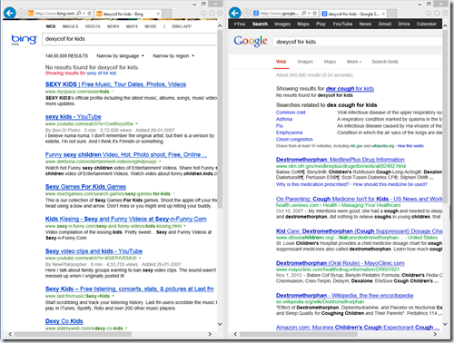
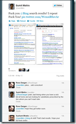
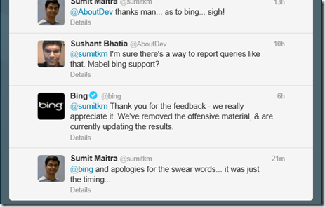

Yesterday, I came back from a visit to the kiddo’s doctor. Doctor had prescribed a medicine that we couldn’t find in the nearby pharmacies (in India you are allowed to walk out with a prescription and get the medicine from any pharmacy). The med prescribed was not available and the doctor was unreachable on phone! Pissed, I turned to the Internet to look for composition.

Start IE10->Type Name in and hit enter and helpful Bing gives you result right? Well I ended up with the following for the search “Doxycof for kids” (Doxycof was the medicine the doctor had prescribed)

Then I did the same search on Google and it gave me the result as you can see above.

I was flabbergasted and mad, so I took to the “international cribbing machine” aka Twitter (apologies for the swearing).

Today morning I got a message from @Bing

Which needless to say leaves me a little red-in-the-ears, but it ended up in this blog post.

## Search is hard but it gets better over time

I started using Google almost 11-12\* years ago and soon after I started using Gmail. Like it or not, Google has a boatload of context about ‘Sumit Kumar Maitra’ or whatever hash their robots use to represent me and my online history. This is after I have turned off my site tracking (not sure if some EULA change has turned it back on) in Google settings. A result of this 11 years worth of context when I search of “dexycof for kids” google checks the entire phrase instead of finding the first auto correct word and doing a search on it. This amount of context sensitivity can only come from maturity of a machine learning algorithm and contextual data.

\*UPDATE: I looked up and it seems I got my GMail invite on December 10, 2004 but I am pretty sure I was using Google search from much before that.

## Back to the beginning (How Microsoft and Yahoo lost it)

Now here is the sad story of MSN Search->Live Search->Bing all different names for a Microsoft product.

I had a Hotmail account when it was Sabeer Bhatia’s brainchild (before he sold it to Microsoft). My Hotmail account was my ‘Live Id’ until recently when I switched to outlook.com. But today I don’t have any of my mails from back in 2000? Why? Because after Microsoft bought Hotmail it couldn’t wait for me to ‘come back’ to it, and in stretch of 3 months where I didn’t use Hotmail (it was NOTORIOUSLY SLOW at the time), Microsoft decided to wipe out my mailbox! Also I never really used Live for logging in to much else other than Hotmail and MSN chats, but that move completely pushed me away from their services. The bottom-line is I never used Microsoft’s online services because of the perception they are notoriously slow (when compared to Google) and next they didn’t have any of my ol’ stuff, so there was nothing to go ‘back’ to.

All the above is true about the Yahoo accounts I had. The history for those is gone!

Thus I slowly moved away from their online services and started using Google till I realized how Google is sniffing my a\*\* and knows more about me than I care to tell it!

## A Possible Turnaround

I started using IE (and kept the default Bing) since IE9. Between IE 5 and IE 8 (both included) I had stopped using IE almost entirely for ‘my stuff’. That’s a valuable chunk of time Microsoft lost.

I couldn’t care less if Microsoft’s search was called Live Search, MSN Search or Bing. A search engine is useful to me if it returns relevant results, fast. I respect the fact that Microsoft is not sniffing my mails and I am willing to cut it some slack when it logs me into all MS affiliated sites using my Microsoft ID that I use for logging in to Windows 8. In fact if it knows what I am looking for in MSDN and StackOverflow good for me, it knows 1/2 my search requirements better.

Also search engine relevance building is a chicken-and-egg problem. You can’t build better search relevance unless you know people better, you don’t know people better unless they use your product and people don’t use your product because you are returning gibberish search results.

Fact is MS and Bing is 10 years behind schedule (thanks to their own bungling)! So while Google’s search engine is in it’s Preens, Bing is a toddler. Can technology beat time? Last I looked they were nowhere close to building a Time Machine. We can only wish Bing best of luck! I can only promise my first search will be on Bing, but if the first result is not relevant my next search will be ‘unfortunately’ on Google!
