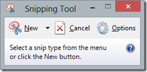
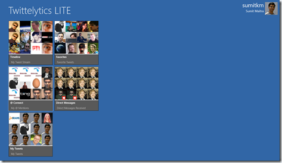

Windows has had the ‘Snipping Tool’ for grabbing screens or portions of screens for a while now.

Apart from that the age old shortcuts like Alt+PrtScn and PrtScn always work on a full size keyboard.

But with Windows 8, it was difficult to take screen grabs or a portion of a ‘Full Screen Modern UI’ App. PrtScn still works, but you’ve to paste it in Paint and then crop it before you can use it.

I’ve had Office 2013 Preview installed for a while now, that comes with OneNote. OneNote has a screen grabbing tool that gets enabled with Windows Key + S. I realized this recently quite by accident that this works in Modern UI as well. When you hit Windows Key + S on a Modern UI App, the screen does a weird flip between the desktop and the Modern UI App you are running before greying out the app and showing you the cross hairs for selecting a portion of the screen. Once you complete the selection you’ll see this

You can either send it to a note or like I did in this case Copy it to Clipboard and paste it here. Here’s a screen grab of my favorite Windows 8 app [Twittelytics LITE](http://www.twittelytics.com) 

Cheers!
