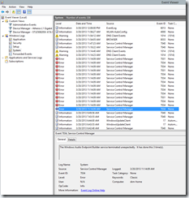
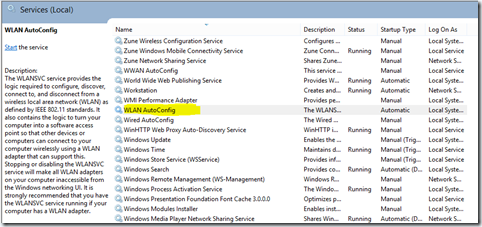

My Windows 8 Desktop seems to have trouble staying connected to my Wireless network. I haven’t gotten down to debugging exactly what causes it to go bonkers but a quick peek at the EventViewer shows this cascading failure of services that ultimately takes down the Wireless network service with it.

To recover, reboot always works, but when you have 5 tabs in browser, three instances of Visual Studio and 2 office documents open at the same time, reboot is not a good idea. Solution in 3 easy steps:

Step 1: Hit Windows Key + R, type Services.msc and hit enter

Step 2: Locate the WLan AutoConfig Service in the service Manager

Step 3: Right Click it and start the service. Voila! You should now be able to connect to your wireless again.

Someday when I have more time I’ll sit down to figure out what causes the cascading service failures in the first place. Looks like Hardware related. But the Wireless issue in Windows 8 is universal as of today, so this is one of the possible workarounds!
