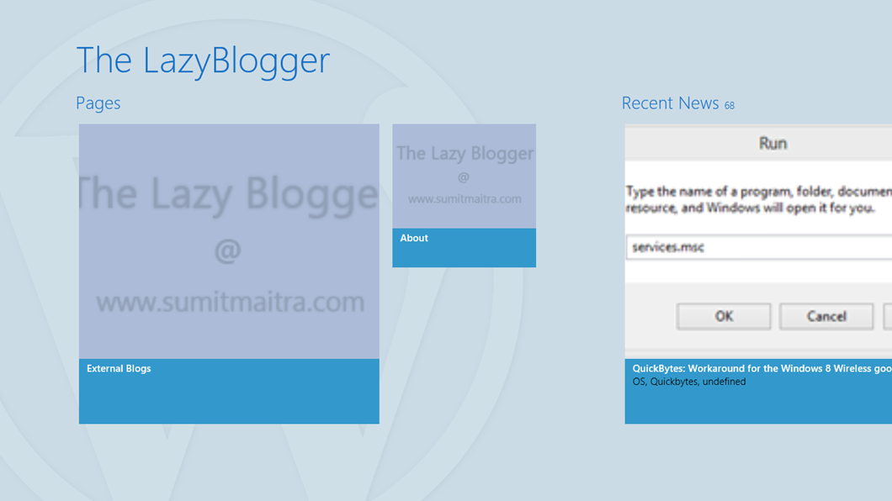

Around middle of April I came across an interesting site + service called [IdeaPress](http://ideapress.me/). It's actually an open source project on GitHub. IdeaPress converts your WordPress site into a Windows Store App. Best part is it gives you the option to download the generated code or the appx file, you pick!

As an experiment I built an app out of this Blog, downloaded the code and put it up for approval. Within three days the app was approved and it is now available in the app store. So if you are a big fan of me blogging lazily away, go ahead and download the Windows 8 app from the app store [http://apps.microsoft.com/windows/app/the-lazyblogger/b4002d78-7cb3-48d3-bd06-ef3ba2317e67](http://apps.microsoft.com/windows/app/the-lazyblogger/b4002d78-7cb3-48d3-bd06-ef3ba2317e67)

# The Outcome

It's easy for me to like my own app, so I'll skip the pleasantries. The code generated is in HTML and JavaScript. Since I am not well conversant with this development model I have no comments on the quality of code generated.

The UI layout is neat and it utilizes images in the Blog reasonably well to create graphical tiles for the UI. Currently the app shows this as my homepage. As you can see it starts off with Pages on your WordPress site, then uses the 'Recent News' feed, and thereafter shows your WordPress categories! Super neat!

After initiating the publish I realized that the code is not picking up the first image for the tile as it appears. Instead it picks the first image that the WordPress API returns. Well fair enough, so I took to the code and was able adapt it to pick up the file that started with the name 01. Thinking of expanding it to include more declarative rules, haven't got a chance to spend any more time with it yet.

# Good Starting Point

Frankly with my 'lazy' blogging at the rate of 1 blog every two months or less an app for it is an overkill. However, if you blog regularly and want to showcase your articles, this is really a nice way to get started. It comes with Search integration and Live Tiles support built in. With a little bit of design flair you can turn this bootstrap into a pretty looking app.

Best part is now you will be more careful about your blogs. The first thing I realized is all my blogs needed a header image for each post I write so that it shines through the app and looks attractive.

Next I have a couple of pages with no images on them and as you can see above it looks rather bland. So I've to think of something to make these two tiles look better. But since I control the content I can potentially 'fix' it without having to worry about the app.

# Bare Minimum Customizations

The default app, has a set of images that you should update. As you can see above the tiles that don't have any image get the default "LazyBlogger @ [www.sumitmaitra.com](http://www.sumitmaitra.com)" tile. I made that to replace the default IdeaPress logo. Not that I mind IdeaPress's logo but it will give your users the feel that you spent 'some time' to polish the app off. My app currently has my picture as the logo. I am going to change that, so I suggest you think of a nice logo for your app also. With these bare minimum customizations, you should be good to go.

# Cookie Cutters and the App Store

When the Apple iOS AppStore started getting popular these type of Cookie Cutter services sprung a plenty. I didn't use any of them, but Apple soon clamped down on them. I hope MS doesn't do that. As I said my app got approved in the usual 3 days and it now has a grand total of 3 downloads so I think you should be fine if you use this service to bootstrap your app.

So I wrap up with a thanks to IdeaPress for the idea and the service. Hope to be able to look a little deeper and maybe do some pull requests too.
