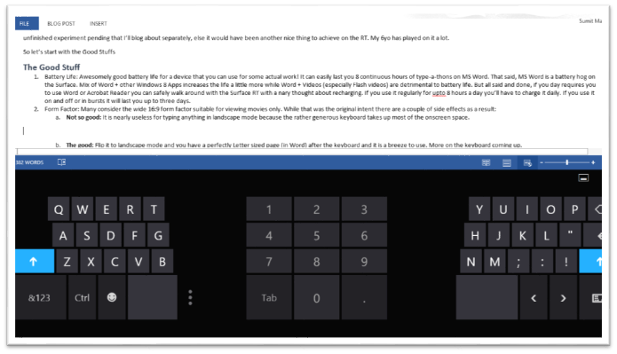

So Microsoft's prodigal child the **Surface** tablet is spreading its wings and becoming available at more and more places around the world. Thanks to the tech journos, Apple Fanboys and Microsoft's crazy ass pricing, Surface RT has got a very bad rep to start with. Well what's done is done and I can't help any of that. What I can do is share my experience of using my Surface RT and in non-exaggerated terms state it's good and bad!

I got my RT early December last year so it's been 6 months that I've had it. In this time I have used it extensively for blogging, browsing, watching videos, reviewing documents and writing documents. I have one unfinished experiment pending that I'll blog about separately, else it would have been another nice thing to achieve on the RT. My 6yo has played on it a lot.

I'll go feature wise and roll out the pros and cons as I go.

# Battery Life

**The Good:** Awesomely good battery life for a device that you can use for some actual work! It can easily last you 8 continuous hours of type-a-thons on MS Word. That said, MS Word is a battery hog on the Surface. Mix of Word + other Windows 8 Apps increases the life a little more while Word + Videos (especially Flash videos) are detrimental to battery life. But all said and done, if you day requires you to use Word or Acrobat Reader you can safely walk around with the Surface RT with a nary thought about recharging. If you use it regularly for up to 8 hours a day you'll have to charge it daily. If you use it on and off or in bursts it will last you up to three days.

On the flip side my first gen two and half year old iPad outlasts it by several days if standby mode. When running videos et al too iPad is still ahead.

## Wish 1

Microsoft has just as much experience with OSes as anyone around. They gotta squeeze more out of the given battery with the given hardware. Windows RT is a clean break, unshackle it from old sins that is holding it back.

# Form Factor and On Screen Keyboard

Many consider the wide 16:9 form factor suitable for viewing movies only. While that was the original intent there are a couple of side effects as a result:

**Not so good:** It is nearly useless for typing anything in landscape mode because the rather generous keyboard takes up most of the onscreen space. I didn't measure it but from the image below we can assume about 45% of the screen is covered by the keyboard in landscape mode.

**The good:** Flip it to portrait mode and you have a perfectly Letter sized page (in Word) after the keyboard and it is a breeze to use. Though I have a touch cover keyboard this landscape mode has become my favorite mode for using Word or Acrobat. The form factor, it is pretty practical for doing serious work too.

I find the portrait layout great for reading as well. However there are plenty of minor quirks that spoils the fun of the form factor.

**Quirk 1:** At least twice my keyboard was stuck refusing to type the letter 'u'. It would type 'y' and 'I' but not 'u'. First time I attached the touch keyboard to do my work. Next time I changed mode to the numeric mode and then went back to letters mode and it started working.

**Quirk 2:** With the touch keyboard attached and folded back it often refuses to bring up the on screen keyboard. Minor irritant but hey you charged a **super-premium** for that keyboard and the device, I demand perfection. The almost works argument doesn't apply. If I wanted almost works I would get an android at ½ the price.

## Wish 2

1. Fix the quirks, especially Quirk 2! it is reproducible rather easily.
2. Find a way to make the on screen keyboard to be more useful in the landscape layout. There is plenty of space available find a better way to use it. Don't make the shit excuse of using the keyboard instead, it's not available for free, it is a rather costly accessory!!!

# Windows 8 RT

Yes, you heard me right, believe it or not Windows by default gives it a sense of usability that just isn't there on an iPad or the cheapo androids. Be it copying files from a pen drive, opening a command prompt and doing a ping, running remote desktop smoothly to remote into my Desktop Or my Raspberry Pi, all of these and more, just add to the usability of the device. In your head something screams out - it's a computer not a toy!

But the crippled nature of Windows RT makes it frustrating to work with. It's time to uncrippled it, set it free.

## Wish 3

Oh there are so many things where do I start

1. Office can't use the modern File Picker and the old Windows Explorer doesn't show Dropbox/SkyDrive folders. I can't begin to explain how broken that is. Yes, SkyDrive works from inside Office, why doesn't DropBox? Add folder locations only takes SkyDrive/SharePoint locations, expose that as an API for other services to hook in to. Make all File Pickers in Modern UI as a special folders like Libraries in the Desktop Explorer so that the workflow of using other cloud based storage services less broken. Then again Modern Office couldn't come soon enough!!!
2. Find a way to offer the security of the sandboxed folder to external folders or do whatever it takes to allow services like Dropbox to sync locally. I don't know if they will ever build anything for WindowsRT but don't make it more difficult.
3. The cursed WinSxS folder and the disks space sink. It's 2013 and if you haven't figured out how to fix your dll hell I am not willing to pay the price for it with my limited disk space. Currently it is occupying 4 of my meagre 32 Gb disk space. Really unacceptable shit. I need to be able to clear this out, whether it is clearing out restore points or just bull dozing it.

### Stability.

This deserves a special section of its own.

1. I've had system crashes the render that result in hot shutdowns' automatically. One moment I am using the Surface, next moment it's crashed and shutdown. I've to power it back on. Using Skype is the most common thing I remember between each such crash.
2. The wireless performance is buggy as hell. Even now, after three firmware updates more often than not wireless is broken specially the so called connected standby.
3. Whenever my son uses his account to play games, I just can't get back into my account and continue with things. The Desktop mode crashes and the menu bars are no longer visible. Here is what it ends up looking like. Only resolution is reboot.

All said and done, all these need to be fixed if you want to get over the derisive write-off that people associate with Windows and anything lean. Windows RT is your excuse for house cleaning. Please take out the old trash.

# Surface Specific

## The Touch Keyboard

It sucks. It need too much pressure, it does not provide any feedback while typing and worse it is unpredictable. Some keys need more pressure than other, so combined with its tiny form factor ensures you will never get used to flipping between a normal keyboard and this. Don't be done in by the 'needs few hours to get adjusted to' propaganda if you can buy one for $110 spend the extra $20 and buy the type cover.

## Wish 4

$130 for a frakking keyboard is shit. Make it $30-$50 for the type keyboard and we are talking. Take the touch keyboard off the market. Maybe have a $10 version that just works as a cover.

## The Power Adapter

## Wish 5

Needs to be three pronged with earth. When plugged in to some of the sockets at home the leakage current can be felt on the mag chassis.

## Wish 6

The fancy mag connector is a piece of junk. Sometimes even though it is slotted in it doesn't provide correct contacts for charging. One has to ensure the charging LED on the cable is lit.

# Pricing

Well MS has already realized that its crazy ass pricing is not doing it any favors. The next generation needs to be 30% cheaper for any mass market appeal. Yes Android has started the race to the bottom (thanks HP) but Microsoft will do well to remember how it won the PC vs. Mac battle - by making PCs more available and affordable. Android is already using that book this time, we have to see if MS can rewrite the rules. For now they are neither available nor affordable. Playing the premium segment game comes with its risk and to play premium you gotta be damn near perfect. Windows RT is unfortunately not, though Surface RT is close.

# Conclusion

Windows 8 RT is a far more useful OS than any of the other toy OSes out there, if MS really cares about the tablet form factor, it needs to up the ante in the above respects at least, to have decent traction with its RT tablets. The number of apps in the store be damned, there is a lot of house cleaning to do. If they want to write it off well, I'll just move on with my loss.
