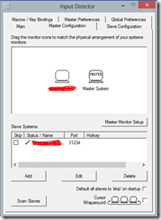
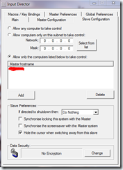

Inspired by @SamSaffron’s [post](http://samsaffron.com/archive/2013/05/03/eliminating-my-trivial-inconveniences) I tried to improve my ‘workflow’ today. I have a desktop running Windows 8 and a laptop running Windows 7. Though I don’t use the laptop often, it’s mostly because it’s ‘odd’ to type on a laptop kept on an Rain Design M-Stand.

Sam mentioned he couldn’t get [Synergy](http://synergy-foss.org/download/) to work and got a commercial application. His use case is more complex where he works between a PC and a Mac with the PC hosting his Ubuntu VM.

Given my scenario was simpler, I tried Synergy first, but after two hours of fiddling I only managed to get it working partially. Only mouse integration worked, and had a strange issue that if I moved from the Master (the machine with the keyboard and mouse) to the Slave once I minimize a window I would loose control completely. I had to do Ctrl+Tab on the child keyboard to get back mouse control. Also, often mouse clicks on title bar did not result in context switches. Keyboard inputs never worked. Thus rendering the experiment useless.

Next I tried [Mouse Without Borders](http://aka.ms/mousewithoutborders) by Microsoft Research team. It behaved almost the same as Synergy, and then suddenly stopped connecting with the slave computer. Busted!

# The Solution – InputDirector

Finally I got hold of [InputDirector](http://www.inputdirector.com/downloads.html). It is an old solution that has not gone from Beta to Production version since September 2012. But it has a rather nice history and it did not install any spyware/malware/toolbars. So I installed InputDirector on both the machines.

On Windows 8 (which is my Master) it threw a compatibility warning at the beginning of the setup. So I cancelled the setup, right clicked on the installer, went to the Properties and set compatibility to Windows 7. After that, when I installed the application, it did not give any warning.

Designated the desktop as the Master.

Designating it as master requires you to do two things

1. Add a Slave System: This usually happens automatically. InputDirector automatically detects other InputDirector instances in the same Subnet.
2. Second thing is positioning the system with respect to your master. As you can see above my Slave machine is on the left of my Master System. By default it was on the right. I just dragged and dropped it on the left. This you can only do after a client has connected. So keep this in mind and re-visit once the client/slave is connected.

Next I designated the laptop as a Slave

This usually implies Adding the name of the Master machine. None of the above radio buttons are selected by default so it refuses connection requests by default. After I added the name, I had to go back and do the Step 2 above. Once done I was all set!

## Performance

It takes about 1MB on the server and about 5MB on the client (as per Task Manager). When you are flitting between Client and Server fast it takes a max of 2% CPU on each, otherwise it' takes about 1% CPU or less. Both my machines are Core 2 Duo machines. So newer machines should handle it even better. Overall, totally acceptable performance.

## Bonus Items

Copy+Paste from clipboard works too. The Slave image you see above was copied from the slave machine and pasted in the master where I am typing this out. Awesome, right?  
File copy however does not work like that .

There is a nice ‘ripple’ effect around the mouse as you move from Master to Slave and back. It gives you a visual cue that you are changing over from one machine to another. It can be switched off if you don’t like it.

# Conclusion

Like with everything, your mileage may vary with respect to which solution works best. I mentioned three that I tried and one that worked the way I wanted it to work! This is a productivity must-have. Wish I found it earlier when I wrote a 4700+ word megathon about a product that was installed on the laptop. I wouldn’t have had to resort to keyboard swaps .
