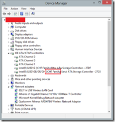
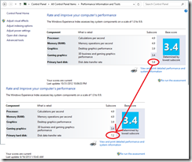

I’ve been holding off on an SSD upgrade for a very long time now, simply because I didn’t want to be limited to 40-60Gigs of drive space even though it’s more than enough for an OS partition. But cost of SSDs have fallen pretty fast over the last 6-8 months and I saw a Kingston 240GB available for little under INR 12K at Flipkart last Monday. So I went for it finally.

I got the **Kingston V+200 240 GB SSD Internal Hard Drive (SVP200S37A/240G)** from Flipkart for Rs.11,542/-. Snagged an extra 10% discount during one of their Monday Sale events.

# Installation and Upgrade

The physical installation was a little tricky because the above model unfortunately didn’t come with a bay converter. Neither did it come with SATA cable or screws (as falsely promised by Flipkart).

Anyways, for someone who’s been assembling computers for the last 15 years I had enough backup screws . The SSD came with a self adhesive plastic rim that’s supposed to act as a spacer if you are using it in a laptop. I used the spacer as a stand as I rested the SSD belly up on one of the bays and put in two screws to hold it in place. (Use screws that come for CD Drives, the other cabinet screws are bigger, the drive is delicate so don’t force bigger screws in, you might just void the warranty).

Once connected, I booted up to the Windows 8 Partition I had and installed the [EaseUS Todo Backup 6.0 Free](http://www.todo-backup.com/products/home/free-backup-software.htm "EaseUS Todo Backup 6.0 Free").

Actually I won’t repeat the steps, you can just follow [LifeHacker’s excellent guide](http://lifehacker.com/5837543/how-to-migrate-to-a-solid+state-drive-without-reinstalling-windows). That’s what I followed.

I did not have an issue with ‘emptying’ my HDD because my existing drive was 250 Gigs too. I could have literally copied partitions and run with it. But I took the opportunity to remove some junk from **My Documents** and **My Downloads** which I was anyways going to put on my HDD once I restored my system. Turns out I was using only about 80Gigs of space in total .

> _**Note:** If you follow the guide, once done with the partition swap and booted into Windows 8 with your SSD, it is suggested that you format your old hard drive. At this point you will be able to see a 300 odd MB ex-system partition ON THE HDD. Feel free to remove it and reclaim the entire space._

Since EaseUS Backup is actually a Backup tool it installs a couple of services. I didn’t want to use EaseUS Backup once I was done with my restore, so I disabled the services and apparently EaseUS doesn’t like that so it doesn’t run without it. Not a big deal, just thought you might want to know.

# Testing Performance

> _**Warning:** Here on things get all geeky so don’t blame me if it’s long and winding._

Who doesn’t want to know how their ‘investment’ improved things .

The first **Wow** was the near instant boot up. My desktop now boots nearly as fast as my Surface RT. Actually my BIOS startup takes longer than going from the boot logo to login page. Visual Studio snaps open, Word/Excel/PowerPoint fly open in no time.

Fair enough but how did the SSD actually stack against the competition? A quick search revealed the excellent [AS SSD Benchmark utility](http://www.alex-is.de/PHP/fusion/downloads.php?cat_id=4&file_id=9 "AS SSD Benchmark Utility") (Direct Download, you can visit [Alex’s Site](http://www.alex-is.de/PHP/fusion/news.php "Alex’s Site") for more information, though major parts are not in English).

So I ran the Utility and my results were as follows:

## First the HDD

Well I didn’t have anything to compare it against so I played along and ran it on the SSD next

## Next the SSD

Billions for blue blistering barnacles, that’s crazy compared to the HDD.

Sequential Read: ~3x  
Sequential Write: ~2.5x  
4K-64K blocks Random Read: ~30x  
Access Time: ~90times faster

But after a little searching it was apparent this was nowhere close to the peak performance the SSD was capable of. According to this [thread](http://www.overclock.net/t/754763/as-ssd-benchmark-thread "AS SSD Benchmark at Overclock.net"), it wasn’t really optimal performance.

I was worried that the ‘Sandforce Controller’ was not working correctly. After hours of searching (and multiple BIOS updates later) the conclusion was much more reassuring.

## AHCI vs. IDE Modes for SSD

AHCI stands for - _**Advanced Host Controller Interface**_ a relatively new standard for Storage Controllers (could be used for others as well I don’t know). Whereas IDE is the older **_Integrated Drive Electronics_** standard. AHCI has come into prominence with SATA and supports Hot Plugging and Native Command Queuing among other ‘stuff’. Long story short you need AHCI to leverage optimal performance out of your SSD. Now here is the kicker that took me hours to find out:

> _The ICH7 chipset does not support AHCI and no amount of BIOS upgrades is going to get you this ability_
> 
> 

Most sites will tell you to enable AHCI in your BIOS and if you go to buy a Motherboard today it will probably come with AHCI default. But unfortunately my M/B is an ageing 6 years+ for a first Gen Core 2. It never had AHCI support to start with.

Unfortunately I didn’t find things out in the order I am presenting here, so I spent about half a day researching how to upgrade my BIOS and applied all the upgrades available to it, which did lead to a more stable S3 sleep mode, but no AHCI. But I just couldn’t stop until I read on [this site](http://www.mail-archive.com/linux-ide@vger.kernel.org/msg02213.html) that AHCI is not supported on ICH7 chipsets! It pointed to some Intel documents that seem to be currently unavailable, but anyway, that’s when I stopped.

So if you have the Chipset ICH7 stop looking of AHCI support in your BIOS. There are other variants of ICH7 like ICH7-DH, ICH7R and ICH7M that have AHCI support, plain vanilla ICH7 does not, end of story.

## How to tell and IDE Controller vs. AHCI

This one was confusing to find at first too. So the shortcut is to look at the AS SSD and spot the controller name

If it says ‘**intelide**’ you have an IDE controller. AHCI controllers usually say **iastor** or **msahci**, first one being an Intel Driver and the next one being a native Microsoft Driver.

Well, that wraps the story of my SSD upgrade. If you have an **ICH7** I hope it saved you some time from looking up a BIOS Setting.

Someday soon, I’ll be upgrading to a new M/B + Processor and this SSD should be right at home. I’ll post an upgraded result then.

For now, I leave you with the rather embarrassing overall WEI score of my PC before and after the upgrade (psst, HDD score went from 5.9 to 7.2):

PS: This post has been a month in the ‘writing’. As you can see from the timestamps in the above image, I did the upgrade just about a month ago. So far so good, all’s well with the Kingston drive on Windows 8 Pro, perfectly stable and much smoother performance.

> _Footnote - I was a happy FlipKart customer till this purchase. First they got the model number and the package contents mixed up resulting in falsely advertising things they didn’t have in the package. Next, on complaining, they responded 5 days later expressing willingness to exchange it. I had installed after waiting for 72 hours without response to my complaint. They closed it well by giving me a discount voucher of Rs. 500/-. Things would have ended there but a few weeks later they took down my review of the product from their site and sent me a mail demanding I change my review (it was rated 3 star initially and I upgraded it to 4 star with details of all that was happening). That’s the straw that broke the camel’s back. I refused to change the review because it had all the ‘facts’ as it had happened. I loved Flipkart but their stupid behavior has left me with the feeling they don’t want their customers to benefit from true reviews and they just want “oo nice service Flipkart'” type reviews instead. Well, I might as well shop from ebay in that case. Also when I last checked the SSD was still advertised with the incorrect Model Number vs. Features. Never shopping at Flipkart again!_
