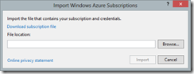
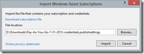
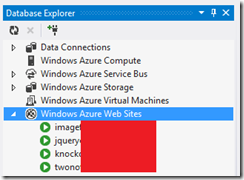

> Updated August 1, 2013: You can also control your Blob storage!

If you have Visual Studio 2012 Update 3 you can hookup your Visual Studio to manage Azure Web Sites remotely from inside Visual Studio.

To do this, open Database Explorer and Right click on Windows Azure Sites. Click on **Import Subscriptions**

In the **Import Windows Azure Subscriptions** dialog click on **Download subscription file.**

This will open up a browser and if you are logged in to Azure already will directly generate the subscription file and download it. If you are not logged in, you’ll have to log in first.

Save the subscription file.

Back in Visual Studio, select the downloaded file and hit **Import.**

This will import the subscriptions and in the Database Explorer you can now expand the Azure Websites node and see all your deployed sites.

You can right click on each site to get additional options like, Stopping/Starting, Downloading publishing settings, Viewing Streaming logs etc.

Pretty neat!

**_Update_**: Not sure if this was in place already but I noticed it yesterday. Once you have imported your subscription you can also use Azure Storage from Visual Studio. Two things that are really neat about Azure Storage integration is ability to create Blob Containers and Retrieving the Connection String directly. Both can be done from the (right click) context menu.

