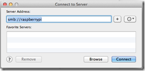
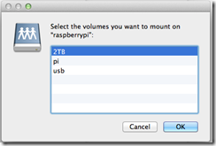
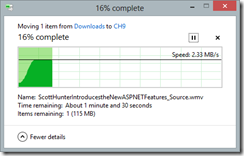

Have been meaning to put this post together for a while, but I wanted my setup to stabilize a bit to gain confidence that it ‘works’. Now that I’ve been using this for over two months and things have stabilized time to put it down.

# The Requirement

I literally have 500GB external USB drives strewn all over the place with multiple copies of multiple things and I have NO clues what is where. So when I sat down to list the things I wanted, I came up with the following:

1. A central place in my Home Office to store all my backup, training videos, music, documents and pictures.
2. Accessible by Macs, Windows 7, Windows 8, Windows 8 RT and if possible on iOS.
3. Low powered, always on, Uninterrupted Power Supply backed.
4. Accessible over WiFi. All my machines are connected via WiFi and that includes my desktop. The only thing connected to the Router ‘was’ the printer. So my ‘Network Storage’ had to be available over wifi.

# The Approach

I had a Pi with me for a while but didn’t do much with it except for a few botched attempts at getting XBMC going on it. Didn’t workout all that well. The Pi was a perfect device to ‘power’ my project because -

1. It ran Linux with aplomb
2. It was low powered
3. I could connect it to my router wirelessly using a Micro Wireless Dongle, but this worked on Wheezy only and not RaspBMC.

So all I needed was to get a big USB drive, plug it in, do a Samba share (at the minimum) and be done with it. With that goal I set off.

# My Kit

The kit comprised of the following

1. One RaspberryPi with a case to securely hold it. I got my Pi initially from Element 14’s official distributors in India [kits’n’spares](http://kitsnspares.com/user1/buyproduct.asp?id=79) and got the case much later from [www.crazypi.com](http://www.crazypi.com). Now you can order directly from CrazyPi, they seem to have full RaspberryPi kits (including enclosures and power-supplies) in stock and as of today they are seem cheaper too! You’ll also need an SD card for the OS. I used the vanilla Wheezy image!
2. Next, I needed a the external USB drive of course. I got a 2TB Seagate Expansion drive. I was careless while purchasing and realized it was a desktop drive instead of a portable one. No harm done, it’s tucked away behind my Printer so I don’t have to see it anymore. It’s a USB 3 drive but the Pi can leverage only USB 2 speeds.
3. High speed WiFi router. I realized this after my initial setup hence the warning up-front. Trying to play video over a 54Mbps wireless router isn’t really going to cut it. My primary router was a TPLink 54Mbps DSL Modem + Router. I upgraded to a TP-LINK TD-W8961ND 300Mbps ADSL2+ Wireless Router with Modem. This gave me two things:
    1. Higher Bandwidth of course
    2. I got more than 1 LAN port. Earlier my only LAN port was being used by my HP network printer, this meant even though my Pi was stationary it had to use a WiFi connection. This was significantly degrading the reliability of the share and trying to play a remote video file was nearly impossible. With the additional LAN ports on the router I could plug in the Pi to the router directly so one wireless hop was reduced. So moral of the story, make sure you Pi is connected to your router over LAN.
4. Now you don’t need this, but I had an external powered USB hub that I initially used to connect Keyboards etc. to the Pi. So I connected my USB drive via the USB hub.

# Samba Server on Raspberry Pi

Samba is the protocol used by Windows to connect to non-windows network shares. Jeremy Morgan who has a set of very good Raspberry Pi tutorials has detailed how to setup the Samba share on a Pi [here](http://www.jeremymorgan.com/tutorials/raspberry-pi/how-to-raspberry-pi-file-server/ "How to setup Raspberry Pi as a file server"). Things couldn’t be easier than this, all credit goes to him so I won’t even bother repeating his steps.

Only caveat is that now-a-days Wheezy auto-mounts USB drives when X is loaded. So you HAVE to un-mount before you start. If you don’t and skip the permissions step, you will end up with a read only folder and that won’t be very useful.

Now connecting to the share on the Pi is easy from both Windows and Mac. On Windows just use the hostname of the pi on your explorer. e.g.

It will ask for the password first time, enter password, ask it to remember the password and you are done.

**_Since my Surface RT is a ‘Windows’ Machine I didn’t have to do anything different. It ‘just worked’ with the share as well._**

From the Mac, open finder and hit Command+K (Connect to Server)

Put in smb://raspberrypi  

Click Connect  

Select the shared folder you want to mount and click OK

All done. You now have a Samba share mounted as a drive in your Finder.

Unfortunately my iPad and iPhone are not privy to the shared goodies. Since I use them so little I don’t intend to spend too much time worrying about them.

# Performance

Well, across the house now I can access my videos wherever I want. I can access 720p videos without a hitch most of the time. I can listen to music from all my machines.

I have a old 54Mbps Linksys router rooted with DDRT and setup as repeater which is pretty useful in the inner rooms. Playing over this router can get a little jerky at times but it mostly works.

I’ve setup Windows 8 File History to use a folder on the share and it works like a charm.

I’ve slowly started centralizing all the music I bought and the Pictures I took over the years. It will take some time but will happen.

I get up to a couple of Mbps when transferring files to the shared drive.

So overall I am happy with this setup. I’ve not tried to connect my XBox to this share, that shouldn’t be a problem either.

# Downsides

I am not sure if the HDD is always on, it probably is. This may affect its life. It is worth investigating a power-saving mode for the Pi, but that’s for another day.

Last but not least, calling this a ‘Personal Cloud’ is a significant stretch of imagination, thanks for humoring me .

So as of now my Pi is doing it’s duties as a File Server. Someday in the future I’ll use it better or maybe just get another one .
