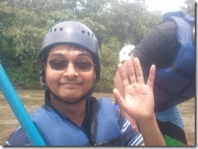
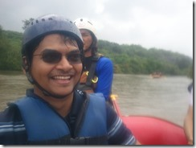
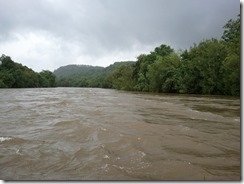
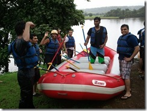
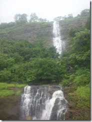
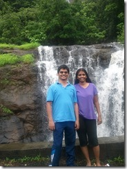
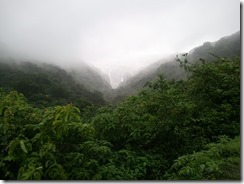
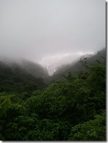

I am not the typical adventure sports guy, but thanks to my better half, we have our fair share of outdoor adventures. Our last outing was a year ago when we went trekking 16 kms from Lonavala to [Rajmachi](http://en.wikipedia.org/wiki/Rajmachi "Rajmachi on Wikipedia") a remote village tucked away in the Sahyadris. That was an embarrassing tale of unfit legs on my part. I never came around to finishing that post and a year has since passed.

This time, thankfully Praji decided to do something that had less than 16kms of trekking. So Rafting it was. We booked our trip through the same adventure sports group [Trek’Di](http://www.trekdi.com/).

# The Journey

Journey from Pune to Kolad via bus/taxi is extremely picturesque in the Monsoons. Road condition gets worse as Monsoon progresses. For us it was patches of bad roads, in the ~93 kms drive from Fergusson College’s main gate (our designated starting point) to the village Rawalje.

(From: Fergusson College, Shivaji Nagar, Pune, Maharashtra, India To: Kundalika River Rafting Start Point, Raigad, Maharashtra, India) Map Courtesy – Google Maps.

Our journey was uneventful except for the sighting of this strange ‘bird’, locally known as Shahamurg (it belongs to Ostrich family I guess).

It’s a big bridie, the gentleman (who was driving our car) in the picture is about 5’5” tall, so the bird is about 4 feet upto its back. Assuming it can crane it’s neck up add another feet or so to it. It small by Ostrich standards but anyways. On our way back we saw another one meandering by the roadside, probably slightly bigger.

Apart from this little event, it was green hills and beautiful waterfalls all the way.

It took us three hours including a ~30 minute stop for Breakfast and the 2 minute Shahamurg photo-shoot breaks, to get to the River rafting starting point.

# Rafting

The River Kundalika is a tiny river that has multiple irrigation/hydro electric projects on it. One of these projects does a controlled release of water in the Monsoons resulting in enough volume of water on the river to do rafting. The 12kms odd stretch from Rawalje to Kamat has a few rapids a couple of which are rated Grade 3. There are a few more Grade 1 and Grade 2 as well.

The water release happens at about 10 am so rafting has to start around that time. We reached exactly at 10 and found loads of eager adventurers.

We get a quick round of instructions from one of the organizing group members telling us how to use the gear. Then we get our life jacket, helmet and oars and are assigned a Team lead – the guy who knows what’s going on . Including team lead we were 10 of us on the Raft.

We get to our raft on the shore and our team lead familiarizes us with the basic commands he’s going to issue:

> **All Forward:** Team on left and right of raft paddle forward  
> **Left/Right Forward:** Team on left OR right of raft paddle forward  
> **Left/Right Backward:** Team on left OR right paddle backward  
> **All Backwards:** Everyone paddle backwards  
> **Stop:** Stop rowing, keep oar securely  
> **Down:** Duck on the inside and hold on to the safety rope for your lives 

After a round of shadow rowing practice, we haul up the raft and head for the river. We are off in less than a minute and soon loose track of time, with our ears keen and perked for instructions from Team Leader who is at the back of the boat.

The Level 1s and 2s are fine, little splashing and all wet in no time, around the midway comes the Level 3s, we row, we duck and row again, raft gets flooded but stays right side up, no one falls over. Woo hoo…

Only for once the ‘Left’ team forgot to stop paddling ‘Back’ led to the raft getting too close to the right bank and all of us getting whacked on the head by the tree branches. For a brief moment team lead got mad at us and a loud STOP! But we were soon in control again and off we went.

Things are spiced up along the way with a heavy downpour as well. Don’t attempt it if you don’t like getting soaked.

# Floating in the water

Near the 3/4th mark river has quieted down and team lead suggests everyone jump off the boat and splash around! Knowing very well that we can’t swim, he seems to be calmly confident that nothing’s gonna go wrong. With faith in his calmness and my life jacket I jump in… Glup… gulp… after a few anxious moments I finally manage to get head up, feet down and I am walking in water. Having never been in water deep enough for my feet not touching the ground, this is a new experience. But the lifejacket makes it really easy. Hooking my hands in front of the jacket and pushing it down kind of guarantees I am in a vertical position, head up. Soon we are floating in the river’s current and have put some distance between ourselves and the raft. Time passes by idly and after what seems not enough idling, Team lead orders us in the boat.

We decide to spice things up by challenging one of our fellow rafts to a friendly race that we promptly loose because we get bumped by another raft and end up doing a 360 . All in fun and games. But unfortunately fun time is soon over and lazily and reluctantly we head for our ‘station’.

We get off, drag the raft on-shore and after a few photo-ops haul the raft up the river bank ready to be transported back.

## Pictures

Here are some random pictures taken through my Samsung Focus Windows Phone. It was duly water-proofed by a ‘hi-tech’ Tesco zip-lock and it amazingly remained dry all throughout the journey even though I was completely soaked. I didn’t jump into the river with it, it was left at the bottom of the raft while I was floating around.

# Change, Lunch and Drive back

There is a reasonably clean facility about a km from our landing location, Trek’D had the car ready for us, but we opt to burn out the rest of the adrenaline and walk to it. We changed into dry clothes before proceeding to a buffet lunch consisting of chicken gravy, rice, hand rolled bread (chappatis) and other local preparations. Lunch done, we head out.

# The Beautiful Western Ghats

The return journey is all about soaking in the beauty of the Western Ghats. I’ll let the pictures do the talking.

- One of the many many waterfalls

- That’s us in front of the waterfall

- At Plus Valley – A junction of two valleys known as the plus valley presents a breathtaking view.

- Note how the waterfalls have golden glow. Behind the clouds the sun is shining on the waterfall

- More waterfalls along the route, with clouds kissing the hilltops

- Dark and beautiful

- Quick stop to grab coal-baked corn delicacy (Bhutta)

After more un-captured but fully absorbed sights we reach Pune city (around 7pm). We disperse at the same location where we had met with fond memories of a nice little adventure trip.

Thank You dearest Praji for forcing me to move my lazy bum and come along on this wonderful trip!!! Cheers to our 9 years together!
