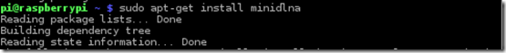
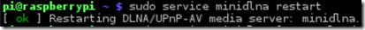
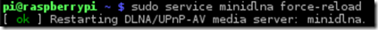
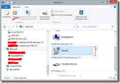
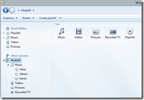
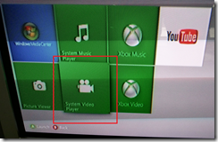

In my [previous](http://raspberry.io/projects/view/naspberry-pi/ "My Raspberry Pi powered personal cloud") article I had mentioned how I setup a Samba based file server using my Raspberry PI to share media across my computers in my home network. It works fine, but still it’s not really streaming the media and I figured out that I still couldn’t use my media via the XBox because XBox doesn’t work with Network shares unless they are over UPnP. So the next quest was to setup a UPnP server on my Pi.

Turned out to be really easy thanks to MiniDLNA. [This article](http://raspberry.io/projects/view/naspberry-pi/ "NASberry Pi") has all the steps if you need Samba+Transmission (Torrent Client)+OpenDNS.

# Setting up MiniDLNA Only

I already had Samba installed so I skipped that step and just installed MiniDLNA. Also I didn’t need it over the web, so I didn’t need Transmission or the Torrent Client, most of my media are training videos that I download from their respective sites. I setup MiniDLNA only and used nano as my editor (yeah, still no good with VI)

> sudo apt-get install minidlna

> sudo nano /etc/minidlna.conf

While updating the minidlna.conf file you have the option of specifying Video/Music/Pictures folders. I already had my media split up in those categories so I used those configurations.

Give it a friendly name to identify over the network

> friendly\_name=MediaPi

Hit Ctrl+X and say Yes when asked if you want to save the changes. This will get you out of Nano. Now restart the service

> sudo service minidlna restart

Force it to rescan for a good measure (though if you are patient enough this might not be necessary

> sudo service minidlna force-reload

Once you are done reloading, give it about 5 minutes, yeah, walk away from your terminal.

# Enjoying your Media

After MiniDLNA is done scanning the folders are you good to go.

## From Windows 8

If you have connected to a ‘Private’ network, Windows will automatically look for Media servers and you should see the Name you gave above (MediaPi) in my case:

You can select it and open it in Windows Media Player, or directly open Windows Media Player and start playing from it directly

## From XBox

Just start your ‘System Video Player’ App (NOT XBox Video).

The Friendly Name should popup automatically assuming you are on the same network

# From iOS

Well iOS doesn’t recognize UPnP and DLNA devices out of the box. But fear not, there is an ‘app for that’. Yeah, cliché I know. Most app players cost a bit of money, but I found ‘Fresh Player’ to be a usable application. Interestingly I can’t connect to the MediaPi at the moment with it, so it may not be the most ‘reliable’. I’ll update once I find a decent player.

Well, that’s a wrap for the day! Things you can do with this tiny $35 computer is simply amazing! The fun continues!
