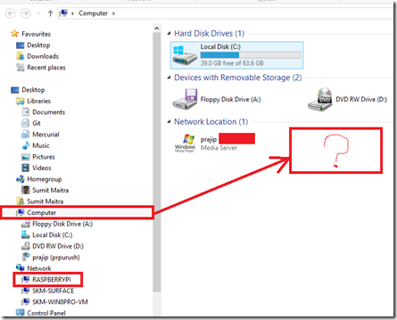
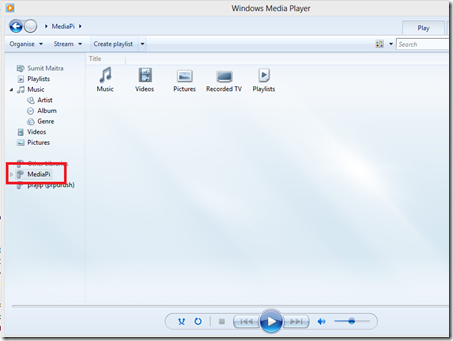
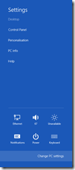
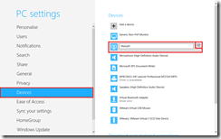
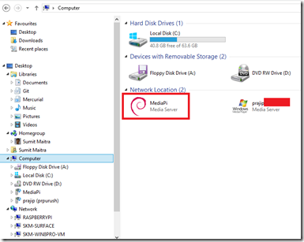

Previously I have blogged about how I converted my [Raspberry Pi into a DLNA Media Server](http://sumitmaitra.wordpress.com/2013/08/09/completing-my-pi-powered-personal-media-cloud/). When we moved to UK I brought along my media server and it was up in a jiffy. However, yesterday, when I sat down to build my long pending Windows 8 Media Client on my rebuilt Windows 8 VM, it simply wouldn’t show the MediaPi (name of my Media Server) when I selected ‘Computer’ in Windows Explorer.

But if you see, the machine was on the Network (RASPBERRYPI). Why is this important?

Well, the WinRT API to retrieve all the Media Servers on the Network is as follows

await KnownFolders.MediaServerDevices.GetFoldersAsync();

If Windows Explorer is not showing the Media server, the above API will not return it either.

Twist in the tale was that the Media server was visible when I selected the ‘Network’ node in Explorer.

To make things more confusing, when I started Windows Media Explorer, the MediaPI came up there too.

This kind of scenario is pretty much a disaster because it’s nearly impossible to search for. So first I posted in on Windows Forum, but continued fiddling around. Finally I found a solution.

# The Solution

1\. I brought up the Settings Charm and click the ‘Change PC Settings’

2\. When I selected ‘Devices’ and I saw MediaPi but it had an ‘offline’ label. So I selected it and clicked on the (-) icon on the top right corner. This removed the Device.

3\. Next I started Windows Explorer again and Clicked on ‘Access media’->’Connect to a media server’.

4\. Windows found the MediaPi device and listed it in the Search Dialog. I selected it and clicked ‘Next’, Windows said it’s installing the ‘Required Files’ and once it was done, I could see the Media Server again.

Sweet! Done there!

I put the same solution back in [Forum question](http://answers.microsoft.com/en-us/windows/forum/windows_8-pictures/windows-explorer-doesnt-show-dlna-server/99274d81-e09c-41f0-be38-7750797e7528) as well.
