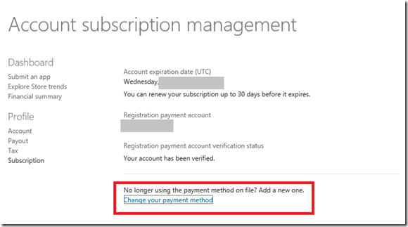
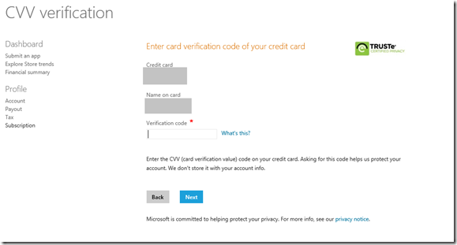
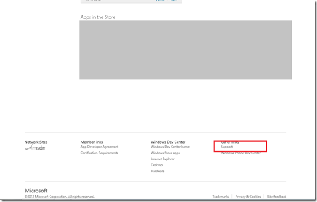
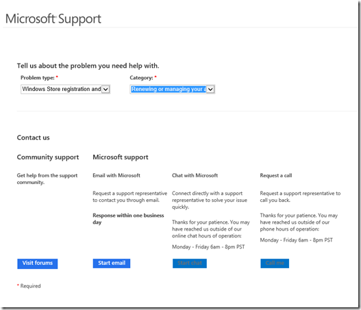
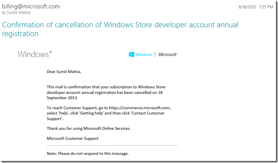

Time has come when I should put this down on the interwebs for people to find easily. Given that Windows 8.1 is due and Windows Store is a little over a year old now, lots of people will be running into this issue. I had a horrid time renewing my Windows 8 Store Developer account mostly because of Microsoft’s shitty support site implementation which repeatedly misguides you. So here is what you have to do when you receive a mail from MS saying your store account is up for renewal (usually sent one month in advance).

**Step 0:** If the card you entered initially when creating you store account is all good, hasn’t changed, been renewed or replaced, you are all good. Things should sail through. But if the card details have changed read on!!!

**Step 1:** Don’t go to commerce.microsoft.com It is not a hyperlink here for a reason! Don’t go there, nope, no, NEVER! Unfortunately, that’s what Microsoft’s reminder mail will tell you, I got the following and I swear, if you follow any of these steps to try and change payment options you are screwed. The thing that MIGHT get done on the site is adding a new payment option (card), but the Commerce site’s chat assistants know batshit about Windows Store Dev account and will not be able to switch payment options, resulting in your account getting terminated eventually due to lack of payment.

**Step 2:** Log in to developer dashboard at [http://dev.windows.com/](http://dev.windows.com/) with your store account details.

**Step 3:** Navigate to your dashboard and **IGNORE** all renewal notices and click on the Subscription link on the left hand Menu as show below

**Step 4:** Use the Change Subscription link in the Subscription Page

**Step 5:** Provide CVV Number of OLD Credit Card to continue. Now it is most likely you don’t have the old credit card anymore, if so, time to start crossing fingers, but read on, it might just save your butt from a lot of hurt.

**Step 6:** Go Back to Dashboard, scroll to the bottom and click on Support (try to open it in a new Page/Tab).

**Step 7: Ignore all the damned links and scroll to the bottom and click on the ‘Contact Us’ link highlighted below. Any other link is likely to put you in an infinite loop with chat agents who know nothing!!!**

**Step 8:** Select Category = ‘Renewing or managing your …’. Hope that Chat sessions are working as you can see below at the time of writing this, they were not. If they are not working click on ‘Start Email’. Once you send the mail, hope that you get a Ticket number. Use the ticket number in subsequent chat/email responses.

**Step _n_:** After you have initiated support, things don’t happen magically, you have to poke/prod/remind. Also once they have confirmed that the new card information has been updated, you are not off the hook. On the day of the expiry you might receive a mail saying your account has been cancelled.

If so, start at Step 1 and repeat. Do not try to get help from any of the links suggested in MS emails. Use the link I showed in Step 7 above. If you are swearing like a sailor after doing all that, well contact a Windows Client Developer Platform Evangelist, be nice, tell all you did, and hope he/she can escalate and get the right person on the job.

**Other Trivia**

International Debit cards don’t work, nope they don’t, trust me! Even if you used them the first time, they no longer work, some shitty payment gateway this is! Also they will deduct the minimum amount successfully from the debit card for card confirmation but will fail to deduct the actual amount resulting in notices like this:

# Conclusion

I have 6 hilarious chat conversations saved and a 18 emails long mail exchange to show for my ‘efforts’ to renew my account after MS cancelled it even though I has supposedly changed my payment option in time; but that’s for another day.

It’s kinda batshit crazy trying to change payment option for your Windows 8 Store Dev Account. So just remember this, and next time your card information changes, update your store account before you throw out the old card!!!
