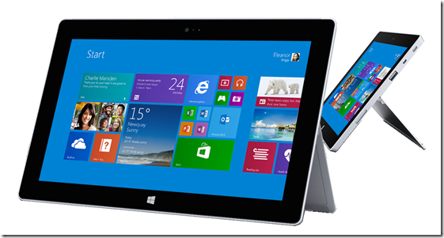

Today’s announcement of Nokia Lumia 2520 made me happy briefly before I realized the inevitability – Microsoft has bought Nokia’s Lumia brand so once the acquisition goes through, either the Surface RT or the Lumia tablet would be canned. As a Surface RT owner and admirer of the Lumia brand it’s not a good scenario, but that’s not what this post is about, the thought of one of the products getting canned rekindled memories of the Courier. Microsoft’s parallel tablet OS experiment that lost out to Windows 8.

If you have never heard of the [The Courier](http://en.wikipedia.org/wiki/Microsoft_Courier), you can see the concept [here](http://www.engadget.com/2010/03/05/microsofts-courier-digital-journal-exclusive-pictures-and-de/) and read how it didn’t [make](http://news.cnet.com/8301-10805_3-20128013-75/the-inside-story-of-how-microsoft-killed-its-courier-tablet/) it.

As you can see, it was an ‘innovative’ idea. But it lost out to Windows 8. At the time I didn’t know about Windows RT and was in general bought into the idea of continuing with the Windows lineage. But then months later, Microsoft Announced Windows RT and the Surface RT.

When Surface RT launched there was an OUTCRY from the tech bloggers as to it was ‘confusing’ because it was Windows that didn’t work with ‘old’ Windows apps. I am pretty sure these are all Apple/Google fanbois who use a Mac or Chromebook (pun intended) for their day to day work!. I bought an RT fully knowing what it is not and I am sure the ‘very few’ people who bought it, knew what they were doing.

But knowing what I knew, I was still surprised how much Windows baggage Windows RT contained and probably the biggest drawback was battery life. Jeff Atwood (of StackExchange fame) had a [scathing take](http://www.codinghorror.com/blog/2013/10/why-does-windows-have-terrible-battery-life.html) on it a few days back and I wrote about it myself in my [Surface RT reviews](http://sumitmaitra.wordpress.com/category/all-articles/gadgets/surface-rt/). Much as we would have liked it Windows RT wasn’t a reboot but a re-compile with unnecessary pieces weeded out! But 18 years of an OS shows and it takes much longer to ‘weed out’ un-necessary gremlins. Would a fresh/ground up Courier OS for ARM tablets have been better? I am not saying Windows RT is not touch friendly, but it’s definitely not battery friendly and neither is it flying off the shelves after being bracketed as an iPad wannabe!!!

So after looking at Nokia’s apps for Photos etc. and thinking about the past few days of blogosphere I was thinking what if Surface RT was the Courier and Windows RT was Courier OS? Surface Pro could have been the productivity tablet, while Courier was the entertainment oriented branding! I am not even saying it should have been a split screen form-factor, a clean start, a different branding, hit battery life and some of the Courier features of course!!! Vendors could have used the Windows Phone 8 ecosystem to launch Tablets while the Courier would have been MS’ niche product.

Well, one can dream!!!
