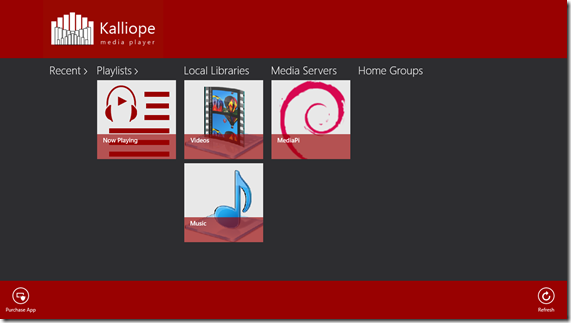

I am happy that [Kalliope Media Player](http://www.kalliopemedia.com/ "Offical web page - Kalliope Media Player") for Windows 8.1 is live on the [Windows 8.1 App Store](http://apps.microsoft.com/windows/app/kalliope-media-player/55bb7897-a784-4afd-ac0d-a4228dd38299 "Kalliope Media Player in the App Store"). While features and other details are coming up on the official website I wanted to write down the story behind why I built it in the first place. Specially since there are about 600 odd ‘Media Player’ apps in the App Store already!

It was around early 2013 when I realized how half baked Window’s default media player was for Windows RT. On Windows x86/x64 you could always download VLC and be done with it, but Windows RT was a real problem. It frustrated me no end that the default media player couldn’t prevent the device from going to sleep and when it went to sleep it would resume when awakened. Instead it would crash and I would have to start all over again! It couldn’t play properly over network shares, and when I finally setup a UPnP server just for it, it still provided subpar usability.

After much searching I found PressPlay media player that overcame some of the issues but lack of Playlists were still a pain in the butt and prevented me from using Windows RT as a true consumption device that I wanted it to be.

So finally I threw in the towel and decided to spend resources of my own company to build something I wanted. I assumed it to be about 3-4 weeks (part-time) worth of effort and had assumed I would easily make the Windows 8.1 launch (Boy, I was wrong!).

Features we wanted were:

1. Play Videos without interruption (not worry about touching screen/moving mouse to prevent it from going to sleep mode).
2. Resume from last Paused or Last Stopped
3. Good ol’ Playlists (front and center not some obliquely hidden feature)
4. Audio/Video and Pictures support
5. Works on Windows 8+
6. A paid app because
    1. A free App provides very little incentive for support
    2. I am not a fan of advertising as a revenue model (yeah I know old school)
    3. I didn’t want to go down to the level where I would have to show ads during playback to make money.
    4. We don’t want to sell our users or their data down the river!!! NEVER!

# Start, Stop, Stutter…

After development started on July 18, 2013 (date when Repository was created), we started with the experience of a few articles I had already written for DotNetCurry! So getting the basic functionality wasn’t a big deal. However, priorities soon shifted and work stopped until Windows 8.1 was almost released.

We had a 8.1 Preview VM ever since it was made available, so one day I decided to try out the build on 8.1 and got stumped

> You cannot target Windows 8 using **Visual Studio 2013 Express** on Windows 8.1. You have to retarget your project to Windows 8.1 and there is no going back (and no way to maintain common solution)! And by cannot target I mean it doesn’t load the projects unless you retarget. So if you want to build an App for Windows 8 and 8.1 using Visual Studio Express tooling you need both Visual Studio Express for Windows 8 2012 and 2013 on a System running Windows 8.1.
> 
> If you don’t want this pain you have to bump up a couple of SKUs in Visual Studio 2013!

This was a massive fiasco, at least for us since we use the Express Editions! Went back to Windows 8 and continued development till I had a working prototype with the UI flow. At the same time I went through the improvements made for better Media support in 8.1, mostly by working through the //BUILD 2013 sessions. By the time Windows 8.1 went GA it became quite clear that 8.1 would be the quicker platform to wrap this up. As soon as we got our hands on 8.1, we branched the code out and moved development to 8.1.

Bulk of the work happened in November 2013, with the aim to go live before Thanksgiving and Holiday Season fervor, but alas!

# Pivoting the UI Flow

Towards the end of November I remember doing some A/B testing with friends and family and the overall reaction was ‘ahem’. So all the three main pages Home/Browser and Player underwent an overhaul. The color palette, information density and UI flow was all modified to make it ‘easier’ and more conformat with Windows 8 aesthetics!

I had a fairly unimaginative name lined up for it ‘Modern Multimedia Player’.

> Credit for the Name, Logo Inspiration and Color Scheme goes to the volunteer work done by **Praji**, Thank you dear!

## The name ‘Kalliope Media Player’

Kalliope is derived from the word [Calliope](http://en.wikipedia.org/wiki/Calliope_%28music%29 "Calliope Music - Wikipedia") which is name of a Steam Powered Musical instrument of the yesteryears. It’s also the name of a tiny Humming Bird.

So if you look at your Logo it’s a 2D representation of a Calliope’s Musical pipes.

All the Graphics and artwork was done using Paint.NET in house. I like to think they came out well, but do let us know what you think.

# Framework Curveball

Once we were happy with Video playback performance, we moved to testing Audio, we were smacked by a Curveball produced by WinRT. As an Audio player I expected my WinRT device to play audio even though it went into connected standby, that’s what all the Sessions said, but it just wouldn’t work! After searching high and low, tucked away in the Developer forums was [this gem of a ‘recommended hack workaround’](http://social.msdn.microsoft.com/Forums/windowsapps/en-US/ae344adb-8314-4f0f-98c2-deb15dbed830/app-gets-suspended-while-playing-audio-in-background-when-in-connected-standby "Microsoft Windows 8 Developer Forum - Question").

Unfortunately for us, it took a lot of hit-n-try to realize that the workaround works ONLY for local files and not for DLNA shares. All our test music/video was on my Raspberry Pi powered ‘Media Server’, and we inanely worked on lots of permutations and combinations of the above ‘workaround’ till it occurred to us that it could be a Windows Bug

> **Lesson #1**: Don’t have implicit faith in an API. If it doesn’t behave the way you expect it, ask around.

> **Lesson #2**: Have test data to support all your scenarios, don’t pigeon hole yourself in one scenario only!

Anyway, by the time I reached the [forum](http://social.msdn.microsoft.com/Forums/windowsapps/en-US/81dd5410-107a-4f61-9f62-1d6de131f8a7/knownfoldersmediaserverdevices-not-available-in-connected-standby "Microsoft Windows 8 Developer Forum - MediaServerDevices not availabe in Connected Standby"), Thanksgiving had come and gone!

The target for a Christmas release was December 16th but we missed that too. Finally in a bid to get the release out, I took out the Picture Viewer functionality all together.

# WACK Testing and Submission

The application was primarily built on a VM running on MacBook Pro. DirectX doesn’t work properly on it (thanks VMWare Fusion for your extortion racket) so WACK always fails on it. We ran WACK on my Surface RT and it passed the first time!

The process is much improved from Windows 8 and now you can sit at your desk and remotely initiate WACK on your devices as long as you have the Remote Debugger working. Enabling WACK involves the first time on on a Surface RT will initiate required s/w download and a change to the Surface RT’s bootloader **_and you need a physical USB keyboard for it_**. More on this in a separate article. But overall if you are looking at all the Popup messages carefully, you will go through it without problem.

We finally submitted the app on December 31st (around midnight PST). To our surprise the app had cleared the app store by 2nd Jan (speed of certification was the Surprise, not that it passed, we knew it would pass ), and we had Kalliope Media Player live!

# Next Steps…

Currently we are working on a Windows 8 port. Once done, we’ll wrap up the Picture Viewer. Overall, building Kalliope Media Player was a good experience in building Consumer Software. We already have a ‘no reason’ 1 Star rating, so I am sure you’ll tell us where we went wrong, and we fully intend to adapt it to consumer wishes as far as possible (just don’t ask us to offer it for free).

Only hope Consumers care to ‘say’ instead of just providing 1\* ratings that give us no clue to the reason.

> Rate us 1 if you hate it, it but do tell us why!

There are lots of features swimming around in my head like Closed Captioning Support, “Play to” support, language support (if video has multiple audio tracks) and so on! The launch was only the beginning, a lot more is yet to come…
