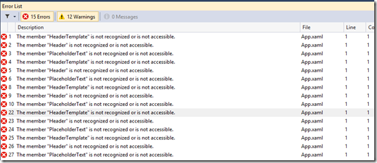

> TLDR; Don't do it

I built [Kalliope media player](http://www.kalliopemedia.com "Kalliope Media Player") for Windows 8.1 before Windows 8 because the MediaElement and overall APIs that I wanted looked more mature in 8.1 than 8.0 and hence it was 'faster' to build it for 8.1.

But Windows 8 PCs still outnumber Windows 8.1 PC by almost 2:1. _Lesson for Microsoft, their PC customers are not as keep 'upgraders' as say Phone customer (specifically Apple iPhone customers)._ Anyway, Windows 8 platform was hard to ignore so I decided to backport Kalliope to run on Windows 8.

## My Dev Environment

Window 8.1 VM fully patched with Visual Studio 2012 Express and Visual Studio 2013 Express for Windows.

## So near yet so far

I was using VS2012 on the VM for the Windows 8 port. Work was almost done, and I was ready to start WACKing the app, when I thought, might as well run it on a Windows 8 machine and test! BAM!!! The Application failed to even navigate properly. Couple of exceptions I've caught so far

> App\_UnhandledException: The property 'HeaderTemplate' was not found in Type 'Windows.UI.Xaml.Controls.Combobox'

> App\_UnhandledException: Failed to create a 'Windows.UI.Xaml.TextWrapping' from the text 'WrapWholeWords'.

After getting these two, I stopped testing and now restoring my Windows 8 Dev VM so that I can actually build the entire Code on Windows 8 and see what actually compiles and what doesn't.

## Why is this happening?

Well first of course it is because I copy pasted XAML from my Win 8.1 app to my Win 8 app. But then question is shouldn't it be causing build errors? Well, I think so. I'll know soon enough once I compile the code in Win 8. But the point is, this exact XAML works in Windows 8.1, in the sense when I hit F5 in VS2012, the app complies without error or warning and runs perfectly fine. Which basically means Windows 8.1 WinRT APIs are more forgiving of XAML errors. However, unfortunately for you, this means you CANNOT trust a Windows 8 build of your app created on a Windows 8.1 machine. Yes Yes Yes, I know... I feel like saying it too... but heck... what's the point!

Essentially there are API leaks (this is my term, maybe it should be called something else, sue me), because of which Windows 8 apps when run on Windows 8.1 will work even with incorrect XAML attributes (or attributes that were not supported in 8.0 but are supported in 8.1).

## Update 1 (Feb 9, 2014)

Well, looks like I am not too much of a trouble, so far the only issues reported are as follows:

Mind you, these are visible only if the designers are open. The build is otherwise reported as OK. So these will bite your bum at runtime.

## Moral of the story?

1\. You need a dedicated Windows 8 machine to develop and test a Windows 8 app, don't depend on a Windows 8.1 machine.

2\. Microsoft has more or less abandoned 8.0 from an API stand point, should you really bother about a back-port? Well you decide!

3\. (Updated on Feb 9, 2014) You will not face these issues if you are upgrading your App from Windows 8 to Windows 8.1. You have to be careful only when you backport, so as to not use new stuff (which is understandable). So the only thing is play closer attention to Designer errors.

## Conclusion

I may have been a little too harsh on MS, but still it’s clear that there is only one XAML engine in Windows 8.1, the one that has all the enhancements for 8.1. So if you mistakenly put some new stuff in Windows 8 App, it will work on 8.1 but fail in Windows 8.
