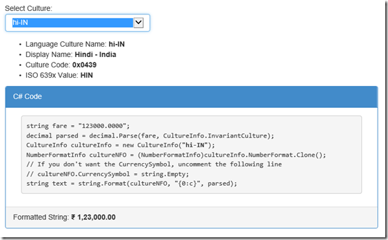

Recently I came across the need to format Decimal as Currency, but force it down to [Indian/Vedic/South Asian numeric formatting](https://en.wikipedia.org/wiki/South_Asian_numbering_system "Indian Numbering System") (thousands, lacs, crores etc.) instead of the standard Arabic/Metric system (thousands, hundred thousands, million, billion etc.).

The answer was easily found in [this StackOverflow thread](http://stackoverflow.com/questions/12492567/how-do-i-convert-string-to-indian-money-format "Stack Overflow: How do I convert string to Indian Money format?"). The code snippet is reproduced here:

> string fare = "123000.0000";  
> decimal parsed = decimal.Parse(fare,  
> CultureInfo.InvariantCulture);  
> CultureInfo hindi = new CultureInfo("hi-IN");  
> string text = string.Format(hindi, "{0:c}", parsed);

The above code gives us the following string

> ₹ 1,23,000.00

However, the next requirement was to keep the decimals and formatting but remove the Currency symbol. Another quick search gave us this little gem from [Jon Skeet on StackOverflow](http://stackoverflow.com/a/1048669/710962 "Format a double value like currency but without the currency sign (C#)"). Essentially he extracted the **NumberFormatInfo** from the **CultureInfo** and reset the Currency Symbol to an empty string. Then use the NumberFormatInfo instance to format the decimal value. So the above code can be modified as follows:

> string fare = "123000.0000";  
> decimal parsed = decimal.Parse(fare,  
>     CultureInfo.InvariantCulture);  
> CultureInfo hindi = new CultureInfo("hi-IN");  
> NumberFormatInfo hindiNFO =  
>     (NumberFormatInfo)hindi.NumberFormat.Clone();  
> hindiNFO.CurrencySymbol = string.Empty;  
> string text = string.Format(hindiNFO, "{0:c}", parsed);

This gives us the following string. It’s difficult to see here but there is a leading space that you might want to trim if you need to.

> 1,23,000.00

## A Sample Application

I thought it would be a fun project to write some code that gives you the above code for any Culture Code you want, so I setup a basic ASP.NET project and deployed it for free on the AzureWebsites. You can see it in action here – [Currency Formatter on Azure WebSites](http://currencyformatter.azurewebsites.net/ "Currency Formatter on Azure WebSites")

- I spun up Visual Studio 2013 and setup a default MVC project.
- Next I updated KnockoutJS to the latest version

PM> update-package KnockoutJS

- Added an Entity to encapsulate the culture information. I referred to this [list](http://msdn.microsoft.com/en-us/library/ee825488(v=CS.20).aspx "Culture Info") on MSDN as my source.

`public class IsoCultureInfo  
{  
    public int Id { get; set; }  
    public string LanguageCultureName { get; set; }  
    public string DisplayName { get; set; }  
    public string CultureCode { get; set; }  
    public string ISO639xValue { get; set; }  
}  
`

- Scaffolded up an EntityFramwork controller: **CultureInfoController**
- Added two methods to the CultureInfoController that return JsonResults
- The first one simply returns the entire list of IsoCultureInfo objects in the DB

public JsonResult List()  
{  
    return Json(db.IsoCultureInfoes.ToList(), JsonRequestBehavior.AllowGet);  
}

- The second one formats the predefined text based on the incoming Culture Name and returns the formatted text as a JSON object.

`public JsonResult FormattedText(string id)  
{  
     try  
     {  
         string fare = "123000.0000";  
         decimal parsed = decimal.Parse(fare, CultureInfo.InvariantCulture);  
         CultureInfo cultureInfo = new CultureInfo(id);  
         NumberFormatInfo cultureNFO = (NumberFormatInfo) cultureInfo.NumberFormat.Clone();  
         //cultureNFO.CurrencySymbol = string.Empty;  
         string text = string.Format(cultureNFO, "{0:c}", parsed);  
         return Json(new { formattedCurrency = text });  
      }  
      catch (Exception ex)  
      {  
          return Json(new { formattedCurrency = "N/A" });  
      }  
}`

- Both these methods are invoked from the Index HTML. The UI is databound to a Knockout ViewModel. This is defined in the script formatCurrency.js

`/// <reference path="_references.js" />`

var isoCultureInfo = {  
    LanguageCultureName : ko.observable("")  
};

var viewModel = {  
    dataList: ko.observableArray(\[\]),  
    formattedString: ko.observable("Test"),  
    selectedCulture: ko.observable(isoCultureInfo)  
};

$(document).ready(function () {  
    $.ajax("/CultureInfo/List",  
        {  
            type: "GET",  
            contentType: "text/json"  
        }).done(function (data) {  
            viewModel.dataList = ko.mapping.fromJS(data);  
            ko.applyBindings(viewModel);

 viewModel.selectedCulture.subscribe(function(newValue){  
                if (newValue.LanguageCultureName() != '') {  
                    var data = { "id": newValue.LanguageCultureName() };  
                    $.ajax("/CultureInfo/FormattedText",  
                        {  
                            type: "POST",  
                            contentType: "application/json",  
                            data: JSON.stringify(data)  
                        }).done(function (data) {  
                            viewModel.formattedString(data.formattedCurrency);  
                        }).error(function (args) {  
                            alert("");  
                        });;  
                };  
            });  
        }).error(function () {

 });  
});

- Finally I updated the Index.cshtml of the Home Controller to show the dropdown with the list of culture info.

 `Select Culture: <select id="cultureOptions"  
                                class="form-control"  
                                data-bind="options: dataList(), optionsText: 'LanguageCultureName', value: selectedCulture, optionsCaption: 'Choose...'"></select>`

- Added a <ul> to show all the property values of the selected Culture

`<ul>  
    <li>Language Culture Name: <b></b></li>  
    <li>Display Name: <b></b></li>  
    <li>Culture Code: <b></b></li>  
    <li>ISO 639x Value: <b></b></li>  
</ul>`

- Next we have a <pre> section which contains the code that changes as per the selected Culture.

<pre>  
string fare = "123000.0000";  
decimal parsed = decimal.Parse(fare, CultureInfo.InvariantCulture);  
CultureInfo cultureInfo = new CultureInfo(<b></b>);  
NumberFormatInfo cultureNFO = (NumberFormatInfo)cultureInfo.NumberFormat.Clone();  
// If you don't want the CurrencySymbol, uncomment the following line  
// cultureNFO.CurrencySymbol = string.Empty;  
string text = string.Format(cultureNFO, "{0:c}", parsed);  
</pre>

- Finally we have a span to show the formatted string returned after we have selected the Culture Info

`Formatted String: <b></b>`

## Conclusion

The code snippet changes as you select the Culture Info in the dropdown and you can copy paste it directly. I deployed it on a free Azure Website, how? That’s for another day .
