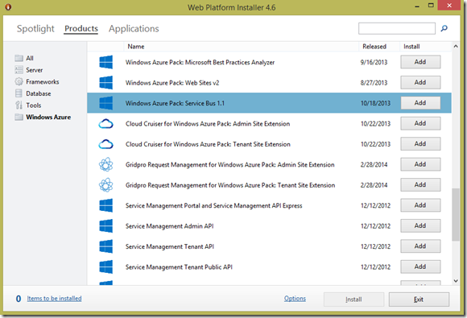
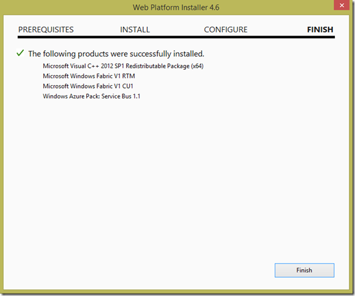
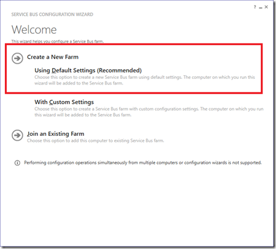
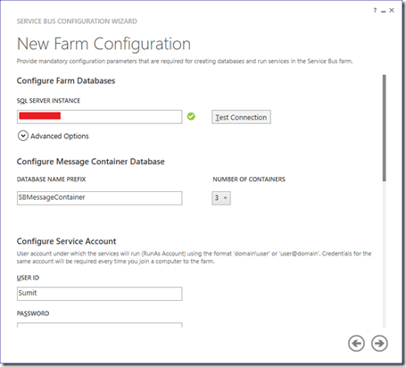
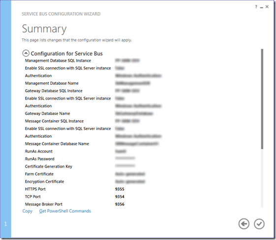
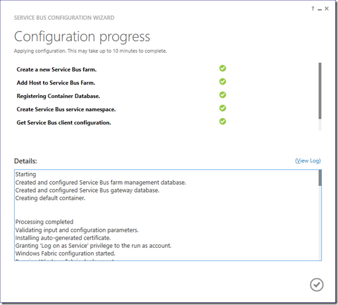

I was goofing around with the idea of Messaging Queue technologies on MS platform when I came across **Service Bus for Windows Server**. It’s an on-premise version of the Azure Service Bus. It has been around officially since October 2012 (coinciding with Office 365 launch). Basically SharePoint/O365 needed a Service Bus functionality so Microsoft extracted the Azure Service Bus implementation and made it available as a runtime on Windows 8 Servers.

Message Bus for Windows Server follows a yearly release cadence where features released for Azure Service Bus in the last 12 months are released coinciding with Windows Server releases.

Since Azure Service Bus is a very fast evolving platform, I found documentation on Service Bus for Windows Server (I’ll just refer it to as SBWS going forth), either dated or difficult to find. So I decided to record my steps of installation and building a small sample. Here goes:

## Installation

Obviously there are two parts to installing any ‘server’ API, the ‘Server’ and the ‘Client’. Fortunately you don’t need a ‘Server’ to play with Service Bus on your machine. All you need is a Windows or Windows 8.1 system to install both Server and Client and play around. The only other pre-requisite is to have SQL Express and we can get started.

### Server Installation

1\. I usually avoid Web Platform Installer over unpredictable internet, but it seems to be the best way to get started with SBWS. So install the latest Web PI (v4.6 at the time of writing) from here [http://www.microsoft.com/web/downloads/platform.aspx](http://www.microsoft.com/web/downloads/platform.aspx "http://www.microsoft.com/web/downloads/platform.aspx") (or **cinst webpi** if you use [Chocolatey](http://www.chocolatey.org "Chocolatey"))

2\. Go to Products, Select Azure, then Add and Install “Windows Azure Pack: Service Bus 1.1”

3\. This is the prerequisites list I got, your mileage may vary. Accept the license and let the installation proceed.

4\. You should end up with a Success screen highlighting the components installed.

### Configuring Service Bus

Web PI installs two items:

a. Service Bus Configuration and

b. Service Bus PowerShell

1\. Start off with the Service Bus Configuration. Select “Create a New Farm” –> “Using  Default Settings”.

2\. The **New Farm Configuration** window is used for providing the following information

a. SQL Server Instance: I’ve set it up to use Windows Authentication (to change, click on Advanced Options)

b. **Configure Service Account**: This is usually an Admin account (on the machine or domain). If you don’t have a domain controller you can use your Windows Account. If you are using an Outlook/MS Live account, only the name will be shown, don’t try to add @outlook.com to the ‘User ID’. Keep the ‘User ID’ and provide the password that you use to log in to windows/Outlook.

c. **Certification Generation Key**: This key is used as the seed to generate a Certificate. Save the value you enter it, it so that you can add nodes to the farm later. Check the ‘Enable firewall rules on this computer’ so that the firewall rules are setup automatically.

d. **Configure Service Bus Namespace**: The service bus namespace is used for identifying the bus and connecting to it. Provide an appropriate string. I’ve stuck to the default below.

e. **Service Bus Management Portal**: This section is relevant if you want to manage the service bus setup via a Azure Management like portal that can be installed on premises as well. We’ll cover the portal in a different article. For now provide a user name/password pair for Administrator and Tenant User. These are forms authentication settings so save these details for use later.

Once done, click on the ‘Next’ button (the right arrow button). It will show a progress bar until it’s done. At this point it will show a summary. At the bottom there are two links, Copy and Get PowerShell Commands. You can extract the PowerShell Commands and save them for later if you want to re-setup the system.

Click on the Complete button, this actually executes the Power Shell commands that were generated.

This completes the Service Bus setup. You can open the **Service Bus PowerShell** and review the status of the farm using the Get-SBFarmStatus command. It should return something like the following

With that we have successfully setup SBWS. In the next post we’ll see how we can use the service bus.
