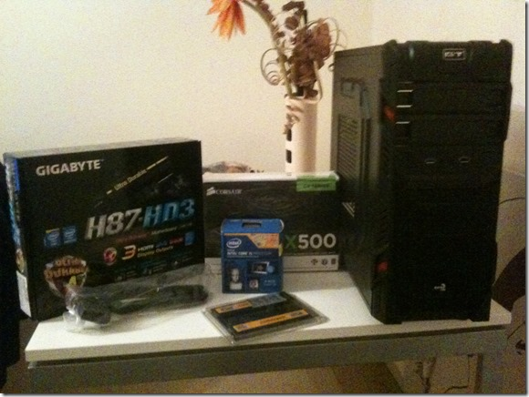
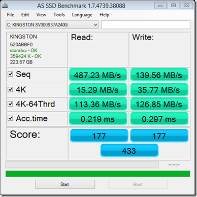

Last month I finally setup my new dev-rig. Yes, I still prefer desktops for development (call me old school)! The configuration is as follows:

1. Processor: [Intel Core i5 4570](http://ark.intel.com/products/75043/Intel-Core-i5-4570-Processor-6M-Cache-up-to-3_60-GHz "ARK | Intel® Core™ i5-4570 Processor")
2. Motherboard: [Gigabyte H87-HD3](http://uk.gigabyte.com/products/product-page.aspx?pid=4516#ov "Gigabyte Motherboard - GA-H87-HD3")
3. RAM: [Crucial Ballistix Tactical (8GBx2) 16GB](http://www.crucial.com/uk/store/partspecs.aspx?imodule=BLT2C8G3D1608ET3LX0CEU "Crucial Ballistix Tactical 2x8GB kit") @1600MHz  
4. Power Supply: [Corsair CX500](http://www.corsair.com/en/builder-series-cx500 "Corsair CX500")
5. Case: [Aerocool GT Advance Mid Tower Interior USB3 12cm Red LED Fan Screwless – Black](http://www.amazon.co.uk/Aerocool-Advance-Tower-Interior-Screwless/dp/B00DDD4X1S "Amazon.co.uk link to product")
6. SSD: Kingston 240GB V300 (Recycled from my MBP)

Here’s the Amazon (co.uk) Wishlist with all the items - [My Haswell Build](http://www.amazon.co.uk/registry/wishlist/2F4IOAXOUEZYM "My Haswell Build")

## Putting it together

Having assembled quite a few machines in my past, this was my first LGA processor. So after a few videos on YouTube on how to put one in, I had the confidence to do it. The processor installation went without hiccup. The Heat Sink and Fan gave a few anxious moments with the amount of pressure required to bolt all the four corners down, but I did it without damaging anything.

Rest was reasonably easy. When installing RAM (if installing 2 sticks) follow the color coding on the slots and check your M/B instruction manual to confirm which set you should use first. If you are putting in 4 sticks, hopefully they are all evenly matched so color coding doesn’t matter.

Key to getting a nicely matched Case was evident when I was able to use the USB3 header on the M/B for plugging in the USB3 port in the front.

The front panel Audio headers work, but sound from the built in Sound Card is pathetic. I can hear the hissing of the fan, whining of the PSU and even moving the (wireless mouse) results in funny squeaking sounds. I use my Blue Yeti (microphone) as an external soundcard, it has very neutral sound and I can use headphones without the annoyances of the internal soundcard.

This case has two fans built in, both come with 3 pin cables that you can plug on to the motherboard, allowing finer control of Fan speed from OS/Additional Software.

The Power Supply goes at the bottom of this case. One suggestion, before putting in the power supply, put the SSD in. Once the P/S is in, there are way too many cables to get out of the way, unless you are using a fully modular P/S, in which case sequence doesn’t matter). The SSD sits just above the 3.5” bays (there place to put only one SSD. For more than one, you’ll need a 3.5” to 2.5” converter). The case comes with a pamphlet that suggests you bolt it to the grill (above the 3.5” bays), but if you do so, it’s difficult (if not impossible) to plug in the SATA and power cables.

This case doesn’t have a power or ‘HDD’ light header, it does have a molex connector for the Red LEDs  that serve as the ‘power’ lights. Plug it into any of the molex power connectors from the P/S.

Given that we don’t have HDDs any more, the ‘HDD’ light doesn’t really make much sense.

The 5.25” drive bay covers can be pinched out, but don’t press too hard, you’ll snap something. I snapped a hook and had to superglue it back.

### BIOS Defaults

The default BIOS settings are by default pretty good. Just make sure you set the Disk Controller to AHCI (don’t remember what the default was). This is important from getting the best out of your SSD and you can’t change it after OS is installed.

I also turned on the XMP memory profile, this makes full use of the 1600MHz Memory Bandwidth, else your RAM will run at 1333MHz.

### The CX500 and Haswell

After I purchased the CX500 I found various articles saying the CX500 was still not Haswell Compliant. Haswell processors have a special power save mode that draws even less power than the ATX standards. I thinks it’s called S7 or something. This results in system not coming out of Power Save mode. However, I have not encountered any issues with the P/S. I put my machine to Sleep overnight regularly and it comes back without fail. So newer versions of CX500 should be fine. There is an ‘official’ CX500 V2 also but mine doesn’t say V2. Either ways, it works fine for me. I’ll update on longevity later.

## Windows Phone 8 SDK Installation and DPC\_WATCHDOG\_VIOLATION

I installed Windows 8 on it first and then upgraded to 8.1 (complete overwrite). After running updates repeatedly, till all updates were in place, I installed Windows Phone 8 SDK. As soon as it re-booted, I got a BSOD saying DPC\_WATCHDOG\_VIOLATION. I ignored it initially and updated the latest Visual Studio 2012 service pack (without which WP emulator doesn’t work on Windows 8.1). After that the WP Emulator worked but every reboot would result in a watchdog violation. This upset me terribly. No amount of Driver install from the Driver disk/Manufacturer’s site etc. helped. Ultimately uninstalling Hyper V (and effectively killing any chance of WP development) I was able to ‘fix’ the reboot issue.

After a lot of [Ducking](http://www.duckduckgo.com "Duck Duck Go") around and posting on [Eight Forums](http://www.eightforums.com/bsod-crashes-debugging/43214-dpc_watchdog_violation-when-restarting-desktop.html "My post of Eight Forums"), I did a Windows 8.1 Reset. However, after reset as soon as I installed WP 8 SDK, the BSOD returned. This time I installed Gigabyte’s APP Center app from the CD that accompanies the Motherboard. Using the APP Center, I updated all the drivers and then updated the BIOS. The motherboard came with V5, I updated it to V6 (latest available). The APP Center is really cool way to update BIOS updates. Just point to the one of the servers offered, wait for download to complete and hit OK. Thanks to the dual BIOS scheme, the App can flash the BIOS on the fly. Once done, it reboots.

After the reboot the DPC\_WATCHDOG\_VIOLATION was resolved. Phew!

### Side Note

If you have a Office 365 for Business account, don’t setup Mail or pay very close attention to the warning that Mail gives about changing security settings. Once the security settings are applied I lost Admin rights. I couldn’t install SQL Express/Create new User Account and in general had permission issues all around. This is why I actually did the reset. I haven’t reapplied the security settings. Not sure if this is the root cause, but for now I don’t have the permissions I had earlier, so I intend to keep things that way.

## SSD Performance

I had high hopes from my Kingston V300, but was surprised to see it’s result compared to my [V200 back in India](http://sumitmaitra.wordpress.com/2013/07/14/adding-ssd-to-my-desktop-ich7-ahci-and-bios-updates/ "Adding ssd to my desktop– ICH7, ahci and bios updates").

As you can see the V300 outpaces the V200 overall but 4K read/write speed is actually lower than the V200. Wonder why! Maybe last six months playing second fiddle in my MBP took it’s toll.

## Conclusion

I built this rig on a tight budget, but it’s a decent performing setup thanks to the ample RAM and SSD. Honestly, once you go SSD you just can’t go back to an HDD. Maybe I’ll add a Crossfire someday to it (unlikely), but it is likely to get more RAM and bigger SSDs in the future.
