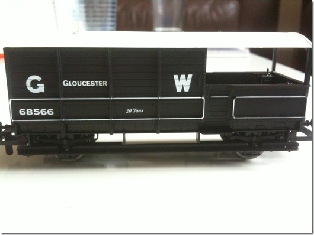

Train modeling is one of those geeky things that I have long aspired, but have never gotten to primarily due to time constraints. Also, I’ve been waiting for Junior to grow up enough to be able to enjoy it too and also I can justify (to better half) buying these things in his name ;-).

Anyway, bought our first modeling train-set last couple of weeks back with a scheduled delivery for Saturday, perfect for an upcoming long weekend. Surprisingly it arrived on schedule on Saturday morning at the Collect Plus collection center and I sneaked it home while Junior was doing his math practice ! He got a real kick when he actually saw it.

As pictured above, the Hornby Western Master consisted of :

1. Steam Loco with GWR (Great Western Railway, England) Livery. The loco has a bare metal DCC controller built in. Bare metal as in, it goes forward and reverse, that’s it. Don’t expect sound, smoke etc. etc.
    
    
    
2. There are three carriages (1 low flat bed, one open carriage and one break van). The green cargo box on the flatbed is loose and can be replaced by other small toys. Son’s favorite cargo is one of his die-cast cars. 
3. All the parts are reasonably high quality plastic. By high quality I mean not cheap looking, well finished paintwork, decent enough details and no jaggy/plasticky edges etc. Here is a closeup of the Break Van. 
4. There is a ‘Track mat’ that accompanies the kit. It actually is a giant paper poster with a proposed layout. However, the quality of paper is again, rather good and it will rip only if you try very hard or poke it with sharp objects. Gently stepping on it (tested up to 70kgs ) or crawling on it, doesn’t rip it. It’s a massive poster 1.6 meters by 1.2 meters (massive as compared to space available in our living room ). I had originally hoped to put the track on an unused table but the ‘Track mat’ was exactly double the size of the table. The tracks that come with the kit have rather gentle curves so it will occupy the entire mat and you can’t make it smaller. This is what it looks like fully laid out. 
5. Note the siding track provided on the top of the image, complete with a stop buffer. The track position can be changed between siding and main line manually. The inner tracks are actually printed on the mat, but Hornby sells each set separately. So eventually you could buy all the sets and complete the entire layout.

## Setting up the layout

First thing we did was the setup the track. Each Track piece comes with fishplates at opposite ends. Initially I was surprised by the amount of pressure it took to join two together. But if you make sure you have aligned the track and the fishplates correctly the fit in rather smoothly. The reason they are so hard is because the track powers the Loco and without the fishplates pressing down hard the circuit won’t be complete.

One of the track straights has the power connector. It has two green push clamps. Green is supposedly digital and orange is ‘analogue’.

Next I installed the Railmaster software. Instead of using the CD I downloaded the software directly from Hornby’s site. Make sure you install it as Administrator. If you use the KEY that’s in the CD case it will register your computer and you won’t be able to use the key again. They do provide an ‘Unregister’ on uninstall, but I haven’t tried it out yet. I am still on the 30 days trial.

## Controlling the train from your computer

After software installation, power up the Elite controller using the transformer that came with the kit. Connect it to the computer using the provided USB cable.

There is another 2-wire cable this is to connect the Elite controller to the track (and provide power to the track). Plug it into the ports on Elite called

Windows 7 will detect it as a RS232 emulation device. If you get a chance to cancel the automatic driver installation do it. Else, after it has installed, go to the Control Panel and update driver for the newly installed USB port device. When updating driver, select option of providing your own driver, select the C:\\Program Files (x86)\\Railmaster folder and pick the Vista driver (yeah )!!!

Once the driver has been updated, you are not off the hook yet. The Railmaster software can talk to the Elite device only if it’s port number is less than 12. I got a port assignment of 18 from Windows. I manually set it it to a used port 8. Windows gave a warning but continued to work. I think Windows 7 can reshuffle ports in these scenarios BUT it doesn’t remember the updated port assignments once you unplug Elite. So when you re-plug it later you have to reset the port number for the Elite again.

By default the application recognized the Loco and was able to connect to it and control it. Though it looks like it was built using Visual Basic 4, the basic functionality works fine. I was able to drive the train in reverse and forward without a glitch. The shunt and cruise speeds work fine as well.

## Programming the Train

Here programming doesn’t mean writing code, but more like creating macros using a visual list designer. You can specify train speed, direction and duration for each step. Once you are done, you can run the ‘program’ for the train. I am still to figure out how to do run a program in a continuous loop. More as things happen.

## Wrapping up for the day

In conclusion, train modeling is loads of fun but it’s not a cheap hobby. You need lots of space, time and patience to build your layout over time. Most people have dedicated garage/rooms for their layouts and put together parts painstakingly over a period of time.

I have to do some ‘jugaad’ (out of the box thinking) to work around to space constraint. Have some ideas in my head. Watch this space. Next step will involve giving the track a decent base and the ability to flip between siding and main tracks automatically. That requires another Digital decoder and a ‘Point motor’ (told you it isn’t cheap or a onetime thingy). More on what that means after I am done with it. Cheers!
