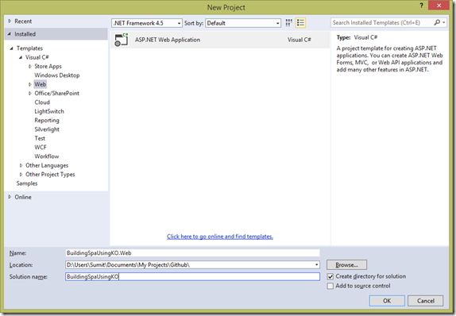
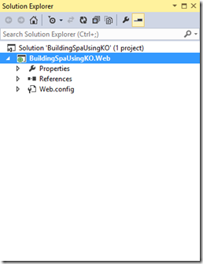
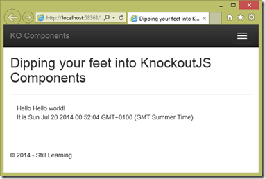

Last week I saw Steve Sanderson’s [NDC 2014 talk](https://vimeo.com/97519516 "Steve Sanderson - Architecting large Single Page Applications with Knockout.js") on how to build large Single Page Applications using KnockoutJS and other tooling. It struck a chord because SPA is something that I am dealing with right now and really wanted to get neck deep into how to use KO and other tools to build one ‘correctly’.

I have tried with AngularJS in the past and you may have read my multipart series on [Devcurry](http://www.devcurry.com/search/label/AngularJS "Six part series on Angular JS and ASP.NET"). While I have nothing against AngularJS I still find myself more inclined towards using KO more than anything else. Don’t read too much into it, it’s just me, I like KO!

Anyway, Steve’s talk is very deep and he rightly says, you feel like you are hanging on to a race car when sitting through his talk. So I’ve decided to really slow things down and take it one small bit at a time to see how we can use the latest and greatest version of KO (3.2.0 Beta) to build a front-end framework.

Today we’ll look at something new that’s not available in the release version of KO 3.1 as of date – Components.

Components allow you to build HTML+JS snippets that can be reused just like old server side controls of yester-years or like Directives in AngularJS. They actually mimic an upcoming web standard called [Web Components](http://webcomponents.org/ "WebComponents.org").

Steve also used a set of tooling that I am unfamiliar with, so I’ll try to map stuff he did to how I would do if I were using Visual Studio (as far as possible). Lets get started.

## Getting Knockout 3.2Beta

As soon as 3.2 goes live it will be available for use via Nuget and the Nuget Package Manager from inside Visual Studio. Today you can download the build from the Releases page on KO’s Github repo - [https://github.com/knockout/knockout/releases](https://github.com/knockout/knockout/releases "Releases Page - Get the highest version (currently 3.2 Beta)")

If you are a JS ninja you can get the entire library source and build it using NPM and Grunt.

## Starting with a clean slate

I’ll start with an empty Web Project in Visual Studio 2013.

As you can see, we get a really really empty template. If you run this in VS, you will get an error saying you don’t have directory browsing permissions.

## The Home Page

Since our project is all clean, let’s first install Bootstrap that we’ll use for styling. In the PM console type:

**install-package bootstrap**

This gives us the following folder structure, where Content has the StyleSheets and Scripts has the JavaScripts required.

Now add a new HTML page to the root of the project, call it Index.html (or home.html)

Thanks to Visual Studio I have forgotten how to setup a basic startup page using Bootstrap. Serves me right, that, I have to scratch my head and wonder ‘now what’:

After ‘considerable’ struggle , I update the HTML to include Bootstrap styling and jQuery references.

<!DOCTYPE html> <html xmlns="[http://www.w3.org/1999/xhtml"](http://www.w3.org/1999/xhtml")\> <head> <title>Dipping your feet into KnockoutJS Components</title> <link href="Content/bootstrap.css" rel="stylesheet" /> <link href="Content/bootstrap-theme.css" rel="stylesheet" /> </head> <body> 
 
 
 <button type="button" class="navbar-toggle" data-toggle="collapse" data-target=".navbar-collapse">    </button> <a class="navbar-brand" href="/">KO Components</a> 
 
 
 
 <h2>Dipping your feet into KnockoutJS Components</h2> 
 
 <footer class="navbar navbar-fixed-bottom"> 
&copy; 2014 - Still Learning 
 </footer>   </body> </html>

Now if I run this in Visual Studio we’ll get the following page:

## Let’s see some KO!

I am assuming you have downloaded the KO library as instructed above, so add it to the scripts folder and add a reference to it in our HTML file.

Now our App is going to be all HTML and JavaScript and I don’t see the need for CSHTML files at the moment. So let’s create an App folder in the application to consolidate ‘our stuff’.

We add a folder called App and add a js file called greeting.js to it.

In this file we add a simple view model with two properties **greeting** and **date**. For now we’ll hardcode the **greeting** to a standard “Hello World”.

var viewModel = { greeting: ko.observable("Hello world!"), date: ko.observable(new Date()) };

$(function () { ko.applyBindings(viewModel); });

Finally we add reference to this script in our Index.html and add a couple of spans to show our greeting.

… 
 <h2>Dipping your feet into KnockoutJS Components</h2> 
 
 
 Hello 
 
 It is 
 
 
 …    

Refresh the Index.html on your browser and you should see something similar:

Now if you are wondering what’s so great about this, it’s exactly how KO works, you are right!

### Where are my komponentz?!?

Well, let’s say we want to convert our ‘Greeting’ HTML + View Model into a reusable component that can be applied anywhere we want? Hello KO components!!!

Change the greeting.js to the following:

ko.components.register('greeter', {     // The register method needs a config object with // 2 properties template: // template is a string with the HTML template to apply // Here we have directly hardcoded the string we originally // had in index.html         "
" + "
 Hello 
" + "
 It is 
" + "
", viewModel: function(){ // viewModel that can be an object or function         greeting = ko.observable("Hello world!"); date = ko.observable(new Date()); } });

$(function () { ko.applyBindings(); //We have removed the explicit reference to the viewModel });

As we can see above, we have used the new ko.components API to declare a new component called ‘greeter’ (first parameter).

The component needs two parts to be initialized properly, one is the HTML template (in the template) property, and other is the View Model in the viewModel property of the initialization object.

As of now, we have hardcoded the HTML that we had added to our Index.html as the template. Later on, we’ll see how to get it from a separate file etc.

We have used the constructor method technique to define the view Model with the same two properties we had earlier. Why? We’ll see in a minute.

Now that our ‘component’ is ready how do we ‘use’ it? Simple, the name of the component is also the name of the tag, so switch back to Index.html and update the body as follows:

 <h2>Dipping your feet into KnockoutJS Components</h2> 
 <greeter></greeter> 

Refresh your Index.html in browser and you’ll see things still work as they were! Congratulations, you’ve just built your first component.

### Passing Parameters to components

Well, the hard coded Greeting is not quite flexible, what if we wanted to pass in a message to the component?

It is very simple to pass parameters into a component. Add a ‘params’ attribute to the tag and pass in **name: value** pairs. You will get it as an object in the constructor of your viewModel and you can use it accordingly.

So change the component setup in greeting.js as follows

ko.components.register('greeter', { // The register method needs a config object with // 2 properties template: // template is a string with the HTML template to apply // Here we have directly hardcoded the string we originally // had in index.html "
" + "
 Hello 
" + "
 It is 
" + "
", viewModel: function(params){ // viewModel that can be an object or function greeting = ko.observable(params.name); date = ko.observable(new Date()); } });

Next update the Index.html to pass parameters to our component.

<greeter params = 'name: " Sumit!"'></greeter>

Refresh the page and you see the following:

Copy paste multiple <greeter … /> instances and pass different names to them

<greeter params='name: " Sumit!"'></greeter> <greeter params='name: " Optimus!"'></greeter> <greeter params='name: " Bumblebee!"'></greeter>

Refresh Index again and things work as expected!

Congratulations, you have built your first KO component!

This concludes the first 15 (approx.) minutes of Steve’s talk. Lots of more stuff is in store. As I explore these things, I’ll continue to share what I learn, first of which will be using RequireJS and Automatic Module Detection. So watch out for the next part in the series.

Source code on my Github repo here - [https://github.com/sumitkm/BuildingSpaUsingKO/tree/Part1](https://github.com/sumitkm/BuildingSpaUsingKO/tree/Part1 "https://github.com/sumitkm/BuildingSpaUsingKO/tree/Part1")
