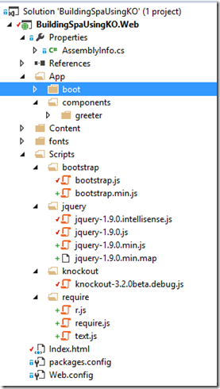
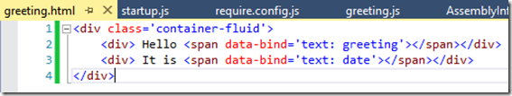

Part 1: [Dipping your feet into Knockout JS Components](http://sumitmaitra.wordpress.com/2014/07/19/dipping-your-feet-into-knockoutjs-components/ "Dipping your feet into Knockout JS Components")

This is the second part in my Knockout JS Components series. So far we have made a simple ‘greeter’ component and used it multiple times. But our HTML template was rather simple and hard coded in the ViewModel as a string. That was fine for a small snippet but for involved templates you don’t want to stick an HTML as string. Rather you would like it to be an independent HTML that’s loaded as required.

Today we’ll see how we can separate the HTML and load it dynamically using another library called RequireJS and a plugin for it (RequireJS-Text).

If you want to follow along, you can get the source code branch for the [previous article](https://github.com/sumitkm/BuildingSpaUsingKO/tree/Part1 "Github Source previous article https://github.com/sumitkm/BuildingSpaUsingKO/tree/Part1").

## Quick intro to RequireJS

[RequireJS](https://github.com/jrburke/requirejs "RequireJS Github project") is a library that is used for ‘Automatic Module Detection’ and loading of JavaScript modules and references. It was developed by James Burke from Mozilla. It is an open source project hosted on Github with a vibrant community that helps maintain it. It also has good documentation that you can refer to for [getting started](http://requirejs.org/docs).

This article is not a RequireJS tutorial, instead we’ll jump right in and start using it, I’ll explain the syntax as we go along. If you have not used RequireJS before, well don’t panic, neither have I .

## Installing RequireJS and RequireJS-Text plugins

RequireJS has an official Nuget channel so getting the base library is easy to install via Nuget Package Manager Console, simply type in

**install-package requirejs**

Next we have to get the Text plugin from Github directly. You can either clone the repo from here [https://github.com/requirejs/text](https://github.com/requirejs/text "https://github.com/requirejs/text") or just download the JS file.

Once you have the file, add it to your scripts folder. I have started creating sub-folders for each library because it will come in handy later.

- **App/boot** : This folder will contain scripts that initialize our libraries
- **App/components** : This folder will contain all the components we create. Each component in turn has it’s own folder that may contain the ViewModel, HTML template and more.
- **Scripts/\***: As mentioned earlier I’ve moved each library into it’s respective sub-folder under the Scripts folder. So Scripts is essentially for all libraries and frameworks that we will use (and not modify), and everything that we build will go under App.

**NOTE: This folder structure is completely arbitrary. I ‘feel’ this works, you can use it, you can totally use your own structure. Just remember where your ‘root’ (folder) is .**

Now that we are done with the structure of the libs and sources let’s move on and configure RequireJS.

## Configuring RequireJS

Under App/boot folder add a new JS file called require.configure.js. The name is, again, not a part of any convention, use what works for you, just refer it in Index.html correctly).

I have configured RequireJS initially as follows

var require = { baseUrl: "/", paths: { "bootstrap": "Scripts/bootstrap/bootstrap", "jquery": "Scripts/jquery/jquery-1.9.0", "knockout": "Scripts/knockout/knockout-3.2.0beta.debug", "text": "Scripts/require/text" }, shim: { "bootstrap": { deps: \["jquery"\] } } }

- I’ve created a require global variable that has three properties, baseUrl, paths and shim.
- The baseUrl property sets the root location with respect to which all other paths will be considered.
- The paths property is assigned an object with name value pairs corresponding to the library names and their relative locations. Not the .js is stripped away from the paths.
- The shim property provides additional dependency information. Here it shows bootstrap is dependent of jquery. The value ‘jquery’ matches the name used in ‘paths’ above.

## Updating references

Now that we have configured RequireJS, technically all we need to do is load RequireJS using the configuration and all should be fine!

Well, let’s update the Index.html file to load RequireJS and remove all other Script references. We update the script references as follows:

<!--  -->  

Now you are wondering where is the greeting.js gone and how is it going to be loaded? Well there is no magic, we have a couple of more steps to go.

### Add App/boot/Startup.js

In the App/boot folder add a new JavaScript file called startup.js. The name is to help us understand the process, it’s not a convention.

Add the following ‘module-definition’. You can read up about RequireJS Modules [here](http://requirejs.org/docs/api.html#define "What are Modules in RequireJS").

define(\['jquery', 'knockout', 'bootstrap'\], function ($, ko) { ko.components.register('greeter', { require: 'App/components/greeter/greeting' }); ko.applyBindings(); });

The Startup module says that it is dependent on jQuery, KnockoutJS and BootStrap. Note, it uses the same names that were used in RequireJS configuration above. The function parameters are instances of the dependencies requested in the array, so if you put another input parameter like **boots** it would have instance of the bootstrap library. We’ll just keep this in mind for now.

Next it declares a function that has jQuery and KO lib references as input parameters.

In the function we ‘register’ our ‘greeter’ component. Note, that we have moved the registration from the greeting.js to startup. Also note instead of specifying the hard-coded template and view model, we are simply configuring a ‘require’ property, that points to the folder where the greeting.js is (without the js).

Well, that’s the startup configuration. Needless to say, as we add more components they will need to be registered here.

### Updating our ‘greeter’ component

The first thing we do is add a greeting.html (name same as JavaScript is again not a convention, just easier to map in our heads).

It contains the same markup that we had hardcoded in the template:

#### Update greeting.js

Finally we update the greeting.js component. We comment out all the old code and replace it with the the following:

define(\["knockout", "text!./greeting.html"\], function (ko, greeterTemplate) { function greeterViewModel(params) { var self = this; self.greeting = ko.observable(params.name); self.date = ko.observable(new Date()); return self; } return { viewModel: greeterViewModel, template: greeterTemplate }; });

So essentially we have morphed our component to a RequireJS module. Key thing to note here is use of the text plugin to load load the greeting.html. Require does all the work to load the template and stuff it into the greeterTemplate parameter.

Finally we return an object that KO accepts as definition for a module.

### One more thing!

We are almost there. Those paying close attention would have noticed that we didn’t put in reference to the startup.js anywhere. How does RequireJS know how to initialize our app and it’s dependencies?

Back to the Index.html, we update the script tag that refers to RequireJS as follows:

The data-main tag, tells Require that the **main** module to initialize the app is in that JS file. Thus RequireJS knows what to invoke once fully initialized.

Done!

## Conclusion

If you run the application now, you’ll see the same old screen we saw in the first part. So what have we done new? Well plenty:

1\. Let RequireJS load scripts dynamically. 2. Separated our KO components’ view from it’s model 3. Defined a central place to register all KO components

What we have not done is do more ‘webby’ stuff like putting in links to other possible pages of the app and creating different types of modules for each page and then showing how our app can navigate to those pages as well as load those dependencies on-demand. That’s what we’ll cover in the next part – Routing!

## Source Code

The source is on Github as usual (note, after each article I am branching the code out and keeping the master for the latest updates)!

[https://github.com/sumitkm/BuildingSpaUsingKO/tree/Part2](https://github.com/sumitkm/BuildingSpaUsingKO/tree/Part2 "https://github.com/sumitkm/BuildingSpaUsingKO/tree/Part2")
