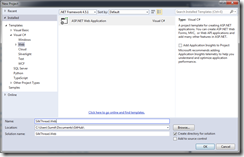
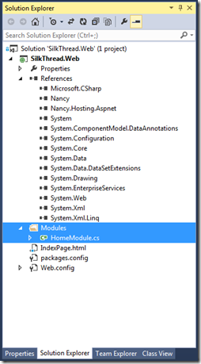
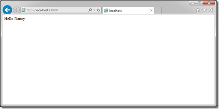
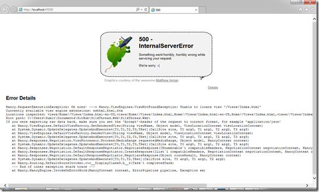
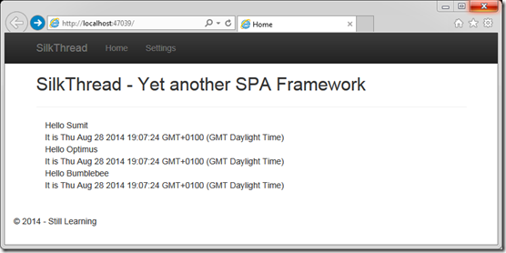
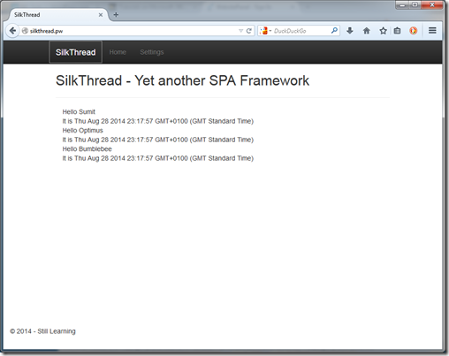

## Background

Those who have been following my [Knockout Component series](http://sumitmaitra.wordpress.com/2014/08/25/part-5-spas-accessibility-and-the-server-side/ "Part 5: SPAs, Accessibility and the Server side") of articles will know I am attempting to build a little SPA framework of my own here. No, it’s not the next best thing since sliced bread, just my attempts at learning Javascript, TypeScript and putting together a bunch of really cool libraries.

To try the entire thing online I decided to purchase a domain and the cheapest one was a .pw. SilkThread sounded like a nice name for a framework that was aiming to string together a series of well written libraries. So here we go, I am going to document my steps on creation of the first cut of [http://SilkThread.pw](http://SilkThread.pw), powered by Nancy and SilkThread itself .

## Who Nancy?

Well, it’s not a who, but a What. [Nancy FX](http://nancyfx.org "Nancy FX") is an Open Source Web Framework in .Net. Conceptualized and initially built by [Andreas Håkansson](https://github.com/thecodejunkie "Andreas Håkansson - aka CodeJunkie") and supported by an awesome community of .NET devs, it’s now 3+ years old ([here’s the list of the contributors](http://nancyfx.org/contribs.html "Nancy FX Contributors")). It is inspired by Sinatra in the Ruby world, but I don’t know enough about Sinatra to talk more about the history. It’s primary goal was to help build HTTP services in .NET. However, Nancy is more, it can serve up static content, html and even supports multiple view engines. So its like the best of both AspNET MVC and Web API worlds in one neat bundle.

## Why NancyFX instead of AspNet MVC?

Well, no reasons really! Since my SPA effort is aimed at learning stuff and all of it is Open Source, I decided to try an Open Source framework that’s contemporary to the Asp.NET MVC!

My only requirement was that it should be host-able on IIS via my shared hosting provider. Once my Twitter pals [Phillip Haydon](https://twitter.com/philliphaydon "Phillip Haydon on Twitter") and [Filip Ekberg](https://twitter.com/fekberg "Filip Ekberg on Twitter") confirmed this is possible, I was all set to give it a go. I should also mention the gentle nudges from Phillip and [Jonathan Channon](https://twitter.com/jchannon "Jonathan Channon on Twitter") to try out NancyFX contributed handsomely too .

So no ‘political’ reasons, just an eager beaver trying out a new framework. You have already seen how to do everything I do here using ASP.NET MVC.

## Getting Started

Nancy has some neat Visual Studio project templates, so you can get started directly using these templates. But that’s less of fun than learning things ground up. So I decided to start with an Empty Web template.

On clicking Ok, a new empty project is created, however we’ll see it has got a bunch of dependencies that I don’t think are required.

So we remove the ones shown selected above.

Next we add two Nancy packages from Nuget. If you are using Package Manager console you can get them using the following commands:

PM> install-package Nancy

PM> install-package Nancy.Hosting.AspNet

These two packages are all you need to get started.

### A quick “Hello Nancy”

The Nancy equivalent of a ‘'AspNET MVC/WebAPI Controller” is the NancyModule. I have created a Modules folder and created added a HomeModule class in it. The Modules folder will hold our controller layer. In the root, I’ve added a IndexPage.html

Next I’ve updated the HomeModule to inherit from Nancy.Module.

In the constructor I’ve added a root path and assigned a method that returns a ViewRenderer. We’ve passed the IndexPage.html to the ViewRenderer because we don’t want any sever side processing done and want to show the HTML as is.

public class HomeModule : Nancy.NancyModule { public HomeModule() { Get\["/"\] = GetIndex; }

 private dynamic GetIndex(dynamic arg) { return View\[@"/IndexPage.html"\]; } }

The IndexPage.Html simply says “Hello Nancy”.

<!DOCTYPE html> <html xmlns="[http://www.w3.org/1999/xhtml"](http://www.w3.org/1999/xhtml")\> <head> <title></title> </head> <body> Hello Nancy </body> </html>

With that set up, hit F5 and you should have a vanilla page on your default Browser as follows:

Well then, the myth of OSS projects being complex to get started with, stands BUSTED! Yes, Nancy is truly a low ceremony, awesome web framework.

But this is not what we want to setup do we? We want a nice Bootstrap Styled SPA! Well, let’s get to work.

## Getting SilkThread into the project

To get SilkThread into the project, the best way would have been to get it via Nuget. But creating a Nuget package is a separate post, so we’ll use the age old technique of ‘copy-paste’. I have the latest code from the main branch of the project from Github. So I copied the App and Scripts folder into the project and re-arranged them a little. My new project structure is as follows:

I have made the following changes

1. Created a Views folder and moved the Index.html to it.
2. Created a Scripts/libs folder and moved all folders previous under Scripts to Scripts/libs
3. Created a Scripts/app folder and moved the contents of the previous /App to Scripts/app
4. The above folder realignment requires us to modify the Scripts/app/boot/require.config.js and change it as followsvar require = { baseUrl: "/Scripts/", paths: { "bootstrap": "libs/bootstrap/bootstrap", "historyjs": "libs/history/native.history", "crossroads": "libs/crossroads/crossroads", "jquery": "libs/jquery/jquery-1.9.0", "knockout": "libs/knockout/knockout-3.2.0beta.debug", "knockout-projections": "libs/knockout/knockout-projections.min", "signals": "libs/crossroads/signals", //"hasher": "Scripts/crossroads/hasher", "text": "libs/require/text" }, shim: { "bootstrap": { deps: \["jquery"\] } } }
5. Next, install the bootstrap nuget package and removed the scripts folder as we already have the scripts in the libs folder.
6. Finally we update the GetIndex method in the HomeModule to point to the Views/Index.htmlprivate dynamic GetIndex(dynamic arg) { return View\[@"Views/Index.html"\]; }

Now if we run the project we’ll get the following:

The ‘Oatmeal’ has greeted us! Nancy tries hard to tell us what happened and it seems it looked at lots of places but couldn’t find a file. Fear not, it’s a small detail but it’s a safe default.

## Explicitly specifying content folders

Basically Nancy serves static content off the Content folder only by default (html files are served from any folder as long as you’ve got the routing right). So when our Index page is trying to access the Scripts folder, things are falling over. To use a custom folder structure like we defined above there are two options a. We move Scripts folder under Content and roll with it OR b. we tell Nancy about our folder structure. Let's try the second option, it’s rather easy to do so.

1. Add a new class called **SilkThreadBootstrapper** and inherit if from **Nancy.DefaultNancyBootstrapper**
2. Override the method **ConfigureConventions** method and use the **StaticContentConventionBuilder** helper to add folders that you want Nancy to track.
3. The full code is as follows, as you can see I’ve added the Scripts folder and the Views folderpublic class SilkThreadBootstrapper : Nancy.DefaultNancyBootstrapper { protected override void ConfigureConventions( Nancy.Conventions.NancyConventions nancyConventions) { base.ConfigureConventions(nancyConventions); nancyConventions.StaticContentsConventions.Add( Nancy.Conventions.StaticContentConventionBuilder.AddDirectory("Scripts"));
    
     } }

With those changes done, if we fire up our app, it will come up smoothly.

Sweet!

## Deploying to the hosting Site

My host doesn’t support a fancy “Deploy from Github on commit to master’' functionality. So I did it the amateur way:

1. Got the IIS Web Publishing settings from my host
2. Imported them into the project. Tear hair out because Web Publish keeps giving a weird error. Either provider or Visual Studio is broken.
3. Enable ftp upload
4. Setup ftp Deploy and Publish

Here you go! [http://silkthread.pw](http://silkthread.pw)

(Note: I will be updating the site to be a little more useful so expect it to change over time).

If you look at the deployment folder it’s got only three dlls, with the total deployment size < 1MB. That’s pretty cool!

## Conclusion

Nancy FX is a neat little framework with a tiny footprint for quick dash web projects. However, I have not even skimmed the surface of it’s abilities. To try out more I’ll continue to build SilkThread’s site using Nancy. So there will now be two streams of articles in parallel! One, features in SilkThread and the other about updates to the Site using Nancy.

Special Thanks to Phillip Haydon, for proofing the Nancy bits and pointing out some gotchas I comitted as a nOOb.

### Source Code

The source code for SilkThread.pw is going to reside at Github, I'll try to branch it as I go!

https://github.com/sumitkm/silkthreadspa
