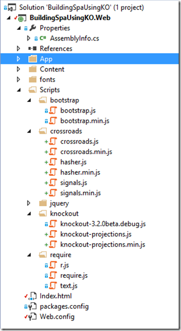
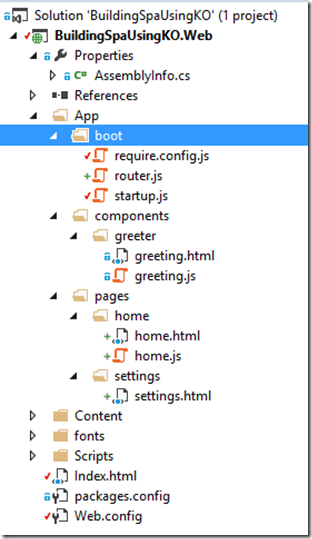
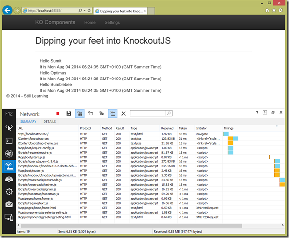

Part 1: [Dipping your feet into Knockout JS Components](http://sumitmaitra.wordpress.com/2014/07/19/dipping-your-feet-into-knockoutjs-components/) Part 2: [Knockout Components – Separating Templates from View Model](http://sumitmaitra.wordpress.com/2014/07/29/knockout-components-separating-templates-from-view-model/ "Part 2: KO Components - Signals, Routes and Hashes")

As we continue our journey to learn more about KO Components, today we look at how we can  navigate around different ‘views’ and manage hyperlinks.

There are multiple libraries out there that allow you to do this. Today we’ll see how to use [Crossroads](http://millermedeiros.github.io/crossroads.js/ "Crossroads Documentation") for routing and [Hasher](https://github.com/millermedeiros/Hasher "Hasher repository") for managing URLs. They internally use the [Signals](https://github.com/millermedeiros/js-signals "Signals") JS library. All three are written by [Miller Medeiros](https://github.com/millermedeiros "Miller Medeiros"). Now you could do all things these three libraries to with Sammy.js too. I will probably look at Sammy.js at some point in future, but Sammy is more opinionated on how it does routing and event handling, while I wanted to go one level lower and fiddle around myself. BTW I am in no way promoting one over the other, just that today’s sample uses Crossroads, Hasher and Signals.

## Adding dependencies

All three libraries are not available as Nuget packages so we’ve to get them from their Github Repos directly. I have linked to the repos above.

Apart from the above three we will also use [knockout-projections extension library by Steve Sanderson](https://github.com/SteveSanderson/knockout-projections "knockoutjs-projects"). This provides helper methods to deal with KO arrays.

I have downloaded them and added to the solution resulting in the following folder layout:

 Figure 1

### Updating require.config.js

We update the require.config.js to add the additional references so Require knows where to get them from as and when required.

var require = { baseUrl: "/", paths: { "bootstrap": "Scripts/bootstrap/bootstrap", "crossroads": "Scripts/crossroads/crossroads", "jquery": "Scripts/jquery/jquery-1.9.0", "knockout": "Scripts/knockout/knockout-3.2.0beta.debug", "knockout-projections": "Scripts/knockout/knockout-projections.min", "signals": "Scripts/crossroads/signals", "hasher": "Scripts/crossroads/hasher", "text": "Scripts/require/text" }, shim: { "bootstrap": { deps: \["jquery"\] } } }

## Restructuring the App layout and adding a page

Since we are going to demo navigation, it’s good to have at least one more page to navigate to. So we’ll introduce a loosely coupled concept of ‘page-components’. These are basically registered as ko.components but they are containers and in turn use other ko components.

As I said in my previous article the folder structure I was using is pretty arbitrary and open to updates.

Under App we will add a **pages** folder which will have all our ‘page’ components. I have added two, **home** and **settings**.

 Figure 2

### The home page-component

The Home page component has the standard HTML + JS structure. I have in-fact taken out the greeter instances from Index.html. We’ll see how we can pass data between two components. We’ll add a collection of ‘guests’ in home view model which will be passed to the greeter component. So our home.js will be as follows:

define(\["knockout", "text!./home.html"\], function (ko, homeTemplate) { function homeViewModel(params) { var self = this; self.title = ko.observable('Dipping your feet into KnockoutJS'); self.guests = ko.observableArray(\[\]); self.guests.push({ guestName: "Sumit" }); self.guests.push({ guestName: "Optimus" }); self.guests.push({ guestName: "Bumblebee" }); return self; } return { viewModel: homeViewModel, template: homeTemplate }; });

We have put the header text in a property called **title**. We also have an observable array of **guests** who the greeter component needs to greet. Instead of hard-coding the names this could have come from a server API call.

The home.html is as follows

<h2 data-bind="text: title"></h2> 
 <!-- ko foreach: guests --> <greeter params='name: guestName'></greeter> <!-- /ko --> <pre data-bind="text: ko.toJSON($data, null, 5)"></pre>

We have bound the title to the header element.

Next we have a standard **ko foreach** that loops through each element in **guests** collection. The **params** attribute takes a JSON snippet so we pass it appropriately as **name: guestName**. KO can evaluate the observable and pass the appropriate value to the greeter component.

## Setting up Routing using Crossroads and Hasher

In Figure 2 above you’ll note we have a new file called router.js.

The Router is defined as an AMD module. It takes in an object with the property **routes** that has an array of routes that are ‘registered’. So the **routes** property is going to hold all our routes.

As of now we have defined two routes, one is the home page that is at the root of the site and the second is the settings page that should be at the /settings URL.

When the module is initialized the Router function is invoked (acts as the ‘constructor’) with the routes defined. These are added to crossroads. I have added a method to log every routing event to the console.

The **activateCrossroads** function sets up **Hasher** to listen for hash changes and on change invoke crossroads to do the routing.

/// <reference path="/Scripts/crossroads/crossroads.js" /> define(\["jquery","knockout", "crossroads", "hasher"\], function ($, ko, crossroads, hasher) {

 return new Router({ routes: \[ { url: '', params: { page: 'home' } }, { url: 'settings', params: { page: 'settings' } } \] });

 function Router(config) { var currentRoute = this.currentRoute = ko.observable({});

 ko.utils.arrayForEach(config.routes, function (route) { crossroads.addRoute(route.url, function (requestParams) { currentRoute(ko.utils.extend(requestParams, route.params)); }); }); crossroads.routed.add(console.log, console); activateCrossroads(); }

 function activateCrossroads() { function parseHash(newHash, oldHash){ crossroads.parse(newHash); }         crossroads.normalizeFn = crossroads.NORM\_AS\_OBJECT;

 hasher.initialized.add(parseHash); hasher.changed.add(parseHash); hasher.init(); } });

With routing all set, let’s setup the Index page and register the new components before we can test out our changes.

### Updating the Index.html page

The Index page has now become a nearly empty shell. We will add two links in the header, one for Home and the other for Settings page.

 
 
 <button type="button" class="navbar-toggle" data-toggle="collapse" data-target=".navbar-collapse">    </button> <a class="navbar-brand" href="/">KO Components</a> <ul class="nav navbar-nav"> <li> <a href="#">Home</a>                 </li> <li> <a href="#settings">Settings</a>                 </li> </ul> 
 
 
 

 …

By default the page will land at the Home page and when user clicks on Settings the routing library will take it to the Settings page (or back to home page depending on the link clicked).

The div with id=page is our equivalent of RenderBody in MVC. The current **page** as defined by the route with be displayed here. As you can see it is using a div to bind any component that is presented to it by the router. If you remember we have setup two routes with **page** names **home** and **settings**. So these are the names of our home and page components. Let’s register them in startup.js.

### Registering new components

We’ll add the two new components to **startup.js** and also initialize our router and pass it to ko as root view model.

To initialize router we use Require’s module loading to request for it in the required collection. Note the syntax ./router. This is because router.js is not a part of the Scripts folder rather it is in the same folder as the startup.js and also the fact that it’s not defined in require.config.js.

Another difference to note is how we are setting up **settings** component. This is the way to setup HTML only components that have no Javascript associated with them.

The **home** component is registered like **greeter** as we had done before.

define(\['jquery', 'knockout', **'./router'**, 'bootstrap', 'knockout-projections'\], function ($, ko, **router**) { ko.components.register('greeter', { require: 'App/components/greeter/greeting' }); ko.components.register('home', { require: 'App/pages/home/home' });     **ko.components.register('settings', {**         **template: { require: 'text!App/pages/settings/settings.html' }** **});** ko.applyBindings(**{ route: router.currentRoute }**); });

With our components registered, we are all set to try it out.

## Demo time

When we run the app, and see the Debug window, you will notice we have downloads the styles and templates that pertain to the Index page, the Home page and the greeter component. The Settings component has not been downloaded yet.

Now if you clear the Network activity window and click on Settings, you will note that only one file is downloaded and that is settings.html. This may seem insignificant for this demo, but has a huge impact when your applications grow big and have hundreds of components (yes, they can have 100s of components, just take my word for it ).

It is all the more fun to note that now if you switch back to Home page no components are called from the server because the browser has everything it needs, so unless you want to force refresh the page with data from server, navigating between pages is as fluid as a client app!

So we have navigation between pages and just in time loads. What about the dreaded browser Back button? Well, if you play around with it, you’ll notice back button works perfectly fine and crossroads is able to switch between views thanks to Hasher monitoring hash changes. Excellent, we could have stopped here and gone home happy but…!

## Hashes in URLs, bot accessibility and best practices

If you were a observing keenly, you would have noticed that when we navigated to **settings** page the URL is /settings instead it is #settings. This is because we are using the age old # prefix to prevent the browser from hitting the server when someone clicks on a link. Now you realize what Hasher is doing. It’s listening to the **hashchanged** event and invoking **crossroads** (albeit in a cross browser compliant way).

This gives us a problem where our URLs are not **semantic**. This is a headache from bot accessibility because search robots don’t really ‘invoke’ AJAX calls to get new views when they encounter a **#** url. There is a nice series by [Derick Bailey](http://www.watchmecode.net/ "Watch Me Code - Derick Bailey") on drawbacks of hash URLs on [Los Techies site](http://lostechies.com/derickbailey/2011/09/26/seo-and-accessibility-with-html5-pushstate-part-1-introducing-pushstate/ "HTML5 and pushstate - Derick Bailey").

As you will see from his articles, HTML5 pushState comes to the rescue to a large extent. I say large extent because once we get pushState into picture we have to start looking at the server side as well because if you don’t have # in your URL, bookmarked URLs will directly request the server to serve the URL e.g. the /settings page. In our case there is no /settings page only index.html that uses client side manipulation to get you to /settings URL. But fear not, we’ll work everything out.

Pushstate is important enough to warrant a separate article in itself. You can refer to Derick’s article for the basics, his sample is in Backbone.js and Rails. You should be able to grasp the idea, but either ways I will do it in KO and ASP.NET MVC.

### Side note – Google search and Hashbangs ( #! )

Once AJAX apps became popular Google came up with a suggestion for appending a bang ( ! ) after the hash to make it apparent to search engines that the URL warranted an AJAX call, but after the initial rush to hashbang everything, the industry settled back into semantic URLs primarily because of problems associated with handling #! at the server and it’s non-standard nature.

## Source Code

I have branched the master out part Part3 and it is available on Github at [https://github.com/sumitkm/BuildingSpaUsingKO/tree/Part3](https://github.com/sumitkm/BuildingSpaUsingKO/tree/Part3 "https://github.com/sumitkm/BuildingSpaUsingKO/tree/Part3")
