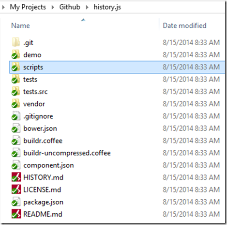
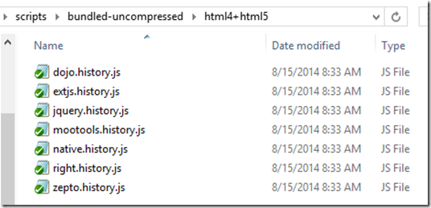
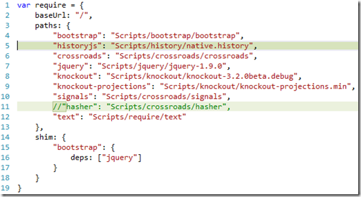
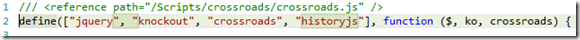
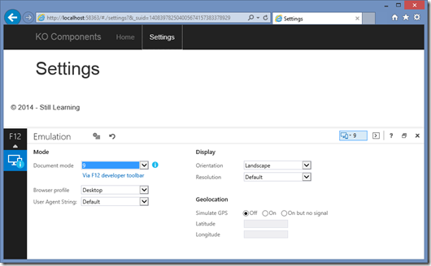

In the previous three parts we have seen:

- [Part 1:](http://sumitmaitra.wordpress.com/2014/07/19/dipping-your-feet-into-knockoutjs-components/ "Part 1: Dipping your feet into Knockout JS Components") How to create a simple KO Component
- [Part 2:](http://sumitmaitra.wordpress.com/2014/07/29/knockout-components-separating-templates-from-view-model/ "Part 2: Knockout Components – Separating Templates from View Model") How to use Require JS to load scripts on demand and
- [Part 3:](http://sumitmaitra.wordpress.com/2014/08/04/part-3-ko-components-routes-and-hashes/ "Part 3: KO Components – Routes and Hashes") How to use [Crossroads](http://millermedeiros.github.io/crossroads.js/ "Crossroads Documentation"), [Hasher](https://github.com/millermedeiros/Hasher "Hasher repository") and [JS Signals](https://github.com/millermedeiros/js-signals/wiki "JS Signals Wiki") to implement client side hash based routing.

At the end of the third article we saw some problems with hash based routing primarily in terms of accessibility and search engine indexing. Also the fact that hashed URLs are semantically incorrect gives us enough reason to look for alternatives.

Today we’ll explore how we can overcome some of these problems and discover some new ones .

## HTML5 and manipulating browser history

HTML5 pushState usually refers to a set of APIs that HTML5 browsers can support, to give more control to the developers on the Browser URL and the Browser’s back button behavior. These include pushState, replaceState and the event popState. Here is a nice primer on pushState on [developer.mozilla.org](https://developer.mozilla.org/en-US/docs/Web/Guide/API/DOM/Manipulating_the_browser_history "HTML pushState").

Essentially, when you want to add a URL to the history you push the URL into browser history using pushState. This is done for free when you click on a link (or type in the URL) and a server returns the page. However, if you wanted to build an AJAX based navigation system where you want to intercept all link clicks and show content dynamically loaded via AJAX, the browser doesn’t know the URL’s correlation to the content. So you have to tell it explicitly what the URL is (e.g. when we are showing the ‘Settings’ page, the URL should be /settings). HTML 5 pushState and related APIs make this easier for us.

Ajax based apps also have had trouble with the browser back button. As users we are trained to hit the big honking ‘Back’ button on the browser when we want to go back to the previous page. This is correct expectation and our Web Apps should respect that. Doing AJAX based page/component loading can break this because you may have content loaded based on user interaction that is not recoverable when user hits the back button.

So ideally we should use the new found ‘pushState’ functionality to indicate on the URL the exact location of the current content that is being shown. Thus when a user hits the back button we can use the URL to load up the previous content again. Back button in HTML5 browsers fire a popState event that can be handled for these purposes.

Doing all this manually is a bit of boilerplate. In Part 3 we saw how crossroads+hasher does it (Back button is fully supported for # URLs. Today we’ll see how we can use another library called History.js. Reason for exploring History.js is that it supports the new pushState API and falls back on Hash-based routing for browsers that don’t support pushState, (one such browser, is IE9 and when I started, one of my ‘undeclared’ goals was to support IE9 and up).

## Replacing Hasher.js with History.js in our sample

You can get the last version of my sample from the [Part 3 branch on Github](https://github.com/sumitkm/BuildingSpaUsingKO/tree/Part3 "Part 3 branch on Github").

You can clone the History.js repo from Github [here](https://github.com/browserstate/history.js "History JS Github repository").

Your cloned folder should look like this:

The Scripts folder has the following the sub-folders. Mechanics behind these folder is actually pretty neat.

### History JS Components and Dependencies

History JS depends on availability of the JSON object so for older browsers that don’t have JSON parsing built in, it refers to JSON2.js. It bootstraps itself differently based on what library you are using. So there are various adapters that bootstraps History JS correctly with the respective library.

The **bundled\*** folder contains one file per-adapter. Each file contains JSON2.js, the respective Adapter and the entire HistoryJS library. So all you have to do is pick the file from either the **bundled-uncompressed\\** folder or if you want to use the minified version use the same file from the **bundled\\** folder. Note there are two subfolders under **bundled\\** folder – **html4+html5** and **html5.** If you don’t want to support HTML4 the library is trimmed a little further, but we want it, so we’ll dive into the **html4+html5** folder.

If you want to experiment with adapters you can pick the adapter and the History.JS file from the **compressed** or **uncompressed** folders.

In my sample I’ve picked the **native.history.js** file from the **bundled-uncompressed\\html4+html5** folder.

### Adding History JS and loading via RequireJS

1. Since it’s a base library we’ll put it in it’s own folder under Scripts

2\. Next we update the **App\\boot\\require.config.js** to load HistoryJS after bootstrap is loaded and remove the Hasher.js dependency.

3\. **Modifying our Router:** We will need multiple changes in our Router.js file to configure it to use History.js instead of Hasher.js.

a. We start by adding historyjs dependency in the module definition

b. Handling anchor clicks to prevent server requests directly: This is actually a big deal. Typically we navigate to a different page by specifying an Anchor tag that has a href pointing to the new page. It may be a full path or partial path. When user clicks on an anchor the request is sent to the server by the browser. When using Hasher we worked around this by using href’s that started with a #. This told the browser that the reference was in the current page itself and then we hooked into the event and did our AJAX magic to load a new page. This also had the side effect of putting a # in the URL irrespective of the browser.

To avoid # in the hrefs, we need to handle all href clicks globally and push the path to HistoryJS for managing and raising **statechange** events.

To do this we assign a click handler for all URLs inside the HTML body tag. We check if the href attribute starts with a #, it means it’s a deliberate reference to some place in the current page and we let the event pass through. If the href doesn’t start with a # we push the path to History using the pushState function. Note we are not using window.pushstate because we want History to manage the pushState for older browser that don’t have a native implementation.

c. Next we update the **activateCrossroads()** function to intercept HistoryJS’ **statechange** event and pass the new path to crossroads:

function activateCrossroads() { History = window.History; // # 1 History.Adapter.bind(window, "statechange", function () { // # 2         var State = History.getState(); if (State.data.urlPath) { // # 3 return crossroads.parse(State.data.urlPath); } else { if (State.hash.length > 1) { // # 4                 var fullHash = State.hash; var hashPath = fullHash.slice(0, fullHash.indexOf('?')); return crossroads.parse(hashPath); } } }); crossroads.normalizeFn = crossroads.NORM\_AS\_OBJECT; crossroads.parse('/'); // #5 }

#1: Gets instance of the HistoryJS. Next we bind a event handler for the “statechange” event. #2: The event handler is fired every time a new URL is pushed using pushState. In a browser this happens automatically when we click on an anchor tag. But clicking on an anchor tag that doesn’t start with a hash **#** results in a get from the server. We want to control this #3: If the State.data has a valid urlPath we extract the urlPath from state provided by HistoryJS and pass it to crossroads to navigate to. However if users bookmark the path, then the urlPath comes in null. The next bit of code handles this #4: If the urlPath is undefined, then we check if the State’s hash length is > 1. This is an indicator of a bookmarked URL and we slice out the path that crossroads needs and let crossroads navigate to it. #5: This is invoked on activation and by default our router navigates to the home page.

## Testing it out

Well, we have made all changes we need so it’s a good time to test it out. I have deployed it to Azure websites via Github deploy, so as soon as I commit to the master branch it updates the [http://buildingspausingko.azurewebsites.net/](http://buildingspausingko.azurewebsites.net/ "Building a Single Page Application using KO Components") (which unfortunately is down due to unscheduled Azure maintenance at the moment, so instead of my VM accessing the site, we’ll ‘fake it’ using IE11 DOM manipulation).

On IE11 the site navigates cleanly

I emulate IE9 DOM on IE11 and I get the rather ugly hash based URL.

Well, old browser users have to live with some ugly stuff unfortunately. But here is the good part, if users bookmark that URL, History JS will do it’s best to return users to the same URL.

Code for this release is at [https://github.com/sumitkm/BuildingSpaUsingKO/tree/Part4](https://github.com/sumitkm/BuildingSpaUsingKO/tree/Part4 "https://github.com/sumitkm/BuildingSpaUsingKO/tree/Part4")

## Conclusion

So we’ve now replaced the Hash based routing of Hasher.js with the pushState based one by HistoryJS. We have also seen how HistoryJS gracefully falls back when using older browsers.

With that I’ll end this article here and push the server side manipulation to the next part.

Just so you know, on modern browsers that support pushstate currently if we visit the /settings page directly it will show us an invalid URL.

Ideally it will show a 404, but my 404 redirection is broken so it’s showing this weird error. Eitherways, we’ll end up with an error. In the next part we’ll see how we can fix this.
