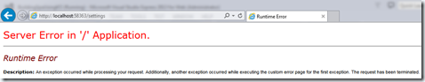
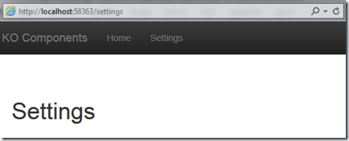

[Part 1: Dipping your feet into KnockoutJS Components](http://sumitmaitra.wordpress.com/2014/07/19/dipping-your-feet-into-knockoutjs-components/ "Part 1: Dipping your feet into KnockoutJS Components") [Part 2: Knockout Components – Separating Templates from View Model](http://sumitmaitra.wordpress.com/2014/07/29/knockout-components-separating-templates-from-view-model/ "Part 2: Knockout Components – Separating Templates from View Model") [Part 3: KO Components – Routes and Hashes](http://sumitmaitra.wordpress.com/2014/08/04/part-3-ko-components-routes-and-hashes/ "Part 3: KO Components – Routes and Hashes") [Part 4: SPA with KO Components-PushState and History JS](http://sumitmaitra.wordpress.com/2014/08/19/part-4-spa-with-ko-components-pushstate-and-history-js/ "Part 4: SPA with KO Components-PushState and History JS")

## Recap

In the previous 4 parts we have seen how to use Knockout Components to make a sample Single Page Application, with different type of client routing libraries.

Towards the end of the third article I had highlighted how SPAs hinder Accessibility and Search-ability of a site’s content primarily because:

a. Search engines don’t ‘click’ on URLs to load content, they simply follow URLs they find and request the server for content. Whatever the server returns is indexed as content of that URL.

b. Accessibility tools work on similar logic to Search engines and cannot ‘click’ on URLs to load content.

Towards both these ends we took a small first step by moving from a hash based client side router to a pushState based one that falls back gracefully for non-push state browsers. This gave us URLs that looked like **/settings** instead of **#settings**. The search engine or accessibility tool now knows it has to navigate to a new URL to get the content.

At the end of the last article I has shown how the server would return a 404 or some similar server-side error because when we click on [http://buildingspausingko.azurewebsites.net/settings](http://buildingspausingko.azurewebsites.net/settings) there is no page at that URL. Remember our entire site is being served from index.html. How to we fix this?

## Enter server side routing fallbacks

Before we start let’s get the Part 4 code from Github.

### Using \_Layout and adding an Index.cshtml for the home page

Before anything, let’s start using the server in the first place.

Our Application was an Empty ASP.NET application to start with. So to get started we’ll first add ASP.NET MVC to it. We can do this by installing the package Microsoft.AspNet.Mvc

PM> install-package Microsoft.AspNet.Mvc

Now let’s add Controller/HomeController and a Views/Home/Index.cshtml files.

We update the Layout such that it contains the top navigation bar and then calls the RenderBody function to render the rest of the page.

<!DOCTYPE html> <html xmlns="[http://www.w3.org/1999/xhtml"](http://www.w3.org/1999/xhtml")\> <head> <title>Dipping your feet into KnockoutJS Components</title> <link href="/Content/bootstrap.css" rel="stylesheet" /> <link href="/Content/bootstrap-theme.css" rel="stylesheet" /> </head> <body> 
 
 
 <button type="button" class="navbar-toggle" data-toggle="collapse" data-target=".navbar-collapse">    </button> <a class="navbar-brand" href="/">KO Components</a> <ul class="nav navbar-nav"> <li> <a href="/">Home</a> </li> <li> <a href="settings">Settings</a> </li> </ul> 
 
 
 
 @RenderBody() 
 <footer class="navbar navbar-fixed-bottom"> 
 
 &copy; 2014 - Still Learning
 
 </footer>   </body> </html>

We put in a simple header in the index.cshtml file showing that it is coming from the server. However not that the div containing the Index content is also the container for the dynamic component which will be loaded by Require JS.

@{ Layout = "~/Views/Shared/\_Layout.cshtml"; } 
 
 <h1>**Index from Server**</h1> 
 

Finally, let’s rename the Index.html to Index2.html so that it’s not picked up as the default by IIS.

If you run the application now you’ll see the ‘Index from Server’ text flashes briefly before being replaced by the greetings.

This simply implies that there was a page that the server rendered and returned, once the page was loaded the client side routing kicked in and replaced the container.

This was the default page.

In the browser change URL by adding settings you’ll get an error as follows:

This is because there is an invalid redirection in my web.config. Open the web.config and delete the highlighted section

Now if you type in the URL /settings on the browser you’ll get a proper 404

You must be wondering how come when I click on Settings link from Home page I get a proper page, but when I type in the URL I get a 404? Well, that’s because typing in a URL sends the request to the server directly. In our case, it sends to ASP.NET MVC. MVC framework uses the current route info and tries to map it to a ‘SettingsController’ with a default ‘Index’ action method. However it doesn’t find the SettingsController and throws a 404.

This is what will happen to Search Engines and Screen readers as well. Even though they will see a URL, trying to browse to it will get them a 404. Search engines will down-rate your site and screen readers will give a poor experience to people using them.

So how do we solve this? Let’s explore two ways today.

## Sending the same page back for all URLs from Server

This is a hackish technique to make sure your users can navigate to the correct page from bookmarked URLs. This doesn’t really help in Search engine optimization or screen readers. But atleast no one gets a 404 when a valid URL is accessed directly from the browser.

For this, all we have to do is, manipulate the MVC router to send all requests to HomeController’s Index action method.

Once the Index page is returned the client side router will kick in and do the ‘right thing’.

In the App\_Start\\RouteConfig.cs update the RegisterRoutes method as follows:

public static void RegisterRoutes(RouteCollection routes) { routes.IgnoreRoute("{resource}.axd/{\*pathInfo}"); routes.MapRoute( name: "Default", url: "{\*pathinfo}", defaults: new { Controller="Home", action = "Index", id = UrlParameter.Optional } ); }

As you can see above, we have changed the url parameter to be a wildcard {\*pathinfo}, and set the default for this wildcard path to Home Controllers’ Index action method.

If you run the application now, and navigate to the Settings page by typing in the URL you’ll see that there is no more 404 error. BUT, the client side routing seems to be taking us back to the Index page. Why?

### Removing hard coded default path in router.js

Well, in our ‘excitement’ to get History.js going with crossroads.js in the last article, we introduced a small hardcoding that’s causing the about “BUG”.

In Router.js’ activateCrossRoads function the last line instructs crossroads to route to the root location (‘/’).

crossroads.parse('/');

This is why even though the browser is pointing to settings page, the page is showing the greetings from the Index page.

Let’s fix this.

The inline function call that’s being bound to the stateChanged event actually needs to be called on first Initialization as well. So let’s refactor it out to a separate function called routeCrossroads.

function routeCrossRoads() { var State = History.getState(); if (State.data.urlPath) { return crossroads.parse(State.data.urlPath); } else { if (State.hash.length > 1) { var fullHash = State.hash; var quesPos = fullHash.indexOf('?'); if (quesPos > 0) { var hashPath = fullHash.slice(0, quesPos); return crossroads.parse(hashPath); } else { return crossroads.parse(fullHash); } } else { return crossroads.parse('/'); } } } I have made some changes to the code in the else section. Actually the condition to check for ‘?’ is there to handle IE9 properly. In case of IE9, History appends a state Id to the URL after ‘?’. Crossroads doesn’t need the state ID hence I strip it out. But the initial condition is incomplete because if there are no ? in the URL we need the entire path (fullHash). I have fixed this in the above code.

Once the above function is in place, the activateCrossroads function becomes as follows:

function activateCrossroads() { History.Adapter.bind(window, "statechange", routeCrossRoads); crossroads.normalizeFn = crossroads.NORM\_AS\_OBJECT; //crossroads.parse('/'); routeCrossRoads(); }

As we can see we have commented out the default routing to the root ‘/’.

With everything in place if we run the app now, and try to type if /settings at the end of the URL we’ll get the correct settings page.

But again, before the Settings page is loaded you will briefly see the red banner saying ‘Index from Server’ flash briefly before navigating to the ‘'Settings’ page. This is because for all URLs we are returning the same Index page from the Server. How do we fix this, if the answer wasn’t obvious, read on 

## Technique 2: Sending a Server Side page for every URL

Now that our SPA is capable of responding to all URLs specified in our web app, let’s dig deeper to see how we can respond to all pages equally.

This section is experimental on my part, if there are better ways to do this, please sound off in the comments section.

### Updating the MVC routing

First thing to do is to update the Routetable to add independent routes for Home/Index and (say) Settings/Index pages.

We’ll keep the ‘catch all’ route that we defined earlier so that if there are any routes that are not defined on the server but defined on the client, we send them off to the home page to load the old fashioned way.

public static void RegisterRoutes(RouteCollection routes) { routes.IgnoreRoute("{resource}.axd/{\*pathInfo}"); routes.MapRoute( name: "Default", url: "{Controller}/{action}/{id}", defaults: new { action = "Index", id = UrlParameter.Optional } ); routes.MapRoute( name: "CatchAll", url: "{\*pathinfo}", defaults: new { Controller="Home", action = "Index", id = UrlParameter.Optional } ); }

With the above routing in place, lets add a new controller called SettingsController and a new cshtml at Views/Settings/Index.cshtml

The Settings Index file again is a simple one saying it’s coming from server! It uses the \_Layout.cshtml file for the header.

@{ Layout = "~/Views/Shared/\_Layout.cshtml"; } 
 
 <h1>Settings from Server</h1> 
 

Now when we run the application and type in /settings we’ll get the server page first and then the client page will get loaded, so you’ll see a brief flash saying ‘Settings from Server’.

In real world the duplication of cshtml and html templates may be a significant effort, I am looking at making things easier in that front and will blog about it if I find anything better. As of now, if you want the best user experience for all types of users (as well as the search engine), this is an extra bit of work that you have to do. It’s not as bad as it sounds either, all you have to do is use the same service that you call during the HTTP GET operation from client, and bind that data to the CSHTML. You can skip elaborate styling and limit it to having correct markup laid out in an orderly fashion.

## Code

As usual the code for this article is up on Github. I have branched this code off as Part5: [https://github.com/sumitkm/BuildingSpaUsingKO/tree/Part5](https://github.com/sumitkm/BuildingSpaUsingKO/tree/Part5 "https://github.com/sumitkm/BuildingSpaUsingKO/tree/Part5")

## Conclusion

With that we conclude this part of the series where we saw how we can handle bookmarked URLs on the server and client. This goes a long way in helping users who use accessibility tools use your site effectively.

More fine tuning will be required on the client side router to handle all scenarios but that’s for another day.

Next we’ll see how to handle URL parameters and more involved routing like Tabs.
