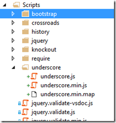

In Part 4 we have seen how to use History.JS along with Crossroads.js to achieve proper client side routing and maintain browser state for proper back button navigation. However, SPAs often have complex page states for example a page with tabbed data or grid data with a particular filter.

One of the ways we can make a particular Tab of data ‘bookmark-able’ is by including the selected tab information as a part of the route. Thus, the particular tab becomes a part of the URL and can be navigated to directly or pushed to the browser history and retrieved on back button.

As you may have noted, our SPA has a name now – SilkThread and a site of it’s own [http://silkthread.pw](http://silkthread.pw). Today we’ll create a Tab-Item component that will working with SilkThread’s routing mechanism.

**Important:** When I started this series KO Components was still in Beta, since then version 3.2.0 has gone live and is now available on Nuget also.This article onwards, I am using the release version from Nuget.

## Before diving into custom components

We have been using ‘’magic strings” for representing routes, component names and so on. Multi-use components are used more than once, and complex views might be composed of multiple components. Relying on magic strings can be error prone and ‘difficult to maintain’. Why? Well imagine that you have created a component called drop-down in the drop-down folder. Now when you access it elsewhere you specify a magic string ‘drop-down’. But does the next person looking into your code know what it signifies? Is it the component name or the folder name or file name or just a random key? However if you accessed the string via a literal **app.components.dropDown.name** it will be amply clear that that string is for. So before our framework gets any more complex, let’s take a stab at cleaning up our magic strings.

### The Component Registration

We add a new file called app.js in the /app folder. Mind you this is a first stab and we are likely to refactor later. Next we add the following code to it

app = { components: { greeter: { name: 'greeter', template: 'App/components/greeter/greeting' } }, pages: { home: { name: 'home', template: 'App/pages/home/home' }, settings: { name: 'settings', template: 'App/pages/settings/settings' } } }

As we can see this is a simple JS object that splits pages and components into different types and registers each sub object represents a component with two properties name and template to start off with.

Now we update our startup.js to use the appropriate component name and template names.

define(\['jquery', 'knockout', './router', 'app', 'bootstrap', 'knockout-projections'\], function ($, ko, router) { ko.components.register(app.components.greeter.name, { require: app.components.greeter.template });

 ko.components.register(app.pages.home.name, { require: app.pages.home.template }); ko.components.register(app.pages.settings.name, { require: app.pages.settings.template }); ko.applyBindings({ route: router.currentRoute }); });

Going forward, we’ll register our components via the app.components object.

#### Registering with Require

We have to tell Require there is a global app object now, so we update the require.config.js and add the app/app route the list.

var require = { baseUrl: "/", paths: { … … "app": "app/app"     }, … }

### Getting a little JS help – Including Underscore.js

The Underscore.js library is a very handy toolset and has some nifty helper functions. I’ll explain the ones we use as I use them. To install it, just use the package-management console

PM> install-package underscore.js

The library is by default installed under the Scripts folder. I’ve moved it to the ‘Scripts\\underscore’ subfolder.

Like the app.js earlier we’ll register Underscore in the require.config.js as well.

var require = { baseUrl: "/", paths: { … "app": "app/app", "underscore": "Scripts/underscore/underscore" }, … }

With these two modifications to existing code set, we’ll start with the actual component.

## Creating a Tab Component

A tab component has two parts, the tabbed header and the panel showing the tab’s content. If we consider the Tab as a menu item it could be a different page altogether. But at any given point a tab control shows only one panel, which is logically related to the selected tab.

To start off with we’ll create a component - tabbed-navigation. The tabbed-navigation component will be the top-level container that will be responsible for showing the tab headers and the selected tab’s container panel. The container panel will be a placeholder div that will be replaced by the component that needs to be shown for the selected tab. We can configure each tab to show a different component.

### The tab-navigation HTML template

The HTML template in the app\\components\\tab-navigation\\tab-navigation.html has the following markup:

<ul id="tabHeader" class="nav nav-tabs" role="tablist"> <!-- ko foreach: tabs --> <li data-bind="css : {active : isSelected }">  </li> <!-- /ko --> </ul>

It has a simple layout using <ul> and the boot-strap styling classes nav and nav-tabs.

Inside the <ul> we loop through an array of tabs items which is going to be encapsulated in the tab-navigation.js view model.

In the loop we add a <li> that has the style **active** if the viewModel tab’s isSelected property is set to true. This sets the active style from Bootstrap.

In the <li> we have an anchor with two data-bindings. First is the **text** that’s going to be shown, next the url that’s bound to the **href** attribute.

Finally we have the 
 tabPanel. This is bound to a component which is initialized with the name and params properties. The name is bound to the selected tab’s component property (so our viewModel has to be able to return a selected tab). In params the only parameter we are currently sending is the name property, which is again picked up from the **text** property of the selected ViewModel.

### The tab-navigation View Model and DataSource

From the above template we can probably guess of a data structure like the following

var ds = { tabs: \[ { text: 'selected 0', url: '/settings/tab0', isSelected : true }, { text: 'selected 1', url: '/settings/tab1', isSelected: false }, { text: 'selected 2', url: '/settings/tab2', isSelected: false }\], selected : function() { // Return the tab that has isSelected = true; } }

To accommodate this structure we use two JS modules - tabsNavigationConfig.js and tabitemConfig.js

**tabitemConfig.js**

tabitemConfig = function (text, url, selected, component) { self = this; self.text = text; self.url = url; self.isSelected = selected; self.component = component; return self; }

**tabsNavigationConfig.js**

tabsNavigationConfig = function (tabitems, selectedIndex) { self = this; self.tabs = \[\]; for (var i = 0; i < tabitems.length ; i++) { self.tabs.push(tabitems\[i\]); if (i == selectedIndex) { self.tabs\[i\].isSelected = true; } } return self; }

The tabsNavigationConfig object has a constructor function that has the list of tabitemConfig objects and the index of which of the tabs is selected.

If you are still wondering as to why we are having a separate datasource for the component, it is simple. We want our component to be re-usable at multiple places, in the same page if required. Hence if we can decouple the data-source from the ViewModel we can configure any number of tab-navigation components with different data-sources. The ViewModel would only be concerned with the rendering and event handling limited to changing of the tabs.

### The tab-navigation ViewModel

With the data source ready, we'll setup the viewModel of the tab-navigation component. I have tagged each relevant line of code with an Index. You can click on them to see more details.

define(\["knockout", "underscore",                                          // #1 "text!./tabbed-navigation.html"\], function (ko, \_, tabbedNavigationTemplate) {                   // #2 var isInitialized = false;                                 // #3 var tabsCache = \[\]; var selectedIndexCache = 0; function tabbedNavigationViewModel(params) {               // #4 self = this; if (!isInitialized) {                                  // #5 isInitialized = true; tabsCache = params.tabConfig().tabs; } self.tabs = ko.observableArray(tabsCache);             // #6 self.selectedIndex = ko.observable(selectedIndexCache);// #7 self.selected = ko.pureComputed(function () {          // #8 return self.tabs()\[self.selectedIndex()\]; }, this); if (params.route) {                                    // #9 selectByRoute(params.route()); } function selectByRoute(route) {                       // #10 var newTab = \_.find(self.tabs(), function (tab) {   // #11 return tab.url == route(); }); if (newTab) { self.tabs()\[self.selectedIndex()\].isSelected = false; //#12 var index = self.tabs().indexOf(newTab);      // #13 select(index);                                // #14 } return item;                                      // #15 }; function select(index)                                // #16 { selectedIndexCache = index; self.tabs()\[index\].isSelected = true; self.selectedIndex(index); } return self; }; return { viewModel: tabbedNavigationViewModel, template: tabbedNavigationTemplate }; });

#1: We start off by declaring that we refer to Underscore.js. #2: Underscore is assigned to the variable \_ .

#3: We create three cache variables that are a part of the module rather than the viewModel constructor function. These are the list of tabs, the selected index and a flag indicating whether we have some cached information or not. When navigating to a tab we will get routed via the settings route. This will reinitialize the viewModel, so if we have the values cached we can use them instead of initializing the tabbed control everytime.

#4: The viewModel constructor function **tabbedNavigationViewModel** which takes in an initialization parameter, and may have a tabsConfig property. The tabsConfig has an array of tabs and the index of the selctedTab.

#5: We check if the module is being initialized the first time around. If so, we set the incoming tabs collection into the cache and mark the module as initialized.

#6: We initialize the tabs with the list in tabs cache.

#7: We set the default selectedIndex to 0.

#8: **Pure Computed Observables**: We have a new type of Observable introduced in KO 3.2.0 called the pureComputed. We know KO had computed observables that automatically updated themselves when their constituent observables changed. However, they suffered from one drawback. Computed observables were always triggered as soon as the constituent observables changed, even if the computed observable was not bound to a view element. This was a performance hit. To resolve this we now have pureComputed observables that get re-calculated only if they have subscriptions, i.e. someone is waiting to update itself based on changes in the pureComputed.

Here we have declared the **selected** property as a pureComputed and it returns the selected Tab. The selection changes whenever the selectedIndex changes. So anytime the selectedIndex changes the **selected** property returns the newly selected tab. As we will see in a bit, this renders a new container.

#9: We check if this viewModel is being created as a result of navigation (all cases except of first time page load). If it is due to navigation the route parameter is populated and we use it to select the particular sub-tab indicated by the route property.

#10: The **selectByRoute** function, called everytime the route changes.

#11: We use the **Underscore** library to find tab in the tabs collection. The syntax of **\_.find** expects the array of items to look into and a comparison function to call for each element in the array. It returns the first element it finds.

#12: Once we've found the element we use the current selected index to set the isSelected flag to false for the current tab.

#13: We retrieve the index of the new selcted tab

#14: Next we call the select method.

#15: The select method sets the isSelected property of the new tab and updates the selectedIndexCache value for future use.

## Initializing the Tab Component

Now that we've seen the structure of data we need and how that data is used lets see how we can use them. The Tab component is used inside the Settings Page component. So someone has to initialize it in the Settings page.

### Tab Component markup in Settings.html

The markup to use the Tab Component is simple and unremarkable:

 <h1>Settings</h1> 
 <tabbed-navigation params="tabConfig : tabbedNavigation(), route: route()"> </tabbed-navigation>

There are two items being passed in the params property, tabConfig and route. The tabConfig property has the initialization parameters of how many tabs, their text, their URL and so forth. Refer to the tabNavigation viewModel section above.

The binding parameters imply that the Component View Model that's backing this HTML has to provide he tabbedNavigation and route properties.

### Tab Component viewModel code

Before now, the settings component was HTML only. We introduce the backing JS for this component. The code for it is as follows:

define( \[ "knockout", "text!./settings.html", "underscore", "../../components/models/tabbed-navigation/tabsNavigationConfig", "../../components/models/tabbed-navigation/tabitemConfig" \], function (ko, settingsTemplate, \_) { var isInitialized = false; var tabsNavigationInstance = null; function settingsViewModel(params) { var self = this; self.tabbedNavigation = new ko.observable(); if (!isInitialized) { isInitialized = true; tabsNavigationInstance = init(params); } self.tabbedNavigation(tabsNavigationInstance); self.route = new ko.observable(); if (params.tab) { self.route(params.request\_); } return self; }; function init(params) { var newTabs = \[\]; for (var i = 0; i < 5; i++) { var key = 'tab' + i; newTabs.push(new tabitemConfig( "Settings " + i, "/settings/" + key, key == params.tab, 'greeter')); } tabsNavigationInstance = new tabsNavigationConfig(newTabs, 0); return tabsNavigationInstance; } return { viewModel: settingsViewModel, template: settingsTemplate }; });

The crux of the component view model is the init method that's called from the constructor function first time around. It need not be called init though. This function initializes an array and pushes in 5 instances of the tabitemConfig that we defined earlier. Since this is a demo we are simply doing a loop. For a real life scenario we would instantiate each instance with a relevant name and more importantly route to a component that should be visible when the tab is selected. In our case we are setting each route to point to the previously created 'greeter' component. So for every tab selection we'll show a greeter component and if you refer back to the original markup at the top you'll see we pass the selected tabs' text property to the greeter as a parameter. So the greeter shows name of the tab selected.

## Demo time

If we run the application and navigate to the Settings page we'll see the following

\- First tab 'Settings 0' is selected - Greeter is saying Hello to 'Settings 0'

\- Clicking on Settings 1 tab, 'navigates to that tab.Notice the route changes to settings/tab1. This corresponds to the route we setup when initializing the tabitemConfig object.

Now we can click on the Browser back button to navigate back to Settings 0 tab, and go forward again to come back to Settings 1 tab. When you navigate you'll notice that the timestamp of Greeter component keeps changing this is because the greeter component doesn't cache the time stamp so everytime the constructor function is called, the time gets updated.

Code for this version is available on the Part6 branch of the repository [https://github.com/sumitkm/BuildingSpaUsingKO/tree/Part6](https://github.com/sumitkm/BuildingSpaUsingKO/tree/Part6 "https://github.com/sumitkm/BuildingSpaUsingKO/tree/Part6")

## Conclusion

In conclusion we saw how we could create a 'tab-component' using KO's component model of development. Next we'll see how we can use different components in different tabs and how to call server to get/put data.
