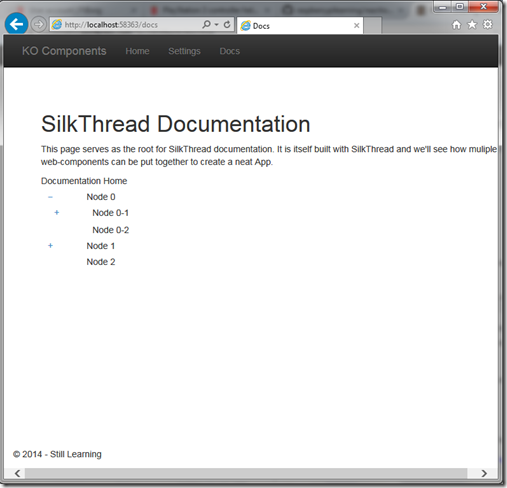

Continuing my account of using KO Components and the building of the [Silkthread](http://silkthread.pw/ "Silkthread") SPA, today I am going to build another component - a Tree view component.

_Note: All my articles on KO Components are now categorized and you can bookmark the_ [_this link_](http://sumitmaitra.wordpress.com/category/silkthread/ "All KO Component articles") _for easy reference. All future articles will automatically appear in that list._

No one really uses a TreeView in a public facing Website today, but the underlying hierarchical data representation is still very valid and the TreeView has transformed into a series of Folding panels, cascading dropdowns, CSS Menus or in case of mobile devices cascading set of lists.

I came across the need for the TreeView because I wanted to build a Documentation Index for the SilkThread site. So this is like dog-fooding of SilkThread SPA itself. Today we'll explore the following things:

1. How to layout the TreeView, creating the Tree and TreeNode components (1/2).
2. How to pass data into nested Components (we have done this in the previous article also) (1/2)
3. Styling the TreeView (1/2)
4. How to raise and handle events using Amplify.js (2/2)

## Creating the Tree and the TreeNode components

I am starting with v6 label of my BuildingSpaWithKO project in Github.

### Adding a new Page

1\. First up, we'll add a new 'page component' called docs.

#### Adding a new Page Component

a. Add new folder under App/pages called docs b. Add a docs.js and docs.html file in the docs folder. Remove all the boilerplate code/markup that Visual Studio adds and setup the component as follows

\[sourcecode language="javascript" padlinenumbers="true"\] define(\['knockout', 'text!./docs.html'\], function (ko, docsTemplate) { function docsViewModel(params) { var self = this; self.title = ko.observable('SilkThread - Yet another SPA Framework'); self.data ={ title: 'Documentation Home', nodes: \[\] }; return self; } return { viewModel: docsViewModel, template: docsTemplate }; }); \[/sourcecode\]

The component is pretty self explanatory, it has two properties, title and data. The title property has a default text but is an observable, so if we bind it to an html element if will be updated in the UI if we decide to change the Title at runtime.

The 'nodes' property has an empty JavaScript object at the moment and we will pump mock data into it once our component is ready.

**_Registering the Docs page_**

To register our new page we update the app.js by adding the new page definition to it.

\[sourcecode language="javascript"\] app = { components: { greeter: { name: 'greeter', template: 'App/components/greeter/greeting' }, tabitem: { name: 'tabitem', template: 'App/components/tabitem/tabitem' }, tabbedNavigation: { name: 'tabbed-navigation', template: 'App/components/tabbed-navigation/tabbed-navigation' } }, pages: { home: { name: 'home', template: 'App/pages/home/home' }, docs: { name: 'docs', template: 'App/pages/docs/docs' }, settings: { name: 'settings', template: 'App/pages/settings/settings' } } } \[/sourcecode\]

We register the component in startup.js as follows:

\[sourcecode language="javascript"\] ko.components.register(app.pages.docs.name, { require: app.pages.docs.template }); \[/sourcecode\]

To navigate to the 'Docs' page we add a link in \_Layout.cshtml page. as seen below the href is pointing to the page-name we registered above.

\[sourcecode language="html" firstline="18" highlight="25,26,27"\] <ul class="nav navbar-nav"> <li> <a href="/">Home</a> </li> <li> <a href="settings">Settings</a> </li> <li> <a href="docs">Docs</a> </li> </ul> \[/sourcecode\]

Finally we add the docs route to our router in router.js as follows

\[sourcecode language="javascript"\] return new Router({ routes: \[ { url: '/', params: { page: 'home' } }, { url: 'home', params: { page: 'home' } }, { url: 'docs', params: { page: 'docs' } }, { url: 'samples', params: { page: 'samples' } }, { url: 'settings', params: { page: 'settings' } } \] }); \[/sourcecode\]

With the Docs page in place we can get down to the business of creating the actual Tree component.

## Building a Tree View using KO Components

A tree component can logically have two sub-parts. First the container and second a Node object that can itself contain a list of Nodes. So we create two components for this purpose:

1\. The Tree-Node component 2. The Tree component

### The Tree Node Component

We look at the node view model before we look at the container. As standard with all KO Components we create a Tree folder under the Scripts/app/components folder and add two files tree-node.html and tree-node.js

#### The Node view model (tree-node.js)

\[sourcecode language="javascript"\] define(\["knockout", "text!./tree-node.html"\], function (ko, treeNodeTemplate) { function treeNodeViewModel(params) { var self = this; self.title = ko.observable('Default'); self.url = ko.observable('/'); self.nodes = ko.observableArray(); self.expanded = ko.observable(true); if (params.node) { self.title(params.node.title); if (params.node.expanded != null) { self.expanded(params.node.expanded); } self.nodes().push.apply(self.nodes(), params.node.nodes); }

self.changeState = function () { self.expanded(!self.expanded()); } return self; } return { viewModel: treeNodeViewModel, template: treeNodeTemplate }; }); \[/sourcecode\]

The treeNodeViewModel has four fields and a function() to store the information and react to actions on it.

**title** - This is the text that's displayed on the Node **url** - A relative or absolute URL to navigate to when user clicks on the node. **nodes** - A collection of more treeNodeViewModels that are child nodes of the current node. Note that, the nodes collection essentially makes the view model recursive. **expanded** - A property storing the state of the current node, as to whether its child nodes are shown or hidden. This is applicable only when the nodes collection has more than one element. **changeState()** – This function is attached to the click event of the span element in the view. The span has the text + or – depending on the value of ‘expanded’ property.

### The Node View (tree-node.html)

The corresponding markup for the Node view is as follows:

\[sourcecode language="html"\] <ul class="nav nav-stacked" style="padding-left:10px"> <li class="nav list-group-item-heading selected"> 
 
 <!-- ko if: nodes().length > 0 --> <!-- ko if: expanded() --> <a data-bind="click: changeState" role="button" href=""> <i class="glyphicon-minus"></i> </a> <!-- /ko --> <!-- ko ifnot: expanded() --> <a data-bind="click: changeState" role="button" href=""> <i class="glyphicon-plus"></i> </a> <!-- /ko --> <!-- /ko --> 
 
  
 
 </li> <!-- ko if: nodes().length > 0 && expanded() === true --> <!-- ko foreach: nodes --> <li> <tree-node params="node: $data"></tree-node> </li> <!-- /ko --> <!-- /ko --> </ul> \[/sourcecode\]

 

The tree-node is wrapped in a <ul> just to make use of Bootstrap's default indentation. If you want you can use any markup. The 
 is where things get interesting. We have two columns in the row.

The first column is rendered conditionally. We check if there are elements in the nodes collection. If there are one or more nodes we check the expanded() property to see if we should render a \[-\] or a \[+\] using an anchor tag. We also attached the click event of the anchor to the changeState function.

The second column is a span that's bound to the title property of the tree-node viewmodel.

Finally we need to render the rest of the nodes so again we check if the nodes collection is empty or not. If there are one or more nodes we loop though each node and render a tree-node itself with the current instance of the node object as provided by KO in the $data variable.

### The Tree Component

Now that we have seen what the node looks like lets setup the container

### The Tree view model (tree.js)

\[sourcecode language="javascript"\] define(\[ "knockout", "text!./tree.html"\], function (ko, treeTemplate) { function treeViewModel(params) { var self = this; self.title = ko.observable(''); self.nodes = ko.observableArray(\[\]);

if (params.data) { self.title(params.data.title); self.nodes().push.apply(self.nodes(), params.data.nodes); } return self; } return { viewModel: treeViewModel, template: treeTemplate }; }); \[/sourcecode\]

As we can see, the viewModel is pretty simple, it has two properties: **title** \- A string that can be shown on top of the TreeView **nodes** - A collection of node objects.

### The Tree view (tree.html)

The markup for the Tree component simply binds the nodes collection from the viewModel into a unordered list.

\[sourcecode language="html"\] <ul class="nav nav-stacked"> <li class="nav list-group-item-heading" data-bind="text: title"> <!-- ko if: nodes().length > 0 --> <li> <!-- ko foreach: nodes --> <tree-node params="node: $data"></tree-node> <!-- /ko --> <!-- /ko --> </li> </ul> \[/sourcecode\]

## Registering the new components

We go back to the app.js file and add our two new components to the ko.components' list.

\[sourcecode language="javascript"\] app = { components: { greeter: { name: 'greeter', template: 'App/components/greeter/greeting' }, tabitem: { name: 'tabitem', template: 'App/components/tabitem/tabitem' }, tabbedNavigation: { name: 'tabbed-navigation', template: 'App/components/tabbed-navigation/tabbed-navigation' }, treeNode: { name: 'tree-node', template: 'App/components/tree-node/tree-node' }, tree: { name: 'tree', template: 'App/components/tree/tree' } }, pages: { home: { name: 'home', template: 'App/pages/home/home' }, docs: { name: 'docs', template: 'App/pages/docs/docs' }, settings: { name: 'settings', template: 'App/pages/settings/settings' } } } \[/sourcecode\]

 

### Adding some dummy data

Now that we've got the components in place, let's add some dummy data to bring up the tree. We go back to the docs.js file and update the data source.

\[sourcecode language="javascript"\] self.data = { title: "Documentation Home", nodes: \[ { title: "Node 0", nodes: \[ { title: "Node 0-1", expanded: false, nodes: \[ { title: "Node 0-1-0" }, { title: "Node 0-1-1" } \] }, { title: "Node 0-2" }\] }, { title: "Node 1", expanded: false, nodes: \[ { title: "Node 1-1" }, { title: "Node 1-2" }\] }, { title: "Node 2" }\] } \[/sourcecode\]

## Demo Time

Now that we are setup with the new components lets run the app and see how it works.

Navigating to the docs page shows us the following:

Notice 'Node 0-1' and 'Node 1' are not expanded by default but 'Node 0' is. This is because these nodes have the **expanded** property explicitly set to false. By default expanded is assumed **true.**

So we have a functional Tree layout. However clicking on the nodes don't do anything because their HREFs are empty and there is no 'click' handler to do something with.

Initially I wanted to introduce AmplifyJS in this article itself, but this one is already 1500+ chars and is straining on everyone's patience. So I am going to split up this article and introduce AmplifyJS in the next article where we'll see how we can use it to handle events and share data across components.
