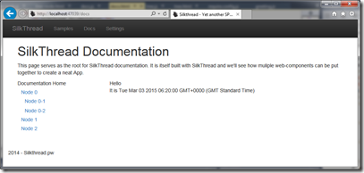

In my previous articles I've shown how to build KO components that start off with a data source of their own and are pretty self contained with respect to interactions with the rest of the page. But, in the first part of this article we built a tree control that's I am planning to use as an Index page. So an action like 'Clicking' a link needs to affect another part of the application/web page.

Beauty (and often the bane) of JavaScript is that there are multiple ways to do this. You could go low down to core JavaScript event handling or jQuery event handling quite easily. However, the beautiful View-ViewModel separation that you have created using KO Components would be completely ruined if you had to know the ID of the UI element to hook an event handler in another component or in the parent page for that matter.

Solution? A light weight message passing system, that subscribes to events for you and publishes the event to all who have subscribed.

## Message passing whaa...

Did you just wince at the sound of 'message passing system', fear not, it's not rocket science, in fact it's pretty simple. Take the two scenarios below.

### Scenario 1

The good ol' fashioned jQuery way of handling events. You take a document element and attach an event handler function to it. When the event occurs the attached function is called. You can do this anywhere in your JavaScript code, only requirement is that the element referred to by the id is available in the HTML DOM.

Here, reference by the id of the element, breaks the model view separation where the View Model has explicit knowledge of the View's elements. This is hard coupling and should be avoided.

### Scenario 2

Instead of attaching our event handler code directly, we list our function in a centrally located - let's call it a 'registry' for now, using a unique string key.

Next when the particular event happens we tell the 'registry' that a 'named' event has happened and that all subscribers should be notified.

The registry takes the name and looks up to see if any functions where registered against it, if so, those functions are called.

Thus, by using a central location for registering event names and their handlers, we have decoupled View and ViewModel. Now View can raise an event, ViewModel handles the event via KO's event handling mechanism and then tells the central registry to dispatch a named event to all the subscribers.

The subscribers need not be a part of this ViewModel, they could be part of any ViewModel on the page. They would register to listen of the 'named event' by providing an event handler function. This is the key, no 'ids' need to be shared across ViewModels.

Once the named event occurs the event handler functions are called.

## Using AmplifyJS

Now that we've got an idea of how we can decouple the UI from the view model and still pass data around components, let's use [AmplifyJS](http://www.amplifyjs.com "Amplify JS website") as our 'events broker' and see what it takes to implement it.

Amplify was created by the team at [http://appendto.com/team](http://appendto.com/team) and is made available under MIT and GNU OSS licenses.

### Installing AmplifyJS

Installing AmplifyJS is easy. Use nuget package manager console and install package using the following command

\[sourcecode language="powershell" padlinenumbers="true"\] install-package AmplifyJS \[/sourcecode\]

This will create a Scripts/amplify folder and put each amplify component in a separate file here. It will also place amplify.js and amplify.min.js in the Scripts folder. Since we'll be using the entire library we'll delete the separate component files and move the amplify.\* files from Scripts to Scripts/amplify

Since we'll need Amplify globally to watch over all messages passed to and from it, we'll set it up in the configuration require.config.js as highlighted below

\[sourcecode language="javascript" highlight="14" padlinenumbers="false"\] var require = {     baseUrl: "/",     paths: {         "bootstrap": "Scripts/bootstrap/bootstrap",         "historyjs": "Scripts/history/native.history",         "crossroads": "Scripts/crossroads/crossroads",         "jquery": "Scripts/jquery/jquery-1.9.0",         "knockout": "Scripts/knockout/knockout-3.2.0beta.debug",         "knockout-projections": "Scripts/knockout/knockout-projections.min",         "signals": "Scripts/crossroads/signals",         "text": "Scripts/require/text",         "app": "app/app",         "underscore": "Scripts/underscore/underscore",         "amplify": "Scripts/amplify/amplify.min",     },     shim: {         "bootstrap": {             deps: \["jquery"\]         }     } } \[/sourcecode\]

### Updating tree-node to handle click event

We update the tree-node view to wrap the text span in an anchor, and attach a click handler

\[sourcecode language="html" padlinenumbers="true" highlight="19,21"\] <ul class="nav nav-stacked" style="padding-left:10px">     <li class="nav list-group-item-heading selected">         
             
                 <!-- ko if: nodes().length > 0 -->                 <!-- ko if: expanded() -->                 <a data-bind="click: changeState" role="button" href="">                     <i class="glyphicon-minus"></i>                 </a>                 <!-- /ko -->                 <!-- ko ifnot: expanded() -->                 <a data-bind="click: changeState" role="button" href="">                     <i class="glyphicon-plus"></i>                 </a>                 <!-- /ko -->                 <!-- /ko -->             
             
                 <a href="" data-bind="click: nodeClicked">                                      </a>             
         
     </li>     <!-- ko if: nodes().length > 0 && expanded() === true -->     <!-- ko foreach: nodes -->     <li>         <tree-node params="node: $data"></tree-node>     </li>     <!-- /ko -->     <!-- /ko --> </ul> \[/sourcecode\]

### In the viewModel we handle the click event and raise

The following snippet handles the click event

\[sourcecode language="javascript"\] self.nodeClicked = function (currentNode) { currentNode.expanded(!currentNode.expanded()) alert("hello " + currentNode.title()); } \[/sourcecode\]

First up it simply raises an alert that says hello with the name of the node. We have also setup the node to flip the expanded flag.

If we run the application now and click a node, we'll see the popup.

So far so good. The node has directly responded to the click event.

### Raising Event using Amplify

In the tree-node.js' nodeClicked function we can 'raise' an event or pass message to our queue that the click event has happened. To do this we first add reference to amplify in our module. Since we have registered it globally all we have to do is use its alias:

\[sourcecode language="javascript" padlinenumbers="" firstline="1" highlight="1"\] define(\["knockout", "text!./tree-node.html", "amplify"\], function (ko, treeNodeTemplate) { \[/sourcecode\]

Next we upload the clicked event function as follows:

\[sourcecode language="javascript" padlinenumbers="true" highlight="3,4"\] self.nodeClicked = function (currentNode) { currentNode.expanded(!currentNode.expanded()); var nodeName = currentNode.title(); amplify.publish(&amp;quot;CurrentNode-NodeClicked&amp;quot;, nodeName ); } \[/sourcecode\]

As you can see the call to 'raise' or 'publish' the event via amplify is pretty simple. All we have done is specified a string key, and then passed on the value we want to event receiver to get, which in this case is the nodeTitle. We could have passed the entire node if we wanted.

Note: I have removed the alert from the nodeClicked Event. Now we need another component to subscribe to this event and handle it when it occurs.

### The 'Content Pane'

The node click is supposed to be handled by a 'Content Pane' component that pulls content from another source. For brevity, I'll 're-use' the greeter component. We update the greeter component such that it handles the click event and updates the greeting.

First we add reference to Amplify

\[sourcecode language="javascript"\] define(\["knockout", "text!./greeting.html", "amplify"\], function (ko, greeterTemplate) { \[/sourcecode\]

Next we add a 'subscription' for the event and update the greeting text

\[sourcecode language="javascript" highlight="5,6,7"\]     function greeterViewModel(params) {         var self = this;         self.greeting = ko.observable(params.name);         self.date = ko.observable(new Date());         amplify.subscribe("CurrentNode-NodeClicked", function (value) {             self.greeting(value);         });         return self;     } \[/sourcecode\]

As we can see, subscribing to the 'event' is as simple as

\- Specifying the same key that we published it with,

\- Providing a function that will be called when the event happens.

In the function we have changed the greeting property of the viewModel.

Now we add the greeter page component in the docs.html

\[sourcecode language="javascript" highlight="13"\] 
     <h1>SilkThread Documentation</h1>     
         This page serves as the root for SilkThread documentation.         It is itself built with SilkThread and we'll see how muliple         web-components can be put together to create a neat App.     
     
         
             <tree params="data: data"></tree>         
         
             <greeter></greeter>         
     
 
 \[/sourcecode\]

### Demo Time

We are all set, when we run the app initially we come up with this

When we click on **Node 0** the greeting changes to

Also note that the node has collapsed because of the code we wrote to toggle the expanded state.

## Conclusion

This light weight message **Pub**lishing-**Sub**scribing system is an established pattern often referred to as **Pub-Sub**. It is a very useful pattern in terms of decoupling interactions. It is used not just in JavaScript, it can be used in highly scalable backend systems.

SignalR is another example of a Pub-Sub system that maintains subscribers on the server and publishes actions to all connected clients. But it is used across server and client systems.

So as you can see the Pub-Sub system is a versatile software development pattern that we leveraged on the client side today.

That concludes this sub-series of my overall [Silkthread](http://silkthread.pw/ "Silkthread") series. Next we will see how we can use Amplify to make http requests and send data to server and retrieve data back.

The code as always is on [Github](https://github.com/sumitkm/BuildingSpaUsingKO "Github - Building SPA using KnockoutJS"). This specific branch is saved as [Part7-2](https://github.com/sumitkm/BuildingSpaUsingKO/tree/Part7-2 "Part 7 - 2").
