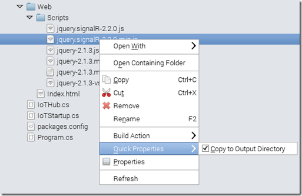
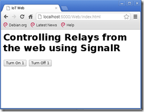
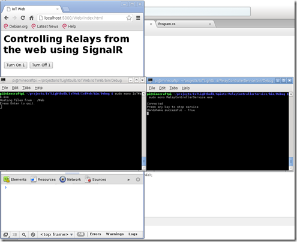

In my previous article I built a C# library to communicate with the GPIO ports of the Raspberry Pi 2 (and Raspberry Pi B+). We also built a small console application to trigger the ports. While the console application was a nice proof of concept, the real fun is when you are able to flip switches from remote locations (when not at home, over phone etc. etc.) As a first attempt at this I built a OWIN based self hosting web site that communicates with the Pi over HTTP using SignalR.

## The Idea

The idea is pretty simple, the GPIOManager is embedded into a Console application that is also a SignalR client.

The SignalR client has SwitchOn, SwitchOff methods taking GPIOPinIds as parameters and call upon the GPIOManager to do so.

Any web application can host the SignalR Hub and a SignalR web client. The web client relays the actions to the remote client. Simple!

## Before we start

In reality I built the sample app first and then did the refactoring but now that the code is already refactored might as well mention it beforehand.

### The PiOfThings.net

I got so involved with this whole IoT things, that I decided to go the whole nine yards

\- Bought the domain [www.piofthings.net](http://www.piofthings.net). It is currently the Github.io page for the piofthings account. I'll eventually move it to docs.piofthings.net and replace the www with something more interesting    
\- Created a new Github account [http://www.github.com/piothings](http://www.github.com/piothings).    
\- Refactored code and checked it into Github  
\- Created Nuget Packages [PiOfThings.GpioCore](http://www.nuget.org/packages/PiOfThings.GpioCore/ "Nuget.Org - PiOfThings.GpioCore") and [PiOfThings.GpioUtils](http://www.nuget.org/packages/PiOfThings.GpioUtils/ "Nuget.Org - PiOfThings.GpioUtils") and uploaded to [www.Nuget.org](http://www.Nuget.org)  
\- So now you can install the dependencies using Nuget Package Manager

\[sourcecode language='powershell'  padlinenumbers='true'\]
install-package PiOfThings.GpioCore

install-package PiOfThings.GpioUtils
\[/sourcecode\]

As you can guess from the namespaces the refactoring involved separating the helper classes into a separate DLL. This is because I wanted to refer the utility enumerations on the Web application but the web application didn't need the manager. So now you can install the Core which has the manager and it will install GpioUtils automatically. Or if you want the Utils only, just install the PiOfThingsUtils directly.

With all the refactoring in place, we are not ready to take the next step.

## Creating the SelfHosted Owin Web App

I started with a Console App in Mono and added the following Packages

Microsoft.Owin  
Microsoft.Owin.SelfHost

  
Microsoft.Owin.Host.HttpListener

  
Microsoft.AspNet.SignalR.Core

  
Microsoft.AspNet.SignalR.JS

  
and of course PiOfThings.GpioUtils

These all install certain sub-dependencies so you'll end up with a bigger list of packages

My final packages.config looks like this  

\[sourcecode language='xml' \]
<?xml version="1.0" encoding="utf-8"?>
<packages>
  <package id="jQuery" version="2.1.3" targetFramework="net45" />
  <package id="Microsoft.AspNet.Cors" version="5.2.3" targetFramework="net45" />
  <package id="Microsoft.AspNet.SignalR.Core" version="2.2.0" targetFramework="net45" />
  <package id="Microsoft.AspNet.SignalR.JS" version="2.2.0" targetFramework="net45" />
  <package id="Microsoft.Owin" version="3.0.1" targetFramework="net45" />
  <package id="Microsoft.Owin.Cors" version="3.0.1" targetFramework="net45" />
  <package id="Microsoft.Owin.Diagnostics" version="3.0.1" targetFramework="net45" />
  <package id="Microsoft.Owin.FileSystems" version="3.0.1" targetFramework="net45" />
  <package id="Microsoft.Owin.Host.HttpListener" version="3.0.1" targetFramework="net45" />
  <package id="Microsoft.Owin.Hosting" version="3.0.1" targetFramework="net45" />
  <package id="Microsoft.Owin.Security" version="3.0.1" targetFramework="net45" />
  <package id="Microsoft.Owin.SelfHost" version="3.0.1" targetFramework="net45" />
  <package id="Microsoft.Owin.StaticFiles" version="3.0.1" targetFramework="net45" />
  <package id="Newtonsoft.Json" version="6.0.8" targetFramework="net45" />
  <package id="Owin" version="1.0" targetFramework="net45" />
  <package id="PiOfThings.GpioUtils" version="0.1.0" targetFramework="net45" />
</packages>
\[/sourcecode\]

### Adding a SignalR Hub

Added a new class called IoTHub that inherit from Microsoft.AspNet.SignalR.Hub. Added a method Handshake that simply returns true. This is for the client to check if the server is there or not when it starts off.

Next we add two methods switchOn and switchOff, both take the GpioId as input parameter. All that this method does is calls the switchOff or switchOn function on all other clients.

The final Hub class is as follows:

\[sourcecode language='csharp' \]
using System;
using Microsoft.AspNet.SignalR;
using Microsoft.AspNet.SignalR.Hubs;
using PiOfThings.GpioUtils;

namespace IoTWeb
{
    \[HubName("IoTHub")\]
    public class IoTHub : Hub
    {
        public bool Handshake()
        {
            return true;
        }

        public void SwitchOn(GpioId gpioPinId)
        {
            Console.WriteLine("Switching ON - " + gpioPinId.ToString("D"));
            Clients.Others.switchOn(gpioPinId);
        }

        public void switchOff(GpioId gpioPinId)
        {
            Console.WriteLine("Switching OFF - " + gpioPinId.ToString("D"));

            Clients.Others.switchOff(gpioPinId);
        }
    }
}
\[/sourcecode\]

### Setting up SignalR in the OWIN pipeline

We add new class called IoTStartup and add decorate it with the OwinStartup attribute.

\[sourcecode language='csharp' \]
using System;
using Microsoft.AspNet.SignalR;
using Microsoft.Owin.Cors;
using Microsoft.Owin;
using Owin;

\[assembly: OwinStartup(typeof(IoTWeb.IoTStartup))\]

namespace IoTWeb
{
	public class IoTStartup
	{
		public IoTStartup ()
		{
		}
	}
}

\[/sourcecode\]

Next we add a method Configuration with an input parameter of type IAppBuilder. A function with an input parameter of type IAppBuilder is the standard convention for chaining OWIN components.

We setup SignalR in the OWIN pipeline as follows

\[sourcecode language='csharp' \]
public void Configuration(IAppBuilder app)
{
	app.UseCors (CorsOptions.AllowAll);
	app.MapSignalR ();		
}
\[/sourcecode\]

### Getting it hosted

Now to host SignalR. We go back to the Program.cs and add update it as follows:

\[sourcecode language='csharp' \]
using System;
using Microsoft.Owin.Hosting;

namespace IoTWeb
{
	class MainClass
	{
		public static void Main (string\[\] args)
		{
			string baseUrl = "http://localhost:5000";
			using (WebApp.Start<IoTStartup>(baseUrl))
			{
				Console.WriteLine("Press Enter to quit.");
				Console.ReadKey();

			}
		}
	}
}
\[/sourcecode\]

We are using the WebApp to host all other OWIN components. The WebApp is hosted at the provided URL (localhost:5000) We could have used SignalR self hosting too, but you'll see in a minute why I used Web App.

Build the application and run from the console

\[sourcecode language='bash' \]

pi@raspberry ~/projects/IoTLightbulb/IoTWeb/bin/Debug $ sudo mono IoTWeb.exe

\[/sourcecode\]

Next launch browser and go to localhost:5000/SignalR/hubs you should see the generated Hub proxy. To ensure it's correctly generated, scroll down till you can see your Hub's name (IoTHub) and the three functions you created in your hub (handshake, switchOff and switchOn

Great, we have a SignalR hub that can issue commands. Now we need two things, a UI to issue the commands and a client connected to this hub to receive those commands. Let set these up.

### Setting up a simple Static File Host using OWIN

In real life we would build a nice ASP.NET MVC around the SignalR app, but today we are only demoing stuff. All we need is an HTML page, some JavaScript so lets use simple static file hosting and host an HTML file and required JavaScript.

1\. Update the jQuery dependency (you got from installing the Microsoft.AspNet.SignalR.JS) from 1.6.4 to the latest using Update package feature of Mono from the solution itself.

2\. Add a folder called Web in your project and move the Scripts folder package under Web. It should look something like this

3\. Now right click on the min.js files one at a time, go to quick properties and check the 'Copy to Output Directory'

Do the same for Index.html. This will ensure the Web folder is create under wherever the exe file is generated and contain the HTML and required JavaScript files.

4\. Under Web add an Html file - Index.html and add the following markup

\[sourcecode language='html' \]
<!DOCTYPE>
<html>
	<head>
		<title>IoT Web</title>
		
		
		
	</head>
	<body>
		<h1>Controlling Relays from the web using SignalR </h1>
		<button id="turnOn1">Turn On 1</button>
		<button id="turnOff1">Turn Off 1</button> 

		
	</body>

</html>
\[/sourcecode\]

We have basically done the following:  
\- Added reference to jQuery, SignalR client (jQuery.SignalR) and the SignalR hub

  
\- Added two buttons with the ids turnOn1 and turnOff1

  
\- Initialized the hub and once the connection started attached a click handler to each button.

  
\- Each click calls the respective switchOn and switchOff method. The number 17 basically implies GPIO 17 that we are trying to turn on an off

  

5\. Finally in the IoTStartup.cs add two lines of code in the Configuration function to initialize static hosting

\[sourcecode language='csharp'  highlight='7,8'\]
public void Configuration(IAppBuilder app)
{
	app.UseCors (CorsOptions.AllowAll);
	app.MapSignalR ();		
	string exeFolder = System.IO.Path.GetDirectoryName (System.Reflection.Assembly.GetExecutingAssembly ().Location);
	string webFolder = System.IO.Path.Combine (exeFolder, "Web");
	Console.WriteLine ("Hosting Files from : " + webFolder);
	app.UseStaticFiles ("/Web");
}
\[/sourcecode\]

All set with the Web page then. Run it again and navigate to http://localhost:5000/Web/Index.html . You should see something similar:

Cool. Now lets build the client that will communicate with this server

## Creating SignalR client to communicate with GPIO ports

Lets start with another console application, I have called it RelayControllerService. This service does the following:

Create a SignalR HubProxy, a GpioManager and establish a connection with the SignalR server.  
Once setup it does the handshake and then wait for commands from the server.

  
When it receives SwitchOn or SwitchOff command, it uses the GpioManager to write to the appropriate GPIO pin.

Before we get started we add references to the following packages:

\[sourcecode language='powershell' \]

install-package Microsoft.Owin
install-package Microsoft.AspNet.Cors
install-package PiOfThings.GpioCore

\[/sourcecode\]

This should setup all other required dependencies. My packages.config is as follows:

\[sourcecode language='xml' \]
<?xml version="1.0" encoding="utf-8"?>
<packages>
  <package id="Microsoft.AspNet.Cors" version="5.2.3" targetFramework="net45" />
  <package id="Microsoft.AspNet.SignalR.Client" version="2.2.0" targetFramework="net45" />
  <package id="Microsoft.Owin" version="3.0.1" targetFramework="net45" />
  <package id="Microsoft.Owin.Diagnostics" version="3.0.1" targetFramework="net45" />
  <package id="Microsoft.Owin.Security" version="3.0.1" targetFramework="net45" />
  <package id="Newtonsoft.Json" version="6.0.8" targetFramework="net45" />
  <package id="Owin" version="1.0" targetFramework="net45" />
  <package id="PiOfThings.GpioCore" version="0.1.0" targetFramework="net45" />
  <package id="PiOfThings.GpioUtils" version="0.1.0" targetFramework="net45" />
</packages>
\[/sourcecode\]

Now that we are all set, let's look at the code for the RelayControllerService.

#### The Constructor

\[sourcecode language='csharp' \]
using System;
using Microsoft.AspNet.SignalR.Client;
using PiOfThings;
using PiOfThings.GpioCore;
using PiOfThings.GpioUtils;

namespace RelayControllerService
{
	public class RelayControllerService
	{
		readonly GpioManager \_manager = new GpioManager ();

		private IHubProxy IoTHub { get; set; }

		private HubConnection IoTHubConnection { get; set; }

		public RelayControllerService (string url)
		{
			IoTHubConnection = new HubConnection (url);
			IoTHub = IoTHubConnection.CreateHubProxy ("IoTHub");

			IoTHub.On<GpioId> ("SwitchOn", OnSwitchedOn);

			IoTHub.On<GpioId> ("SwitchOff", OnSwitchedOff);

			Console.Read ();
		}
\[/sourcecode\]

We are setting up our service by initializing the GpioManager, ProxyHub and HubConnection. We are also assigning an event handler for the SwitchOn and SwitchOff events that will be invoked someone clicks on the buttons on our website.

#### The Event handlers

The event handlers have the same code from our previous sample console application. Whenever a switchOn or switchOff is received, we first check if the \_manager's current pin is the same as the pin requested, if not it is selected. Once selected we write the Low or High appropriately.

\[sourcecode language='csharp'  firstline='29'\]
        private void OnSwitchedOn(GpioId gpioPinId)
        {
            Console.WriteLine("SWITCH ON RECIEVED " + gpioPinId);
            if (\_manager.CurrentPin != gpioPinId)
            {
                \_manager.SelectPin(gpioPinId);
            }
            \_manager.WriteToPin(GpioPinState.Low);
        }

        private void OnSwitchedOff(GpioId gpioPinId)
        {
            Console.WriteLine("SWITCH OFF RECIEVED " + gpioPinId);

            if (\_manager.CurrentPin != gpioPinId)
            {
                \_manager.SelectPin(gpioPinId);
            }
            \_manager.WriteToPin(GpioPinState.High);
        }

\[/sourcecode\]

#### Connection Initialization and termination

Our service is setup and ready to provide event handlers. All we have to do is start connection and wait for server. Also when user wishes they can stop the connection.

The StartConnection creates an async task that attempts to connect to the server. Once connected to the server is calls our HandShake method and reports that the Handshake was successful. In future the Handshake will be more involved with the device sending specific device identifiers to the server so that the server can keep track of which device is connected and connect to that particular device only.

The StopConnection simply calls the GpioManager's Release all function to release all the GPIO pins and then calls a SignalR Stop to gracefully close the connection.

\[sourcecode language='csharp'  firstline='50'\]
using System;
using Microsoft.AspNet.SignalR.Client;
using PiOfThings;
using PiOfThings.GpioCore;
using PiOfThings.GpioUtils;

namespace RelayControllerService
{
    public class RelayControllerService
    {
        readonly GpioManager \_manager = new GpioManager();

        private IHubProxy IoTHub { get; set; }

        private HubConnection IoTHubConnection { get; set; }

        public RelayControllerService(string url)
        {
            IoTHubConnection = new HubConnection(url);
            IoTHub = IoTHubConnection.CreateHubProxy("IoTHub");

            IoTHub.On<GpioId>("SwitchOn", OnSwitchedOn);

            IoTHub.On<GpioId>("SwitchOff", OnSwitchedOff);

            Console.Read();
        }

        private void OnSwitchedOn(GpioId gpioPinId)
        {
            Console.WriteLine("SWITCH ON RECIEVED " + gpioPinId);
            if (\_manager.CurrentPin != gpioPinId)
            {
                \_manager.SelectPin(gpioPinId);
            }
            \_manager.WriteToPin(GpioPinState.Low);
        }

        private void OnSwitchedOff(GpioId gpioPinId)
        {
            Console.WriteLine("SWITCH OFF RECIEVED " + gpioPinId);

            if (\_manager.CurrentPin != gpioPinId)
            {
                \_manager.SelectPin(gpioPinId);
            }
            \_manager.WriteToPin(GpioPinState.High);
        }

        public void StartConnection()
        {
            //Start connection
            IoTHubConnection.Start().ContinueWith(task =>
            {
                if (task.IsFaulted)
                {
                    Console.WriteLine("There was an error opening the connection:{0}",
                        task.Exception.GetBaseException());
                }
                else
                {
                    Console.WriteLine("Connected");

                    IoTHub.Invoke<string>("HandShake").ContinueWith(joinGroupTask =>
                    {
                        if (task.IsFaulted)
                        {
                            Console.WriteLine("There was an error calling send: {0}",
                                task.Exception.GetBaseException());
                        }
                        else
                        {
                            Console.WriteLine("Handshake successful - " + joinGroupTask.Result);
                        }
                    });
                }

            }).Wait();
        }

        public void StopConnection()
        {
            \_manager.ReleaseAll();
            IoTHubConnection.Stop();
        }
    }
}
\[/sourcecode\]

And that's it, we are done. Compile the project, open a terminal, change directory to the /bin/Debug folder and execute

\[sourcecode language='bash' \]

sudo mono RelayControllerService.exe

\[/sourcecode\]

Initially you should see a successful handshake

Next click on the 'Turn On 1' button and give it about a second to see the response on the RelayController window

If you had the relay circuitry setup as shown in my previous article, the LED would have gone bright red and the relay clicked.

Now click on the Turn Off 1 button and the service should respond accordingly.

And we are done for today !!!

## Conclusion

We stepped up from connecting to GPIO from the console to connecting using a Web page. So we are one step closer to the 'Internet' in 'Internet of Things'. From here on, how you want to build your service to be able to connect to your Pi is entirely up to you. I'll keep you posted with my progress! Cheers!

Code is up at the same repository [https://github.com/sumitkm/IoTLightbulb](https://github.com/sumitkm/IoTLightbulb "https://github.com/sumitkm/IoTLightbulb")
