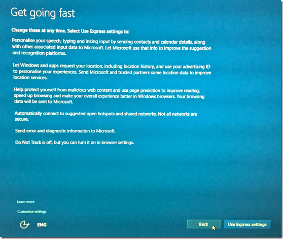
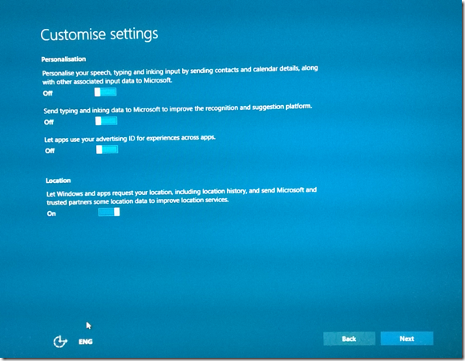
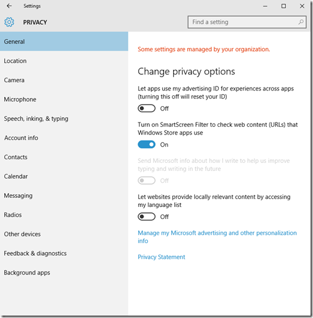
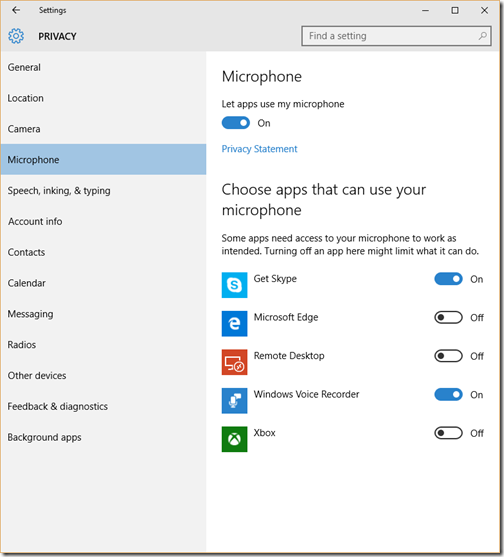
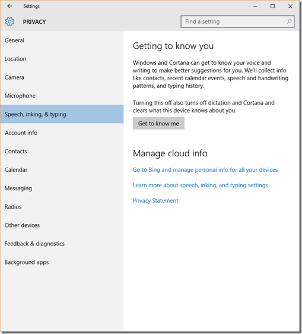
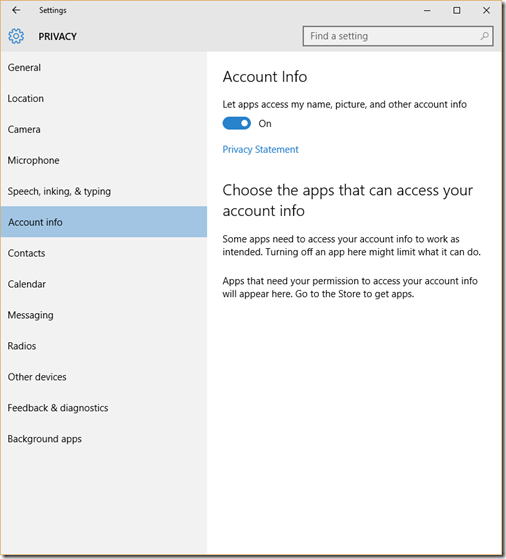
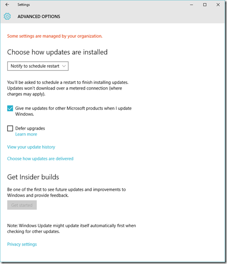
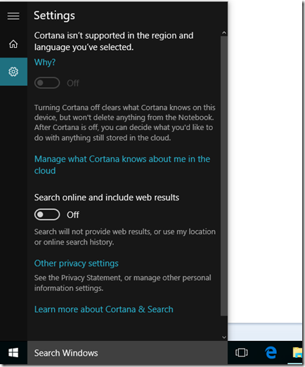

Okay folks this is rant, you have been warned!

TLDR; Windows 10 is a privacy nightmare if you installed it with **default** settings. I hate those settings! Good news is, **you can turn most of it off** unlike Google's omnipresent web tracking!

## The longer version

I've been a Windows 10 insider for a long time and knowingly given up my usage history to 'help make Windows better' (and of course use the latest and greatest Windows)! I had one VM on the main desktop, and when I got an SSD in my old laptop I installed Win 10 as my primary OS (boy that was a mistake, but that's for later). Having used it fulltime for 1+ month and part-time for another month, I was extremely disappointed with its performance on old hardware (or lack thereof), but kept deferring judgment till the final release arrived. Well it arrived today morning and boy did it annoy the hell out of me! But it wasn't about performance (on a year old desktop you can barely tell the difference), it was about the default settings that came out of the box for an upgrade from Windows 8.1 that I had purchased legitimately!

### Default settings nightmare

As a self-respecting software developer, I never install Express/Recommended/Default Configuration of a software. I like to know what's getting installed. I guess I have Java and its toolbars to thank for it!

In past Windows 8.1 always had two clear options "Express" and "Custom". The buttons were equally sized right next to each other. Express was the default and it said clearly that it was going to sniff into everything you do on your computer. However selecting "Custom", Windows would turn off all the naughty bits and leave some for you to turn off/on. This is what Windows 8.1 looked like

When Windows 10 starts configuration you get this:

Customize settings is now obscured on the left side as a link, as if it links to text like the 'learn more' link on top of it.

Before you click on 'Customize settings' do you care to read the consequences of "Use Express settings"?

#### Paragraph 1

In de-jargonized form the first paragraph says - Windows will send what you say ("Personalize your speech"), what you type ("Personalize your contacts and calendar details"), what you view, and what you do to Microsoft ("...along with other associated input data"). What do you get out of it?  
\- A computer whom you can talk to and will probably respond 60-70% of the time correctly (Cortana). I am sure Microsoft must have imagined a floor full of developers in an Enterprise IT shop shouting "Hey Cortana" was a brilliant idea.  
\- Faster auto completion when you are typing email addresses?!?!? (I mean come on...)  
\- Better handwriting recognition on touch devices by 'teaching Microsoft's central AI server about handwriting patterns' (my guess here).

#### Paragraph 2

The second paragraph says - Microsoft will replace your name with an ID and reveal that ID's location/location history to whoever they can sell this information. I DON'T KNOW - If ID is tied to Microsoft account, if it is, there you go, all advantages of the OS with regards to settings syncing comes with the additional baggage of being sold out to advertisers. By the way Advertising ID was there in Windows 8 as well, so not really Windows 10 specific. What do you get in return?  
\- Better targeted ads in not only your web browsing experience but in ALL FREE apps that Microsoft (and its partners) are going to 'give you'... (thanks but no thanks, keep your free stuff with you)!

#### Paragraph 3

The third paragraph says in so many words - we'll send everything you do on the browser to Microsoft. Apparently it's good for you. All the feature will do for you is vet internet links you visit presumably on Edge/IE only. MS will have a blacklist and if you visit a blacklisted site you'll be suitably warned. In exchange all your browsing history will be sent to Microsoft.

Now if you are alarmed by this, your favorite Chrome browser does the same and is unfortunately owned by an advertising company whose business is to make money off you by selling your info. The very reason I am (was?) a Windows fan is this did not happen with on it, welcome to Windows 10.

(Yes phishing is the worst possible online offense and most commonly used for hacking/installing malware, but detecting phishing is a global thing, crawl faster, deeper, why bother about my browsing history)?

#### Paragraph 4

Automatically connect to suggested open hotspots and shared networks is the expanded form of the feature "WiFi-Sense". Someone at Microsoft thought it would be brilliant for them to store all the WiFi passwords in the world so that they could make it easier for your Facebook/Skype friends to connect to your WiFi. How crazy is that?  
Well, there is a lot of FUD on the internet about what it actually does. But my understanding is the express settings do not start sharing by default. They just start collecting by default. To start sharing you have to connect Windows to your Facebook account and then share each WiFi you connect to one at a time (read [Ed Bott's article on ZdNet for details](http://www.zdnet.com/article/no-windows-10s-wi-fi-sense-feature-is-not-a-security-risk/ "Windows 10's Wi-Fi Sense is not a security risk. Here's why")).  
Whatever, even collecting my WiFi passwords by default is an unacceptable behavior. Microsoft is doing it because WiFi information tied with other meta information just helps them pinpoint your location - to sell targeted ads. They don't really need the passwords for it as far as I understand! Again, their reasoning is Google did it and got away, so can we!!!

Pssssttt MS, when I took my router from US to India and gave it to my Sis, Google Maps still thought I was in US and brought that location up as default, not a brilliant strategy I say!

#### Paragraph 5

Send diagnostic information to Microsoft means it sends crash reports to Microsoft. Now I usually turn this on selectively, depending on what type of computer I am on, what kind of internet bandwidth I have and so on. I've let Visual Studio and its derivatives (SQL Management Studio etc.) run diagnostics mode silently in the past. However Microsoft now has made this mandatory. There is no opt out! There are three levels of information 'sending' (maybe more based on variant of Windows 10 you have, I have the Pro edition). But you simply cannot tell Windows to not send crash reports. Who pays for the bandwidth on a metered connection Microsoft? This isn't a privacy issue (maybe but it is in the Privacy section of your Settings Panel) but it is an imposition I have to deal with on what is ironically called a 'Personal' Computer.

## What now - is there a way out?

Well kind of, but you have to be very careful to start off with.

After windows has downloaded and done its eye of Sauron installation/copy of files, the first thing you will come up with is the Settings screen as shown above.

1\. Click on the Customize Settings link. I have disabled all Personalization stuff but kept the Location on. Keeping it on turns on a few ad related stuff in browsing, that you can turn off but to be safe just turn the dang thing off.

2\. Next You can keep smart screen on and disable the rest. I had kept the Send error and diagnostic information to Microsoft on, only to find out there isn't really a way to turn it off ever. So on/off doesn't matter. I'll show how to reduce levels in a bit. But do make sure you turn off automatic connection to open hotspots. This is important for laptops and portable devices. Also keep Automatic connect to networks by your contacts. Slyly this is not referred to as WiFi-Sense here in the settings.

I don't have any more screen captures, so I am guessing that ends the setup options.

### Reviewing your Privacy settings

This is the part I still appreciate about Microsoft that we have some semblance of control.

Once the setup completes go into the new control panel aka the 'Settings App'

To go to settings app, press the Windows Key and start typing 'Settings'. When you see the 'Settings App' on top of the list hit enter.

#### Privacy - General Settings

The last setting 'Let websites provide locally relevant content by accessing my language list' might be enabled. Decide what you want to do with it. I've disabled it.

Don't be confused by the 'Some settings are managed by your organization' message. I started getting that after I turned off a few more settings under privacy, I don't quite remember the sequence of events after which I started getting the message. Yes it's a dumb message that doesn't make sense on a computer that is sitting at home.

#### Privacy - Location tab

On my desktop I have no need for the Location to be on, so I just turned it off. If you turn it off apps will not be able to use it. Alternately you can keep it on and turn off individual app access just like you do on phones.

#### Privacy - Camera Tab

The following apps had access to my web camera by default. I turned off access for a bunch

#### Privacy - Microphone Tab

This one is rather important so not only do you have to set this up in the beginning be sure you come back to it occasionally to review it

#### Speech, Inking and Typing

While speech is a strict no-no for me, Inking would have been okay if I had a touch screen device I could write on (read Surface tablets). If you don't you are better off tell Windows to buzz off and not bother about knowing you.

The 'Get to know me' button indicates it is disabled. This is because we had turned it off in the very first page of Customization screen.

#### Privacy - Account info

I've set my name and picture to be visible, but I have no idea what other account info is being 'sold off'.

#### Privacy - Contacts

There are two weird apps here that are trying to access my Contacts. I have no idea what they are and I don't really want to give them access. So Windows if you give a crap about what users think either explain what those two Apps (App connector and Windows Shell Experience) are or get turned off.

#### Privacy - Feedback & diagnostics

This is the screen I was talking about. You cannot set the Diagnostic and usage data to NONE or Never. Basic is the lowest you can go.

When I moaned about it online (okay I called the privacy settings 'vile'), Clemens Vasters a Microsoftie whom I respect a lot, came back saying that's got nothing to do with privacy. This is his exact tweet.

<blockquote class="twitter-tweet">
<a href="https://twitter.com/sumitkm">@sumitkm</a> so, no, I don't find foundational telemetry supporting platform stability and security at breadth "vile" for everyday users
— Clemens Vasters (@clemensv) <a href="https://twitter.com/clemensv/status/626856650272604160">July 30, 2015</a></blockquote>

Follow the conversation on twitter, it's an interesting one.

I am guessing Diagnostic data somehow tells Microsoft whether you are part of a bot-net or maybe more. Either ways, just be aware if your browser crashes while watch things you don't want others to know about, there is an off chance Windows might send off a screenshot of what you were watching. Wonder what companies using Office products to create competitive and potentially secret documents think about it.

That comes from their 'Learn more about feedback & diagnostics settings' link. Give it a read.

### Internet Bandwidth at mercy of Windows

That was Privacy, now a few things if you are on a metered internet connection like I was in India two months ago. My monthly quota was 4GB @ 2Mbps per month. After 4Gb it is unlimited data at @512 Kbps. Such a connection being called Broadband is laughable, but that's what the reality is.

In such a scenario you have to do a few more settings to optimize.

Go back to Setting home and click on 'Update & Security'

Click on Advanced options.

Next click on 'Choose how updates are delivered'

Microsoft has introduced peer-to-peer delivery of updates, but guess what, it wants to use your internet connection to deliver updates to others on the 'Internet'. Ahem why? Using peer transfer on local network is commendable, but internet, that too by default? What where you thinking Microsoft? I have changed the setting to PCs on my local network.

#### Paranoia Level 5/5 - Banishing Bing

When in India over my piss poor internet, every time I tried to use the new 'Search Windows' box to find/launch apps, the system would irritatingly freeze trying to do a Bing search on every keystroke. It got so bad that I edited my hosts file and set bing.com to 127.0.0.1. This immediately speeds things up because the launcher thinks you are not connected to the internet and searches Windows locally only.

But earlier today I found out that you could switch off Web searches as follows.

That will improve your 'Search Windows' performance significantly over slow internet connections or older hardware or both (funny its called 'Search Windows' but tries to search the internet by default)!

So if you still want to use Bing elsewhere (bwahaa haa haa, sorry couldn't help) and use the 'Search Windows' for local system searches only, turn off Web Results.

Banishing Bing might reduce data transmission over the internet, by how much I have no clues.

Ever since I discovered the Windows Key shortcut's use as an App launcher (in Windows 7) that has become my default method of starting apps. Windows 8 and 8.1 caused a bit of disruption but still worked almost similarly. Glad Windows 10 has set it back to Windows 7 almost and thanks for having the switch to turn off Web Results.

So there you go, everything I did to setup Windows 10 and start using it. After this, I used WireShark to sniff packets and found some data still going to some Microsoft servers with no applications 'visibly' running in the task bar. Thankfully they were over https. I also found somehow my machine was talking to Amazon (the music downloader has put in something deep somewhere) and Dropbox. Haven't looked at it any deeper, my paranoia level is maxed out at this point.

## Conclusion

Many years ago once I tried to search for a substitute medicine for my son on Bing. It returned some offensive results, resulting in me dropping a lot of F-Bombs at Bing (the results were promptly removed by the team to their credit, and I apologized for cussing). At the time I had blogged how Microsoft had completely missed the boat on search context because it didn't care to keep user context.

With Windows 10, Microsoft has done a U-turn on that, but in process has created privacy invading defaults that put Google's tracking to shame. Does Microsoft want to go from the number 1 enterprise and development platform to the number 1 botnet owner or does it want to become a cheap online ad agency dealing in fake ad clicks???

None of the data it is seeking helps its users more or less. All the claims of improved usability is simply to learn user behavior for the singular goal of selling ads and remember Microsoft is selling off/closing down it's own online ad business, so literally, all it is doing is selling your data to third parties. Won't be surprised if Google signs up!!!

### We are slowly broiled frogs, Windows 10 just finished cooking us

It would be dishonest to not mention how as users we have been slowly broiled by services like Facebook, Twitter and Google to become their products by giving away personal information. But Microsoft using that excuse to setup the defaults in an OS that's used by ~90% of computer users is still improper! (And I am just an old fart)!

#### Constructive suggestions?

Clemens, the gentleman he is, asked me to email him a list of constructive suggestions. Well I have a few:

1\. Set defaults to what I have described above, to start with.  
2\. Seek permissions when applicable, e.g. if I want to use Cortana tell me clearly what it entails before enabling it and enable data gathering for Cortana only (segue into 3 below).  
3\. Drop the 'click Yes and all your data is ours' global behavior. If I allow the Maps application to access location, I am giving it to the Maps application because either I derive value from it knowing my location and/or I trust the Map application to use my Location information responsibly. Use my location information in context of the Map application. You don't get a free pass to share my location information to every Tom, Dick and Harriett and neither does ANY OTHER APP. You can keep a global setting, but I need to see more value than 'better ads' to ever enable it.  
4\. If you care about being a platform, the 'Search Windows' box should support search providers for Web Search. Windows search can and should remain native.  
5\. Explain mystery apps better so I know what they are. Enough with the bolt-ons.  
6\. Tell me who you've shared my data with.  
7\. Last but most important - Give me control over the data you take from me. My computer, my data! I need to know what Windows has taken to its servers, how it has used it and I need to be able to clear it out at the source if required.  

#### My last word about Ads sponsored anything

Google has somehow convinced the world that you can literally provide any service for free as long as you can somehow stick ads on them. This is a misconception beyond  reason. Google's gravy train is running on bot views and high hopes from its clients that someday it will provide better RoI than anything else. Well, sooner or later people will realize spending money on ads is like buying Housing debt. There is nothing of real value in them.

Example, remember the good old days of terrestrial television? Ads were few, programs were few but tolerable and you barely paid anything to watch them (after you had bought the TV and the ariel). Fast forward to now - You see programs clips between series of ads, and that is after you are paying a handsome sum of money to 'subscribe' to those channels on a monthly basis. Most of the times you just get re-runs anyways. So basically you are paying to see ads interspersed with some programs. So what did we do to break free from it, created services like Netflix that don't show ads. Life's come a full circle. Now tell me one good reason why this won't be the case in future for 'free' ad supported Software??? Think!!!
