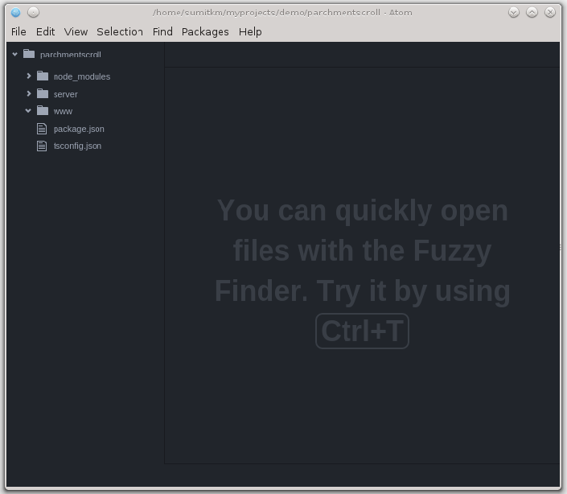

I've been meaning to try out NodeJS for a while now, and finally got around to doing it over the last few days. I thought I would share my experience as I go along.

Update: Those 'few days ago' are actually a couple of months now ;-)

I have used NodeJS as a (build) tool to help me 'compile' front-end scripts, that involves taking dev source code and minifiying it into cache-busted deployable code. I use gulp for it and it works pretty okay. Fact is, while writing the gulp script I got pretty interested in NodeJS.

Also given the fact that ASP.NET vNext is pretty much going the 'Node way', I thought I should know what the real deal is, before I muck around with ASP.NET vNext.

So here is my first go at building 'something' using NodeJS as a platform as opposed to just a Dev/Build tool. The article expects you to have heard of NodeJS and NPM (Node Package Manager, something like Nuget but runs off the command line and available to both Windows and \*nix). If you have never used either of them, it's fine.

## Environment

### **OS**

Debian 8 (Jessie).

My readers using Windows fear not, you can use NodeJS on Windows using nearly the same steps, so if you get stuck just let me know and I'll try and help.

### **NodeJS**:

\[code language="bash"\] node --version

v4.2.1

npm --version

2.14.7 \[/code\]

Side note on upgrading Node in Debian: If you read my previous article I had mentioned Jessie comes with a Node package by default, but it's a rather old one. I un-installed that one using

\[code language="bash"\] sudo apt-get remove nodejs \[/code\]

Thereafter I followed the step outlined on [Nodejs.org](https://nodejs.org/en/download/package-manager/#debian-and-ubuntu-based-linux-distributions) . Reproduced here

\[code language="bash"\] curl -sL https://deb.nodesource.com/setup\_4.x | sudo -E bash -

sudo apt-get install -y nodejs \[/code\]

This basically downloads the latest package from the official node repository and installs it.

Windows Users: Just get the latest Node installers from nodejs.org and rock on! NPM is installed as a part of Node. OSX Users: You guys are all good, just install Node and the rest of the commands should be all the same.

### IDE/Editor

Well, you could use anything you want, starting with Visual Studio full on, to Visual Studio Code, or any other IDE/Editor that suits your fancy. I am using Atom by Github. I am new to Atom as well, so there might be some moments when the experienced Atom user in you wince at my noobish-ness.

## The Project

Well, I want to figure out what it takes to use QuillJS wrapped in a KO Component and then save the text in component into Azure Blob Storage. Simple right ;-). The project is called ParchmentScroll. Why? Well you use quills to write Scrolls on Parchment paper... ;-) ;-) ;-)

Oh, BTW, QuillJS is a really cool JavaScript library for add Rich Text capabilities to your Web Application. It was open sourced by Sales Force and is available under a permissive BSD license.

So lets get started, but before that lets try wrapping our head around 'Server-side' JavaScript.

## JavaScript... umm... TypeScript everywhere (client-side and server-side)

You either love JavaScript or loathe it! I have made my peace with it and I kind of like its dynamic quirkiness. After I started using TypeScript I like JavaScript even better.

Anyway, traditionally we all know how to use JavaScript in the browser. But Node JS takes JavaScript and runs it through Google's V8 engine on the server so you can actually write HTTP services in JavaScript. So you can have a HTML page hosted on IIS, NGINX, Apache or wherever, do an AJAX post to your NodeJS application that you've written in JavaScript and send back a response. To put things in contrast with the .NET world, think of writing Web API services, but instead of writing ApiControllers in C# you get to write it in JavaScript.. err TypeScript!!!

## Down to some code... err well... kind of

Since I am using Atom, a lot of the steps I describe here, to setup a blank project, will look long drawn, when compared to Visual Studio's File->New Project->Wizard->Done.

So lets get started.

Open a terminal.

Select/Create your favourite project folder and navigate to it. Mine is at \[code language="bash"\] cd /home/sumitkm/myprojects/demo/parchmentscroll \[/code\]

### Packages, their managers and Node JS

The NodeJS ecosystem thrives on a huge repository of third party libraries that are distributed as packages. Packages inherit the idea of Linux packages. They bundle self contained units of code/binaries that can be installed and updated using their respective package managers.

In this project I have used three package managers

1\. The Node Package Manager aka npm - This is Node's default package manager and is used to distribute all node packages, binaries and extensions. Fun fact, you use npm to install other package managers :-). So npm is the alpha dog of package managers in Node and is installed by default with Node. Node packages are mostly used for installing dependencies that you will use on the server side. For client side Script/style dependencies you use the next package manager – Bower.

2\. Bower – The front-end package manager. Bower installs front-end dependencies that are mostly distributable versions of the libraries or frameworks that you will use e.g. KnockoutJS, RequireJS, QuillJS etc. To get started with Bower you first need to install it using npm at the global npm repository location as follows.

Please note if you are are not the administrator but have sudo-er rights, you need to prepend sudo to every shell command unless I say you don't need one explicitly.

\[code language="bash"\] npm install bower -g \[/code\]

3\. TSD – The TypeScript Definitions package manager. While the good thing about TypeScript is it provides better code management due to type enforcement at compile time, the flip side is you need TypeDefinitions for existing libraries written in ES3-4. DefinitelyTyped is a nice Open Source repository of TypeDefinitions that users have contributed as they have used existing libraries. While creating a TypeDefinition is relatively easy, its good to have a leg up with the existing libraries. So we install TSD a package manager that helps you retrieve type definitions for libraries you will use from the DefinitielyTyped repository

\[code language="bash"\] npm install tsd -g \[/code\]

We start by initializing an NPM 'project'. This creates a package.json file which has the list of dependencies as well as details like the Project Name, version, Git repository, Author name, License information etc.

\[code language="bash"\] npm init \[/code\]

(don't use sudo here)

This will present you with a series of prompts where you provide the requested details and it will in turn scaffold a package.json file for you. I provided the following details:

\[code language="bash"\] This utility will walk you through creating a package.json file. It only covers the most common items, and tries to guess sensible defaults. See \`npm help json\` for definitive documentation on these fields and exactly what they do. Use \`npm install --save\` afterwards to install a package and save it as a dependency in the package.json file. Press ^C at any time to quit. name: (parchmentscroll) version: (1.0.0) description: A blogging platform built using Node, QuillJS and TypeScript entry point: (index.js) test command: git repository: https://github.com/sumitkm/parchmentscrolldemo/ keywords: QuillJS, NodeJS, TypeScript author: Sumit Kumar Maitra license: (ISC) MIT About to write to /home/sumitkm/myprojects/demo/parchmentscroll/package.json: { "name": "parchmentscroll", "version": "1.0.0", "description": "A blogging platform built using Node, QuillJS and TypeScript", "main": "index.js", "scripts": { "test": "echo \\"Error: no test specified\\" && exit 1" }, "repository": { "type": "git", "url": "https://github.com/sumitkm/parchmentscrolldemo/" }, "keywords": \[ "QuillJS", "NodeJS", "TypeScript" \], "author": "Sumit Kumar Maitra", "license": "MIT" } Is this ok? (yes) yes \[/code\]

If you do ls now, you'll see that a package.json file exists in the folder.

Here on, you have to decide your project structure. There are lots of sensible defaults, you can look up on the net. I am trying out one that I feel comfortable with. I may change it as we go along and build the project.

Since there are no csproj files or equivalent (package.json is a distant cousin, more like a .sln file than anything else), I am going to create top level folders as projects. So I create two main folders

(no sudo required)

\[code language="bash"\] mkdir www

mkdir server \[/code\]

Next will initialize the typescript definition file tsconfig.json (no sudo required)

\[code language="bash"\] tsc --init \[/code\]

This creates a TypeScript config file that helps TypeScript compiler with location of the ts files in the project and other configuration items. If you open the file in an editor you'll see the default:

\[code language="javascript"\] { "compilerOptions": { "module": "commonjs", "target": "es3", "noImplicitAny": false, "outDir": "built", "rootDir": ".", "sourceMap": false }, "exclude": \[ "node\_modules" \] } \[/code\]

 

The compiler options are same ones available via command line. I tend to remove the outDir attribute completely. This results in the .js files being generated in the same folder as the .ts file. This fits better with my deploy script that we'll see sometime in the future.

The exclude array tells typescript compiler which folder it shouldn't look at. Currently only node\_modules is excluded.

The final tsconfig.json file we are starting with is

 

\[code language="javascript"\] "compilerOptions": { "module": "commonjs", "target": "es3", "noImplicitAny": false, "rootDir": ".", "sourceMap": true }, "exclude": \[ "node\_modules" \] } \[/code\]

This completes our 'File->New Project'. Here on we'll get on with some real code.

### Application layout in a little more details

In the previous section we created two folder server and www as our two 'projects'. The server folder will be root folder for all the server side logic and the www folder will hold whatever resources the browser needs to serve up the web page. So folder names basically help us with a mental segregation of what goes where.

 

Node JS can open ports and server content on ports if you want it to. But we don't want to go that low level. Instead we'll get help from a framework called Express JS to the low level stuff of opening/listening to ports, parsing requests, sending back responses etc. Basically we'll use ExpressJS to bootstrap the application. The handy bit is, Express can serve up static files as well, so we'll use the same framework to host the front-end and handle backend request/responses.

## Down to some code, finally!

### Getting started with ExpressJS

Setting up anything in node basically means npm --install. Express is no different. In the 'parchmentscroll' folder using the following

\[code language="bash"\] npm install express --save \[/code\]

Save tells npm to update the package.json file with this particular dependency. So when you get sources on to a new folder all you have to do is npm install and all dependencies listed in package.json will be installed for you.

Time to start up Atom in the parchmentscroll folder enter

(no sudo required)

\[code language="bash"\] atom . \[/code\]

This should launch atom with the following layout

 Under the server folder create a folder called app

Add app.ts file under app folder. This is going to be our entry point into the application.

But before we start writing code, we need a little more 'configuration' to do.

Back to the console in the parchmentscroll folder we'll use the tsd package manager to install typescript definitions for node itself (no sudo required)

\[code language="bash"\] tsd query node --action install --save \[/code\]

This tells tsd to look for the node type definition and if found install it and save it to tsd.json

Similarly we install typedefinitions for ExpressJS as well

\[code language="bash"\] ts query express --action install --save \[/code\]

Next we'll install a couple of npm modules that Express JS uses for parsing a request body and serving up static files.

\[code language="bash"\] npm install body-parser

npm install serve-static \[/code\]

We also need the typescript definition for these two, so invoke tsd again -

\[code language="bash"\] tsd query --action install serve-static --save --

tsd query --action install body-parser --save --resolve \[/code\]

Note the -- resolve flag that we've used in the above two commands. This tells tsd to resolve sub-dependencies of the library and get their type-definitions as well. You'll note both use another dependency call mime that gets installed automatically.

Back to Atom in app.ts paste the following code and save the file.

\[code language="javascript"\] /// <reference path="../../typings/tsd.d.ts"/> import \* as express from "express"; var app = express(); var bodyParser = require('body-parser'); app.use(bodyParser.json()); // for parsing application/json app.use(bodyParser.urlencoded({ extended: true })); // for parsing application/x-www-form-urlencoded app.use(express.static('www/')); var server = app.listen(3001, () => { var host = server.address().address; var port = server.address().port; console.log('Example app listening at http://%s:%s', host, port); }); \[/code\]

\- This code initializes express. - Initializes an instance of the body parser module and sets it up to handle HTTP request body of type application/json

\- Sets up the bodyParser module to handle parsing of url encoded HTTP requests

\- Sets up express to handle static files in the 'www' folder (which is currently empty).

\- Finally it setup up the express instance to listen to port 3001 and once the server starts print out a console message. With the code setup, switch back to the terminal and in the parchmentscroll folder run tsc.

\[code language="bash"\] tsc \[/code\]

The code should compile silently and come back with no messages.

Next we try to run the app using the following command

\[code language="bash"\] node . \[/code\]

The . tells Node to use the package.json to start up. However you'll get an error at this point.

\[code language="bash"\] Error: Cannot find module '/home/sumitkm/myprojects/demo/parchmentscroll' at Function.Module.\_resolveFilename (module.js:338:15) at Function.Module.\_load (module.js:289:25) at Function.Module.runMain (module.js:467:10) at startup (node.js:136:18) at node.js:963:3 \[/code\]

This because when we setup our package.json we said index.js was our 'main' file. Problem, easily fixed, switch to Atom and open package.json.

Set the "main" attribute to "server/app/app.js" instead of the initial "index.js".

Save the file and flip back to the terminal. Run node . Again

\[code language="bash"\] node . \[/code\]

This time you should see a message like the following: \[code language="bash"\] Example app listening at http://:::3001 \[/code\]

If you open your browser and go to localhost:3001/ you'll get a message saying “Can't GET /”

So switch back to Atom and add a file under www called **index.html**.

Add a bit of hello world markup \[code language="html"\] <!DOCUMENT> <body> Hello Node JS </body> \[/code\]

Save the file.

Refresh the browser and voila!

 

 Phew! Lot of work for a Hello World!

## To sum up...

That may have seemed a lot of work up-front but all of it can be automated and scaffold-ed if we wanted to. Open source tool chains are much lighter weight when compared to enterprise apps like Visual Studio. However, they give you a lot more freedom to mix and match and hey all of them are actually free without you signing away your keystrokes in some EULA.

We have not even scratched the surface on NodeJS yet. In the next part, I'll jump straight into more real life Node JS concepts like routing and middleware and show how to build front-end clients as well as HTTP services using it.

To be continued... (oh and wish you all a Happy new 2016)!
