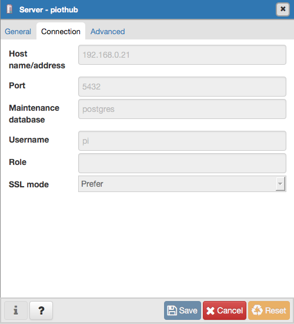

I have been trying to setup a home network of connected devices for... lets just say a long time! I have made some progress in recent days and the next step is to start using some sort of backing store to store some values.

While MongoDB works well with the Nodejs stack, it isn't well supported on Raspbian because Raspbian is 32bit and MongoDB stopped supporting 32 bit fully due to data size restrictions (biggest DB you can have is 2GB). Raspbian Stretch does provide an updated MongoDB but it is still a few (minor versions) short of the shiniest.

However using Jessie Backports I was able to install PostgreSQL 9.6 (the shiniest version). Having installed it, I had no idea what to do next. Here's my journey to get PostgreSQL to a place where I can start using it.

My dev environment's base OS is OSX and I run my DB in a VM hosted by VirtualBox. So I have setup a Debian Stretch VM called dev-db before I start with PostgreSQL installation. I am trying to setup a parallel runtime environment on a Raspberry Pi as well so if there are any exceptions to these steps I'll document them for the Raspbian as well.

## Installing on Debian/Raspbian Stretch

Both the distros have the required repositories in the apt list, out of the box, so all you have to do is

sudo apt-get install postgresql-9.6

This will create a PostgreSQL default user called 'postgres'.

sudo service start postgres

### Setting up your User Account

PostgreSQL databases are usually tied to a user. Out of the box, PostgreSQL users are not the same as \*nix account users, however, if you a common name between your \*nix account and PostgreSQL account things become much easier. So lets assume account I am using to log in to Debian stretch is called 'dbuser'. It is in the sudoers list and I logged in to the terminal/desktop using it.

First step is to change user from 'dbuser' to 'postgres' that PostgreSQL created during installation.

sudo -i -u postgres

This is the admin account for postgresql, in a production environment, it is a good idea to protect this with a password at least.

Next step is to tell PostgreSQL, we have a 'dbuser' account that we want to be able to use for create databases in PostgreSQL.

postgres@dev-db: ~$ createuser dbuser --pwprompt

It will ask for password, I entered the same password as my \*nix account but that may not be a best practice.

Finally create a db for the dbuser

postgres@dev-db: ~$ createdb dbuser

Now log out of the postgres account and go back to dbuser account

postgres@dev-db: ~$ exit
dbuser@dev-db: ~$

Start psql client and you should get logged into the pi database using the PLSQL

dbuser@dev-db: ~$ psql
psql (9.6.4)
Type "help" for help.
pi=>

Enter \\q to exit psql.

We have setup PostgreSQL and have established local client access

## Enabling remote access

Default PostgreSQL setup enables local client access only. In Dev environment I like to access my VM or PI using a client on my local desktop/laptop. This needs a few additional steps.

### Step 1: Open up firewall on VM or Raspberry Pi hosting the DB Server

sudo iptables -A INPUT -s 192.168.0.21 -p tcp --destination-port 5432 -m state --state NEW,ESTABLISHED -j ACCEPT

sudo iptables -A OUTPUT -s 192.168.0.21 -p tcp --destination-port 5432 -m state --state NEW,ESTABLISHED -j ACCEPT

### Step 2: Edit PostgreSQL config to allow remote access

Edit the pg\_hba.conf file

sudo nano /etc/postgresql/9.6/main/pg\_hba.conf

Scroll to the bottom and add the following line

host all all 192.168.0.21/24 trust

Edit the file postgresql.conf

sudo nano /etc/postgresql/9.6/main/postgresql.conf

Find the setting 'listen\_address' and set its value to the IP address of the VM/Raspberry Pi. This line maybe set commented (starts with #), so uncomment it first.

listen\_addresses = '192.168.0.21'

Restart PostgreSQL server

sudo service postgresql restart

You should now be able to access if from a Remote Client.

I use the standard pgAdmin 4 and the connection settings were as follows

And done!

Up next compiling and setting up Redis on the Pi :-)
